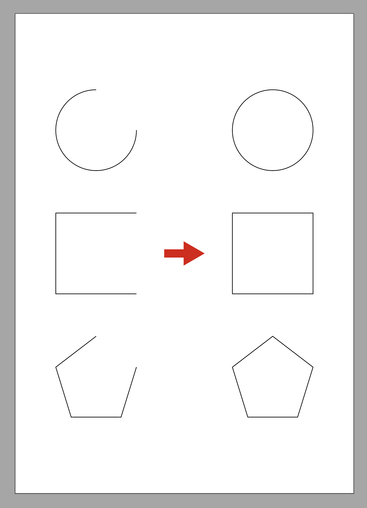
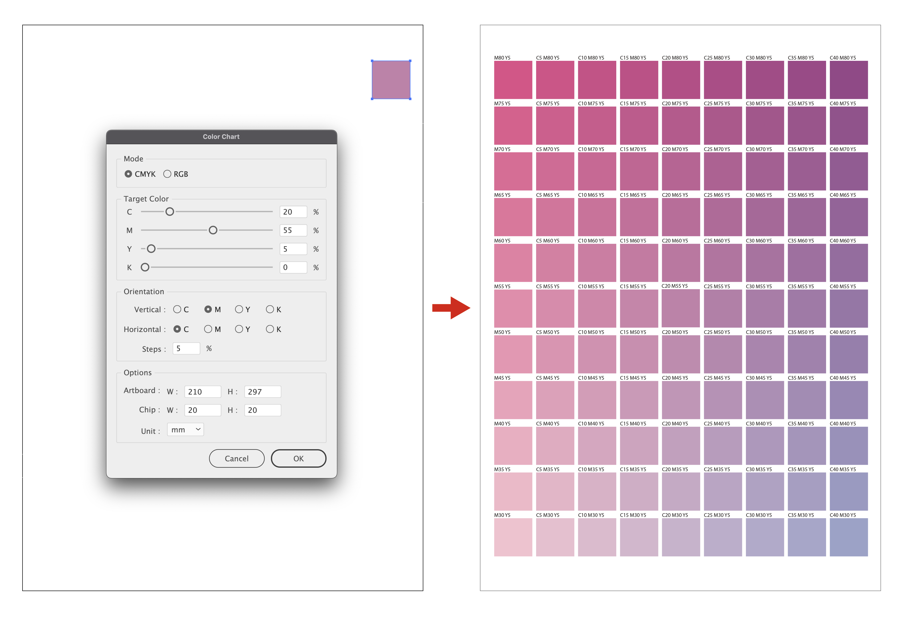
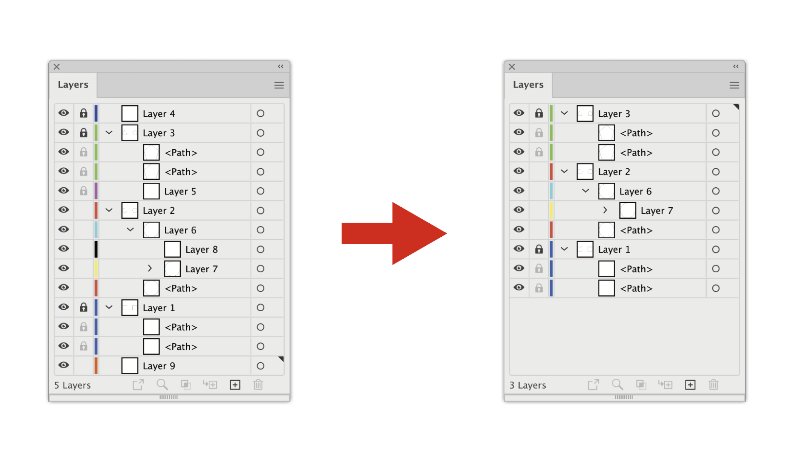
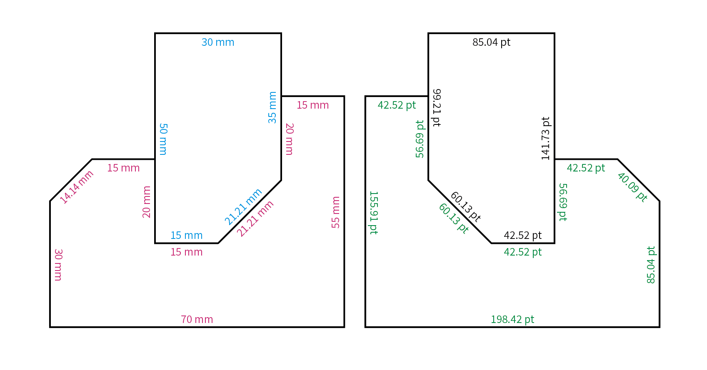
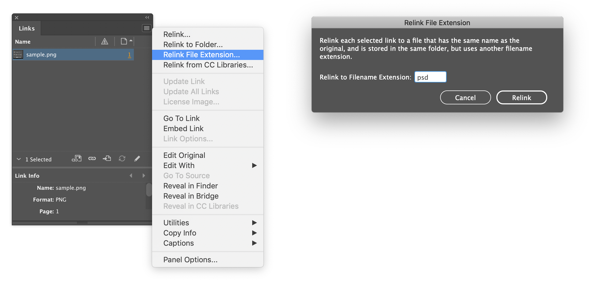
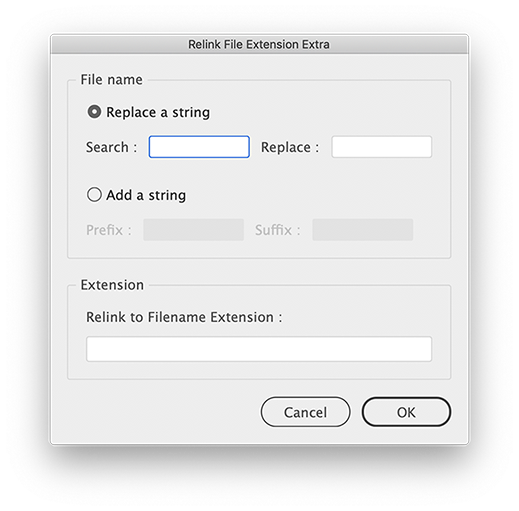
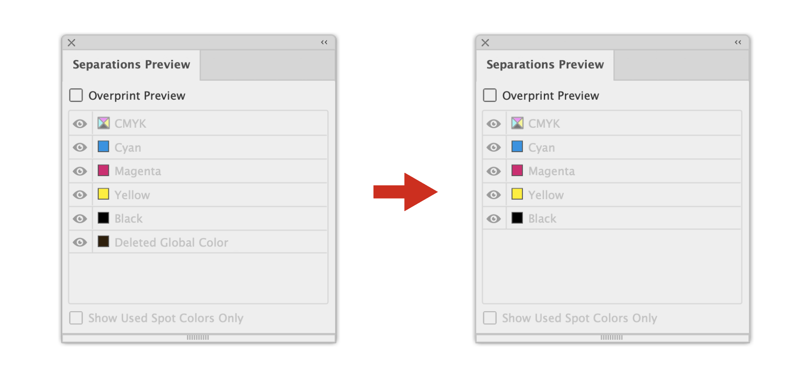
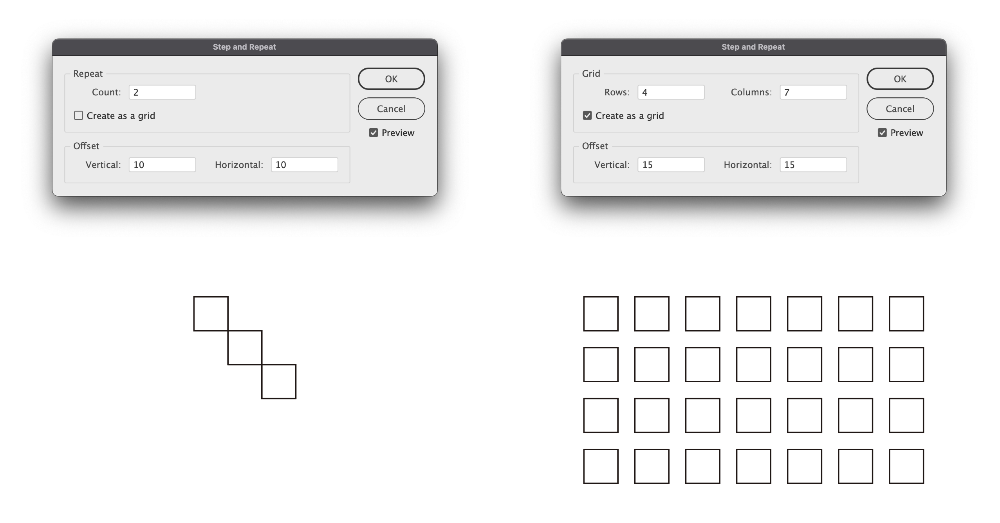

# Adobe Illustrator Scripts
This is a collection of scripts for Adobe Illustrator.

# closePath.js

### Description
This script close the path objects.

### Usage
1. Download Zip file and unzip.(You can place it anywhere you like.)
2. Select the path objects, run this script from File > Scripts > Other Script...

### Notes
In rare cases, you may not be able to create it.  
In that case, restart Illustrator and run this script again.

### Requirements
Illustrator CS or higher

# createColorChart.js

### Description
This script create a color chart.

### Usage
1. Download Zip file and unzip.(You can place it anywhere you like.)
2. Run this script from File > Scripts > Other Script...
3. Select either CMYK or RGB, enter the color values.
   If an object is selected, the fill value of the object will be used as the initial value.
4. Select the color you want to increase or decrease with vertical, or horizontal.
5. Enter the increase or decrease value.
   Enter the percentage to be increased or decreased.
6. Set the artboard size, chip size, and units according to your preference.

### Notes
For CMYK, K cannot be increased or decreased.  
In rare cases, you may not be able to create it.  
In that case, restart Illustrator and run this script again.

### Requirements
Illustrator CS4 or higher

# deleteUnusedLayers.js

### Description
This script delete unused layers.

### Usage
1. Download Zip file and unzip.(You can place it anywhere you like.)
2. Run this script from File > Scripts > Other Script...

### Notes
In rare cases, you may not be able to create it.  
In that case, restart Illustrator and run this script again.

### Requirements
Illustrator CS or higher

# measurePathItems.js

### Description
This script measures the distance of an anchor point between two points of an object.

### Usage
Select the path object, run this script from File > Scripts > Other Script...

### Feature
Group and color a measurements by path object.  
Switch the dimension units according to the ruler units.

### Notes
In complex shapes, a measurements may be displayed overlapping each other.  
Curves are not supported.  
In rare cases, you may not be able to create it.  
In that case, restart Illustrator and run this script again.

### Requirements
Illustrator CS4 or higher

# relinkFileExtension.js

### Description
This script is equivalent to InDesign's "Relink File Extension".

### Usage
1. Download Zip file and unzip.(You can place it anywhere you like.)
2. Open the Ai file.
3. Run this script from File > Scripts > Other Script...  
   (If you don't select an image, all images in the document will be targeted.)
4. Enter the extension at the prompt that appears.

### Notes
Place the relink files in the same place as the original files.  
Broken link files are not replaced.  
Embedded files are also not possible.

### Requirements
Illustrator CS4 or higher

# relinkFileExtensionExtra.js

### Description
This script is an enhanced version of relinkFileExtension.js.

### Usage
1. Download Zip file and unzip.(You can place it anywhere you like.)
2. Open the Ai file.
3. Run this script from File > Scripts > Other Script...  
   If you don't select an image, all images in the document will be targeted.
4. Choose to replace or add the string.  
   To replace, you can use regular expressions.  
   To add, specify a string to be added to the beginning or end of the original file name, or both.
5. Enter the extension.  
   If you don't enter an extension, the extension of the original file will be used.

### Notes
Place the relink files in the same place as the original files.  
Broken link files are not replaced.  
Embedded files are also not possible.

### Requirements
Illustrator CS4 or higher

# removeDeletedGlobalColor.js

### Description
Deletes the Deleted Global Colors displayed in the Separations Preview panel.  

### Usage
1. Download Zip file and unzip.(You can place it anywhere you like.)
2. Open the Ai file.
3. Run this script from File > Scripts > Other Script...

### Notes
In rare cases, you may not be able to delete it.  
In that case, restart Illustrator and run this script again.  
If you save the file and reopen it, it may be restored.  
In this case, there is no way to delete it.

### Requirements
Illustrator CS or higher

# stepandRepeat.js

### Description
This script is equivalent to InDesign's "Step and Repeat".

### Usage
1. Download Zip file and unzip.(You can place it anywhere you like.)
2. Open the Ai file.
3. Select the objects, run this script from File > Scripts > Other Script...
4. Select Repeat or Grid.
5. Enter the number of copies to be duplicated.
6. Enter the offset values.

### Notes
In rare cases, you may not be able to create it.  
In that case, restart Illustrator and run this script again.

### Requirements
Illustrator CS4 or higher

# textAlign_Center.js textAlign_Left.js textAlign_Right.js

### Description
This script changes the text alignment without moving the text position.  
Vertical text is also supported.

### Usage
1. Download Zip file and unzip.(You can place it anywhere you like.)
3. Select the text objects, run this script from File > Scripts > Other Script...

### Notes
In rare cases, you may not be able to create it.  
In that case, restart Illustrator and run this script again.

### Requirements
Illustrator CS or higher

# Licence
All scripts is licensed under the MIT licence.  
See the included LICENSE file for more details.  
