# Adobe Illustrator Scripts
[](https://github.com/sky-chaser-high/adobe-illustrator-scripts/releases/latest/download/AllScripts.zip)

Adobe Illustratorのスクリプト集です。  
スクリプト名をクリックすると詳細説明にジャンプします。  
[](https://github.com/sky-chaser-high/adobe-illustrator-scripts/releases/latest) からスクリプトをダウンロードしてください。
<br><br>

### アートボード
[](https://github.com/sky-chaser-high/adobe-illustrator-scripts/releases/latest/download/Artboard.zip)
| スクリプト | 概要 |
| --- | --- |
| [showArtboardName.js](#showArtboardNamejs) | アートボード名とサイズを表示 |
| [sortArtboards.js](#sortArtboardsjs) | アートボードをソート（アートボードパネル内のみ） |

<br>

### カラー
[](https://github.com/sky-chaser-high/adobe-illustrator-scripts/releases/latest/download/Color.zip)
| スクリプト | 概要 |
| --- | --- |
| [addSelectedGradientsToSwatch.js](#addSelectedGradientsToSwatchjs) | 選択したグラデーションをスウォッチに追加 |
| [convertToGlobalColor.js](#convertToGlobalColorjsconvertToSpotColorjs) | グローバルカラーに変換 |
| [convertToSpotColor.js](#convertToGlobalColorjsconvertToSpotColorjs) | 特色に変換 |
| [createColorChart.js](#createColorChartjs) | カラーチャート作成 |
| [deleteAllSwatches.js](#deleteAllSwatchesjs) | すべてのスウォッチを削除 |
| [exportColorValuesToCSV.js](#exportColorValuesToCSVjs) | カラー数値をCSVファイルに保存 |
| [extractColorsFromGradient.js](#extractColorsFromGradientjs) | グラデーションのカラー分岐点から色を取り出す |
| [generateGradientColor.js](#generateGradientColorjs) | グラデーションを生成 |
| [highlightWord.js](#highlightWordjs) | 指定した単語の塗り色を変更 |
| [importCSVtoSwatch.js](#importCSVtoSwatchjs) | CSVファイルを読み込む |
| [matchLocationOfGradientStop.js](#matchLocationOfGradientStopjs) | グラデーションのカラー分岐点、中間点の位置を同期 |
| [randomTextColor.js](#randomTextColorjs) | テキストの塗り色をランダムに変更 |
| [removeDeletedGlobalColor.js](#removeDeletedGlobalColorjs) | Deleted Global Color を削除 |
| [roundColorValue.js](#roundColorValuejs) | カラー数値を四捨五入 |
| [roundLocationOfGradientStop.js](#roundLocationOfGradientStopjs) | グラデーションのカラー分岐点、中間点の数値を四捨五入 |
| [showColorValues.js](#showColorValuesjs) | カラー数値を表示 |
| [shuffleGradientColor.js](#shuffleGradientColorjs) | グラデーションをシャッフル |

<br>

### レイヤー
[](https://github.com/sky-chaser-high/adobe-illustrator-scripts/releases/latest/download/Layer.zip)
| スクリプト | 概要 |
| --- | --- |
| [deleteHiddenLayers.js](#deleteHiddenLayersjs) | 非表示レイヤーを削除 |
| [deleteLockedLayers.js](#deleteLockedLayersjs) | ロック状態のレイヤーを削除 |
| [deleteUnusedLayers.js](#deleteUnusedLayersjs) | 未使用（空）のレイヤーを削除 |
| [invertLockedLayer.js](#invertLockedLayerjs) | ロック状態を反転 |
| [invertVisibleLayer.js](#invertVisibleLayerjs) | 表示状態を反転 |
| [moveSublayerToMainLayer.js](#moveSublayerToMainLayerjs) | サブレイヤーを親レイヤーの外へ移動 |
| [unifyLayerColors.js](#unifyLayerColorsjs) | レイヤーカラーを統一 |

<br>

### リンク
[](https://github.com/sky-chaser-high/adobe-illustrator-scripts/releases/latest/download/Link.zip)
| スクリプト | 概要 |
| --- | --- |
| [relinkFileExtension.js](#relinkFileExtensionjs) | ファイル拡張子にリンクを再設定 |
| [relinkFileExtensionExtra.js](#relinkFileExtensionExtrajs) | ファイル拡張子にリンクを再設定（機能拡張版） |
| [relinkToFolder.js](#relinkToFolderjs) | フォルダに再リンク |
| [resetToFullScale.js](#resetToFullScalejs) | 画像サイズを100%に戻す |
| [selectEmbeddedLink.js](#selectEmbeddedLinkjs) | 埋め込み画像を選択 |
| [selectLink.js](#selectLinkjs) | リンクを選択 |

<br>

### パス
[](https://github.com/sky-chaser-high/adobe-illustrator-scripts/releases/latest/download/Path.zip)
| スクリプト | 概要 |
| --- | --- |
| [alignInCenterOfSpace(Horizontal).js](#alignInCenterOfSpaceHorizontal--Verticaljs) | 余白の水平方向中央に整列 |
| [alignInCenterOfSpace(Vertical).js](#alignInCenterOfSpaceHorizontal--Verticaljs) | 余白の垂直方向中央に整列 |
| [closePath.js](#closePathjs) | パスを閉じる |
| [convertAllAnchorPointsToCorner.js](#convertAllAnchorPointsToCornerjs) | すべてのアンカーをコーナーポイントに切り替え |
| [createGridLines.js](#createGridLinesjs) | グリッドラインを作成 |
| [disjoinPath.js](#disjoinPathjs) | パスを分解 |
| [distributeInSpace(Horizotal).js](#distributeInSpaceHorizontal--Verticaljs) | 余白の水平方向に分布 |
| [distributeInSpace(Vertical).js](#distributeInSpaceHorizontal--Verticaljs) | 余白の垂直方向に分布 |
| [drawCircumscribedCircle.js](#drawCircumscribedCirclejs) | 外接円を描く |
| [drawRectangle.js](#drawRectanglejs) | オブジェクトの周囲に長方形を描く |
| [drawShapeOnAnchorPoint.js](#drawShapeOnAnchorPointjs) | アンカーポイントに図形を描く |
| [extendHandle.js](#extendHandlejs) `New` | ハンドルを伸縮 |
| [extendLine.js](#extendLinejs) `Update` | パスを伸縮 |
| [fitGuideInArtboard.js](#fitGuideInArtboardjs) | ガイドをアートボードにフィット |
| [removeColorInGuideObject.js](#removeColorInGuideObjectjs) | ガイドオブジェクトの色を削除 |
| [selectGuides.js](#selectGuidesjs) | ガイドを選択 |
| [showDimensions.js](#showDimensionsjs) `Update` | パスの寸法を表示 |
| [shuffleObjects.js](#shuffleObjectsjs) | オブジェクトをシャッフル |
| [stepAndRepeat.js](#stepAndRepeatjs) `Update` | 繰り返し複製 |

<br>

### テキスト
[](https://github.com/sky-chaser-high/adobe-illustrator-scripts/releases/latest/download/Text.zip)
| スクリプト | 概要 |
| --- | --- |
| [addNumericSeparators.js](#addNumericSeparatorsjs) | 数字を3桁で区切る |
| [convertTypeOnAPathToPointType.js](#convertTypeOnAPathToPointTypejs) | パス上文字をポイント文字に切り替え |
| [copyLineDown.js](#copyLineDownjscopyLineUpjs) | 行を下へコピー |
| [copyLineUp.js](#copyLineDownjscopyLineUpjs) | 行を上へコピー |
| [copyLine(emptySelection).js](#copyLineEmptySelectionjscutLineEmptySelectionjs) | 選択なしでコピー |
| [createPageNumbers.ja](#createPageNumbersjs) | ノンブル作成 |
| [cutLine(emptySelection).js](#copyLineEmptySelectionjscutLineEmptySelectionjs) | 選択なしでカット |
| [deleteAllLeft.js](#deleteAllLeftjsdeleteAllRightjs) | カーソルの左側をすべて削除 |
| [deleteAllRight.js](#deleteAllLeftjsdeleteAllRightjs) | カーソルの右側をすべて削除 |
| [deleteTrailingSpaces.js](#deleteTrailingSpacesjs) | 行末のスペースを削除 |
| [deleteWord.js](#deleteWordjs) | カーソル位置の単語を削除 |
| [encloseWordInParentheses.js](#encloseWordInParenthesesjs) | 文字列を括弧で囲む |
| [goToLine.js](#goToLinejs) | 指定の行に移動 |
| [goToNextText.js](#goToNextTextjsgoToPreviousTextjs) | カーソルを次のテキストオブジェクトへ移動 |
| [goToPreviousText.js](#goToNextTextjsgoToPreviousTextjs) | カーソルを前のテキストオブジェクトへ移動 |
| [insertLineAbove.js](#insertLineAbovejsinsertLineBelowjs) | 上に行を挿入 |
| [insertLineBelow.js](#insertLineAbovejsinsertLineBelowjs) | 下に行を挿入 |
| [justifyContentSpaceBetween.js](#justifyContentSpaceBetweenjs) | テキスト両端揃え |
| [moveLineDown.js](#moveLineDownjsmoveLineUpjs) | 行を下へ移動 |
| [moveLineUp.js](#moveLineDownjsmoveLineUpjs) | 行を上へ移動 |
| [swapTextContents.js](#swapTextContentsjs) | 文字列を交換 |
| [textAlign_Center.js](#textAlign_CenterjstextAlign_LeftjstextAlign_Rightjs) | 文字列の位置を動かさずに中央揃え |
| [textAlign_Left.js](#textAlign_CenterjstextAlign_LeftjstextAlign_Rightjs) | 文字列の位置を動かさずに左揃え |
| [textAlign_Right.js](#textAlign_CenterjstextAlign_LeftjstextAlign_Rightjs) | 文字列の位置を動かさずに右揃え |

<br>

### ユーティリティ
[](https://github.com/sky-chaser-high/adobe-illustrator-scripts/releases/latest/download/Utility.zip)
| スクリプト | 概要 |
| --- | --- |
| [arrangeWindows.js](#arrangeWindowsjs) | ウィンドウを並べて表示 |
| [checkDayOfWeek.js](#checkDayOfWeekjs) | 選択した日付の曜日をチェック |
| [closeAllDocuments.js](#closeAllDocumentsjs) | すべてのファイルを閉じる |
| [compareScale.js](#compareScalejs) | 拡大・縮小率を表示 |
| [measureDistance.js](#measureDistancejs) `Update` | 距離を測る |
| [sumNumbers.js](#sumNumbersjs) | 文字列内の数字を足す |
| [syncView.js](#syncViewjs) | ウィンドウの表示を同期 |

<br><br>


### インストール
[](https://github.com/sky-chaser-high/adobe-illustrator-scripts/releases/latest) 
または [Releases](https://github.com/sky-chaser-high/adobe-illustrator-scripts/releases/latest) から
ZIPファイルを[ダウンロード](https://github.com/sky-chaser-high/adobe-illustrator-scripts/releases/latest)してください。  
解凍したスクリプトは好きな場所に置いて管理してください。  
ファイル > スクリプト > その他のスクリプト... ( <kbd>⌘</kbd> / <kbd>Ctrl</kbd> + <kbd>F12</kbd> ) からスクリプトを選択して実行します。  

スクリプトの導入方法は下記のサイトで詳しく解説されています。参考にしてみてください。
- [Illustratorでスクリプトを使ってみよう［標準機能編］](https://hamfactory.net/illustrator/script-basic/)
- [Illustratorでスクリプトを使ってみよう［Mac+SPAi編］](https://hamfactory.net/illustrator/script-spai/)

> **Note**  
> スクリプトを使い続けていると、まれに動作しなくなる場合があります。  
> その場合は、Illustratorを再起動してから再度実行してみてください。


### ソフトウェア、エクステンション
下記のソフトウェア、エクステンションを使用すると楽にスクリプトを実行できるようになります。
- [SPAi](https://tama-san.com/spai/)（Mac）
- [Sppy](https://sppy.stars.ne.jp/sppyai)（Windows）
- [Scripshon Trees](https://exchange.adobe.com/apps/cc/15873/scripshon-trees)（エクステンション）  
- [LAScripts](https://exchange.adobe.com/apps/cc/19405/lascripts)（エクステンション）


### ファイル名
スクリプトのファイル名は日本語に変更しても問題なく動作します。  
例えば、textAlign_Center.js を「テキスト中央揃え.js」のように変更しても大丈夫です。


### UI デザイン
UIのあるスクリプトはすべて日本語の表示になります。  
UIデザインツールには、[ScriptUI Dialog Builder (SDB)](https://scriptui.joonas.me/) を使用しました。  
ツールの詳細は [ScriptUI-Dialog-Builder-Joonas](https://github.com/joonaspaakko/ScriptUI-Dialog-Builder-Joonas) を参照してください。
<br><br><br>


# <a name="addNumericSeparatorsjs">addNumericSeparators.js</a>
[](https://github.com/sky-chaser-high/adobe-illustrator-scripts/releases/latest/download/Text.zip)  
数値をカンマで3桁区切りにします。


#### 使用方法
テキストオブジェクトを選択してスクリプトを実行します。  
または、テキスト編集状態でスクリプトを実行します。

#### 動作条件
Illustrator CS以降

<div align="right">[ <a href="#テキスト">↑ トップへ戻る ↑</a> ]</div>
<br>


# <a name="addSelectedGradientsToSwatchjs">addSelectedGradientsToSwatch.js</a>
[](https://github.com/sky-chaser-high/adobe-illustrator-scripts/releases/latest/download/Color.zip)  
選択したグラデーションをスウォッチに追加します。

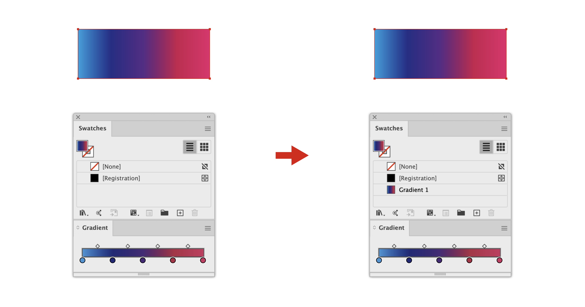

#### 使用方法
パスオブジェクトを選択してスクリプトを実行します。

> **Note**  
> テキスト、線の色には対応していません。

#### 動作条件
Illustrator CS以降

<div align="right">[ <a href="#カラー">↑ トップへ戻る ↑</a> ]</div>
<br>


# <a name="alignInCenterOfSpaceHorizontal--Verticaljs">alignInCenterOfSpace(Horizontal | Vertical).js</a>
[](https://github.com/sky-chaser-high/adobe-illustrator-scripts/releases/latest/download/Path.zip)  
余白の水平または垂直方向中央にオブジェクトを整列します。

例 alignInCenterOfSpace(Vertical).js:
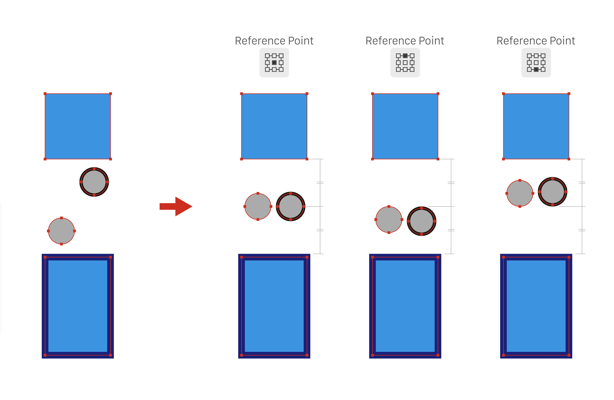

#### 使用方法
オブジェクトを選択してスクリプトを実行します。  
整列の位置は、基準点により変わります。

> **Note**  
> 余白は線幅を含みません。  
> オブジェクトは3つ以上選択してください。

#### 動作条件
Illustrator CS3以降

<div align="right">[ <a href="#パス">↑ トップへ戻る ↑</a> ]</div>
<br>


# <a name="arrangeWindowsjs">arrangeWindows.js</a>
[](https://github.com/sky-chaser-high/adobe-illustrator-scripts/releases/latest/download/Utility.zip)  
開いているすべてのウィンドウを分割して並べて表示します。

> **Note**  
> バージョン2022からアプリケーションバーに実装されています。


#### 使用方法
このスクリプトを実行するだけです。

#### 動作条件
Illustrator CS6以降

<div align="right">[ <a href="#ユーティリティ">↑ トップへ戻る ↑</a> ]</div>
<br>


# <a name="checkDayOfWeekjs">checkDayOfWeek.js</a>
[](https://github.com/sky-chaser-high/adobe-illustrator-scripts/releases/latest/download/Utility.zip)  
選択した日付の曜日をチェックします。


> **Note** Illustrator日本語版を使用している場合は、UIは日本語で表示します。

#### 使用方法
カーソルで日付を選択してスクリプトを実行します。

> **Note**  
> 年がない場合（月日のみ）は、今年とみなします。  
> 日付が正しくない場合は警告を表示します。  
> チェック可能な日付の書式は下記になります。

> **書式**  
> `YYYY/MM/DD`, `MM/DD/YYYY`, `DD/MM/YYYY`,   
> `YYYY-MM-DD`, `MM-DD-YYYY`, `DD-MM-YYYY`,  
> `YYYY.MM.DD`, `MM.DD.YYYY`, `DD.MM.YYYY`,  
> `YYYY MM DD`,  
> `YYYY年MM月DD日`,  
> `Jan(uary) (the) DD(st|nd|rd|th)(,) YYYY`, `MM DD(st|nd|rd|th)(,) YYYY`,  
> `DD(st|nd|rd|th) (of) Jan(uary)(,) YYYY`, `DD(st|nd|rd|th) MM(,) YYYY`

#### 動作条件
Illustrator CS4以降

<div align="right">[ <a href="#ユーティリティ">↑ トップへ戻る ↑</a> ]</div>
<br>


# <a name="closeAllDocumentsjs">closeAllDocuments.js</a>
[](https://github.com/sky-chaser-high/adobe-illustrator-scripts/releases/latest/download/Utility.zip)  
すべてのファイルを閉じます。  
編集中のファイルがある場合は、保存してから閉じるかを選択します。

> **Note**  
> バージョン2021からファイルメニューに実装されています。

#### 使用方法
このスクリプトを実行するだけです。  

#### 動作条件
Illustrator CS4以降

<div align="right">[ <a href="#ユーティリティ">↑ トップへ戻る ↑</a> ]</div>
<br>


# <a name="closePathjs">closePath.js</a>
[](https://github.com/sky-chaser-high/adobe-illustrator-scripts/releases/latest/download/Path.zip)  
開いているパスを閉じます。


#### 使用方法
パスオブジェクトを選択してスクリプトを実行します。

#### 動作条件
Illustrator CS以降

<div align="right">[ <a href="#パス">↑ トップへ戻る ↑</a> ]</div>
<br>


# <a name="compareScalejs">compareScale.js</a>
[](https://github.com/sky-chaser-high/adobe-illustrator-scripts/releases/latest/download/Utility.zip)  
2つのオブジェクトを比較して拡大・縮小率を表示します。


> **Note** Illustrator日本語版を使用している場合は、UIは日本語で表示します。

#### 使用方法
2つのオブジェクトを選択してスクリプトを実行します。

> **Note**  
> 寸法の単位はルーラー単位により変わります。

#### 動作条件
Illustrator CS4以降

<div align="right">[ <a href="#ユーティリティ">↑ トップへ戻る ↑</a> ]</div>
<br>


# <a name="convertAllAnchorPointsToCornerjs">convertAllAnchorPointsToCorner.js</a>
[](https://github.com/sky-chaser-high/adobe-illustrator-scripts/releases/latest/download/Path.zip)  
すべてのアンカーポイントをコーナーポイントに切り替えます。  
コントロールパネルの機能ではアンカーポイントを選択しなければなりませんが、このスクリプトではオブジェクト全体を選択します。


#### 使用方法
選択ツールでパスオブジェクト全体を選択してスクリプトを実行します。

> **Note**  
> ダイレクト選択ツールでアンカーポイントを選択する必要はありません。

#### 動作条件
Illustrator CS以降

<div align="right">[ <a href="#パス">↑ トップへ戻る ↑</a> ]</div>
<br>


# <a name="convertToGlobalColorjsconvertToSpotColorjs">convertToGlobalColor.js<br>convertToSpotColor.js</a>
[](https://github.com/sky-chaser-high/adobe-illustrator-scripts/releases/latest/download/Color.zip)  
スウォッチをグローバルカラーまたは特色に変換します。

convertToGlobalColor.js:
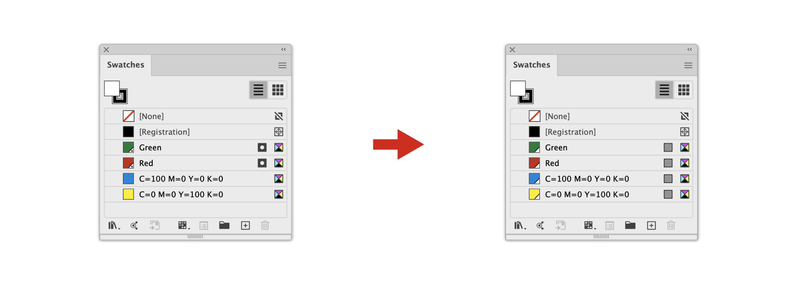

convertToSpotColor.js:
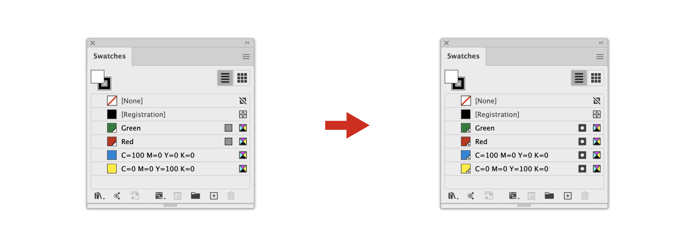

#### 使用方法
変換したいスウォッチを選択してスクリプトを実行します。  
選択しない場合は、すべてのスウォッチが対象になります。

> **Note**  
> 同名のスウォッチがある場合は変換しません。  
> プロセスカラーを変換する場合は、スウォッチに登録し直すため表示順が変わります。

#### 動作条件
Illustrator CS以降

<div align="right">[ <a href="#カラー">↑ トップへ戻る ↑</a> ]</div>
<br>


# <a name="convertTypeOnAPathToPointTypejs">convertTypeOnAPathToPointType.js</a>
[](https://github.com/sky-chaser-high/adobe-illustrator-scripts/releases/latest/download/Text.zip)  
パス上文字をポイント文字に切り替えます。


#### 使用方法
パス上文字を選択してスクリプトを実行します。

> **Warning**  
> 元のパス上文字は削除されます。  
> アピアランスで適用していた効果は失われます。

#### 動作条件
Illustrator CS以降

<div align="right">[ <a href="#テキスト">↑ トップへ戻る ↑</a> ]</div>
<br>


# <a name="copyLineDownjscopyLineUpjs">copyLineDown.js<br>copyLineUp.js</a>
[](https://github.com/sky-chaser-high/adobe-illustrator-scripts/releases/latest/download/Text.zip)  
Visual Studio Code の「行を下へコピー」( <kbd>Option</kbd> / <kbd>Alt</kbd> + <kbd>Shift</kbd> + <kbd>↓</kbd> )、
「行を上へコピー」( <kbd>Option</kbd> / <kbd>Alt</kbd> + <kbd>Shift</kbd> + <kbd>↑</kbd> )と同様のことができます。  
[Keyboard Maestro](https://www.keyboardmaestro.com/main/)、
[SPAi](https://tama-san.com/spai/) や
[Sppy](https://sppy.stars.ne.jp/sppyai)
などでショートカットを割り当てると、より一層Visual Studio Codeの操作感が出せると思います。  
ポイント文字、エリア内文字のどちらにも対応しています。


例 copyLineDown.js:


#### 使用方法
コピーしたい行にカーソルを合わせてスクリプトを実行します。  
1行すべてを選択する必要はありません。

> **Warning**  
> カーソルを移動させるためにスクリプト内部でコピー＆ペーストを行っています。そのため、あらかじめ文字列等をコピーしていた場合はその内容が失われてしまいます。  
> エリア内文字で文字の折り返しがある行をコピーする場合、うまく動作しないことがあります。  
> copyLineDown.jsで最終行をコピーする場合は、バグを回避するために空行を追加します。

> **Note**  
> コピーできるのは1行のみです。複数行には対応していません。  
> バージョン2020以前の場合は、スクリプトを実行するとキーボードが反応しなくなります。  
> テキストを編集する場合はマウスでテキストをクリックしてください。

#### 動作条件
Illustrator CC 2018以降

<div align="right">[ <a href="#テキスト">↑ トップへ戻る ↑</a> ]</div>
<br>


# <a name="copyLineEmptySelectionjscutLineEmptySelectionjs">copyLine(emptySelection).js<br>cutLine(emptySelection).js</a>
[](https://github.com/sky-chaser-high/adobe-illustrator-scripts/releases/latest/download/Text.zip)  
Visual Studio Code のショートカット「コピー（選択なし）」( <kbd>⌘</kbd> / <kbd>Ctrl</kbd> + <kbd>C</kbd> )、
「切り取り（選択なし）」( <kbd>⌘</kbd> / <kbd>Ctrl</kbd> + <kbd>X</kbd> )と同様のことができます。  
[Keyboard Maestro](https://www.keyboardmaestro.com/main/)、
[SPAi](https://tama-san.com/spai/) や
[Sppy](https://sppy.stars.ne.jp/sppyai)
などでショートカットを割り当てると、より一層Visual Studio Codeの操作感が出せると思います。  
ポイント文字、エリア内文字のどちらにも対応しています。

例 cutLine(emptySelection).js:


#### 使用方法
コピーまたは、カットしたい行にカーソルを合わせてスクリプトを実行します。  
1行すべてを選択する必要はありません。

> **Warning**  
> バグを回避するために改行は含みません。  
> エリア内文字で文字の折り返しがある行をコピーまたはカットする場合、うまく動作しないことがあります。

> **Note**  
> バージョン2020以前の場合は、スクリプトを実行するとキーボードが反応しなくなります。  
> テキストを編集する場合はマウスでテキストをクリックしてください。

#### 動作条件
Illustrator CC 2018以降

<div align="right">[ <a href="#テキスト">↑ トップへ戻る ↑</a> ]</div>
<br>


# <a name="createColorChartjs">createColorChart.js</a>
[](https://github.com/sky-chaser-high/adobe-illustrator-scripts/releases/latest/download/Color.zip)  
カラーチャートを作成します。CMYK、RGB のどちらにも対応しています。


> **Note** Illustrator日本語版を使用している場合は、UIは日本語で表示します。

#### 使用方法
1. スクリプトを実行します。
2. カラーモード「CMYK」または「RGB」を選択します。  
   パスオブジェクトを選択している場合は、塗りの値が初期値として使用されます。
3. 垂直方向、水平方向で増減させたい色を選択します。
4. 増減値を入力します。
5. アートボードサイズ、カラーチップサイズ、単位を設定します。

> **Note**  
> 新規ドキュメントにカラーチャートを作成します。

#### 動作条件
Illustrator CS4以降

<div align="right">[ <a href="#カラー">↑ トップへ戻る ↑</a> ]</div>
<br>


# <a name="createGridLinesjs">createGridLines.js</a>
[](https://github.com/sky-chaser-high/adobe-illustrator-scripts/releases/latest/download/Path.zip)  
アートボードにグリッドを作成します。


#### 使用方法
このスクリプトを実行するだけです。

> **Note**  
> グリッドの間隔は環境設定のガイド・グリッド項目の設定に依存します。

#### 動作条件
Illustrator CS以降

<div align="right">[ <a href="#パス">↑ トップへ戻る ↑</a> ]</div>
<br>


# <a name="createPageNumbersjs">createPageNumbers.js</a>
[](https://github.com/sky-chaser-high/adobe-illustrator-scripts/releases/latest/download/Text.zip)  
InDesignの書式メニュー > 特殊文字を挿入 > マーカー > 現在のページ番号 に相当します。  
アートボードの指定した位置にノンブルを配置します。


> **Note** Illustrator日本語版を使用している場合は、UIは日本語で表示します。

#### 使用方法
1. スクリプトを実行します。
2. 各項目を設定します。
   - `位置` ノンブルの表示位置。
   - `見開き` チェックを入れると見開きページに対応します。
   - `開始ページ番号` 始まりの番号を指定します。
   - `セクションプレフィックス` ノンブルの前に文字列を追加します。見開きページの場合は、後ろに追加します。
   - `フォントサイズ` ノンブルのフォントサイズ。
   - `マージン` アートボードからの距離を指定します。現在のルーラー設定で単位が切り替わります。

> **Note**  
> ノンブルに指定できるスタイルは数字のみです。  
> アートボード順にノンブルを割り当てます。

#### 動作条件
Illustrator CS4以降

<div align="right">[ <a href="#テキスト">↑ トップへ戻る ↑</a> ]</div>
<br>


# <a name="deleteAllLeftjsdeleteAllRightjs">deleteAllLeft.js<br>deleteAllRight.js</a>
[](https://github.com/sky-chaser-high/adobe-illustrator-scripts/releases/latest/download/Text.zip)  
Visual Studio Code のショートカット「左側をすべて削除」( <kbd>⌘</kbd> + <kbd>Backspace</kbd> )、
「右側をすべて削除」( <kbd>⌘</kbd> + <kbd>Delete</kbd> )と同様のことができます。  
[Keyboard Maestro](https://www.keyboardmaestro.com/main/)、
[SPAi](https://tama-san.com/spai/) や
[Sppy](https://sppy.stars.ne.jp/sppyai)
などでショートカットを割り当てると、より一層Visual Studio Codeの操作感が出せると思います。  
ポイント文字、エリア内文字のどちらにも対応しています。

例 deleteAllRight.js:


#### 使用方法
削除したい場所にカーソルを合わせてスクリプトを実行します。  
削除する文字列を選択する必要はありません。

> **Warning**  
> カーソルを移動させるためにスクリプト内部でコピー＆ペーストを行っています。そのため、あらかじめ文字列等をコピーしていた場合はその内容が失われてしまいます。

> **Note**  
> 削除できるのは1行のみです。複数行には対応していません。  
> バージョン2020以前の場合は、スクリプトを実行するとキーボードが反応しなくなります。  
> テキストを編集する場合はマウスでテキストをクリックしてください。

#### 動作条件
Illustrator CC 2018以降

<div align="right">[ <a href="#テキスト">↑ トップへ戻る ↑</a> ]</div>
<br>


# <a name="deleteAllSwatchesjs">deleteAllSwatches.js</a>
[](https://github.com/sky-chaser-high/adobe-illustrator-scripts/releases/latest/download/Color.zip)  
［なし］と［レジストレーション］以外のすべてのスウォッチを削除します。

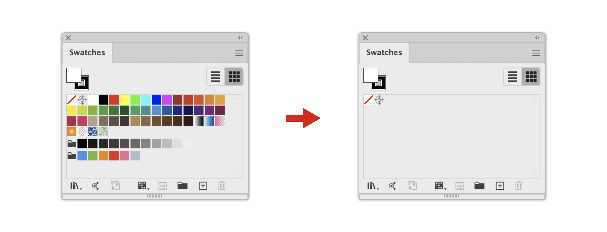

#### 使用方法
このスクリプトを実行するだけです。

> **Note**  
> オブジェクトに使用中のスウォッチも削除します。

#### 動作条件
Illustrator CS以降

<div align="right">[ <a href="#カラー">↑ トップへ戻る ↑</a> ]</div>
<br>


# <a name="deleteHiddenLayersjs">deleteHiddenLayers.js</a>
[](https://github.com/sky-chaser-high/adobe-illustrator-scripts/releases/latest/download/Layer.zip)  
非表示のレイヤーを削除します。

> **Note**  
> バージョン2021からレイヤーパネルメニューに実装されています。


#### 使用方法
このスクリプトを実行するだけです。  

#### 動作条件
Illustrator CS以降

<div align="right">[ <a href="#レイヤー">↑ トップへ戻る ↑</a> ]</div>
<br>


# <a name="deleteLockedLayersjs">deleteLockedLayers.js</a>
[](https://github.com/sky-chaser-high/adobe-illustrator-scripts/releases/latest/download/Layer.zip)  
ロックしているレイヤーを削除します。


#### 使用方法
このスクリプトを実行するだけです。  

#### 動作条件
Illustrator CS以降

<div align="right">[ <a href="#レイヤー">↑ トップへ戻る ↑</a> ]</div>
<br>


# <a name="deleteTrailingSpacesjs">deleteTrailingSpaces.js</a>
[](https://github.com/sky-chaser-high/adobe-illustrator-scripts/releases/latest/download/Text.zip)  
行末のスペースを削除します。
ポイント文字、エリア内文字のどちらにも対応しています。


#### 使用方法
テキストオブジェクトを選択してスクリプトを実行します。  
スペースがある文字列を選択する必要はありません。

> **Warning**  
> エリア内文字で文字の折り返しがある場合、うまく動作しないことがあります。

> **Note**  
> タブも削除の対象になります。

#### 動作条件
Illustrator CS以降

<div align="right">[ <a href="#テキスト">↑ トップへ戻る ↑</a> ]</div>
<br>


# <a name="deleteUnusedLayersjs">deleteUnusedLayers.js</a>
[](https://github.com/sky-chaser-high/adobe-illustrator-scripts/releases/latest/download/Layer.zip)  
未使用（空）のレイヤーを削除します。サブレイヤーも対象です。


#### 使用方法
このスクリプトを実行するだけです。  
未使用レイヤーを選択する必要はありません。

#### 動作条件
Illustrator CS以降

<div align="right">[ <a href="#レイヤー">↑ トップへ戻る ↑</a> ]</div>
<br>


# <a name="deleteWordjs">deleteWord.js</a>
[](https://github.com/sky-chaser-high/adobe-illustrator-scripts/releases/latest/download/Text.zip)  
カーソル位置の単語を削除します。
ポイント文字、エリア内文字のどちらにも対応しています。


#### 使用方法
削除したい単語の位置にカーソルを合わせてスクリプトを実行します。  
削除する単語を選択する必要はありません。

> **Warning**  
> カーソルを移動させるためにスクリプト内部でコピー＆ペーストを行っています。そのため、あらかじめ文字列等をコピーしていた場合はその内容が失われてしまいます。  
> エリア内文字で文字の折り返しがある場合、うまく動作しないことがあります。

> **Note**  
> バージョン2020以前の場合は、スクリプトを実行するとキーボードが反応しなくなります。  
> テキストを編集する場合はマウスでテキストをクリックしてください。

#### 動作条件
Illustrator CC 2018以降

<div align="right">[ <a href="#テキスト">↑ トップへ戻る ↑</a> ]</div>
<br>


# <a name="disjoinPathjs">disjoinPath.js</a>
[](https://github.com/sky-chaser-high/adobe-illustrator-scripts/releases/latest/download/Path.zip)  
アンカーポイントごとにパスオブジェクトを分割します。


#### 使用方法
パスオブジェクトを選択してスクリプトを実行します。

> **Warning**  
> 元のパスオブジェクトは削除されます。

#### 動作条件
Illustrator CS以降

<div align="right">[ <a href="#パス">↑ トップへ戻る ↑</a> ]</div>
<br>


# <a name="distributeInSpaceHorizontal--Verticaljs">distributeInSpace(Horizontal | Vertical).js</a>
[](https://github.com/sky-chaser-high/adobe-illustrator-scripts/releases/latest/download/Path.zip)  
余白の水平または垂直方向にオブジェクトを分布します。

例 distributeInSpace(Vertical).js:
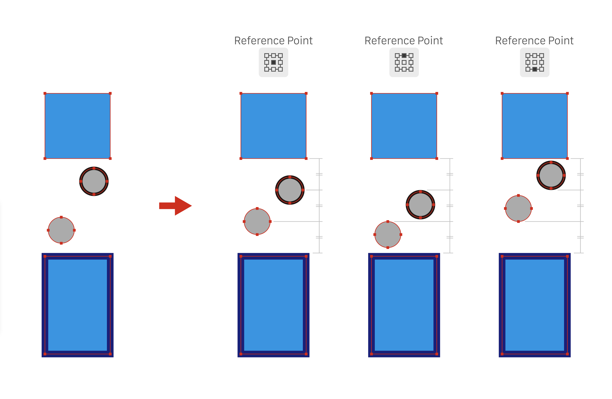

#### 使用方法
オブジェクトを選択してスクリプトを実行します。  
分布の位置は、基準点により変わります。

> **Note**  
> 余白は線幅を含みません。  
> オブジェクトは3つ以上選択してください。

#### 動作条件
Illustrator CS3以降

<div align="right">[ <a href="#パス">↑ トップへ戻る ↑</a> ]</div>
<br>


# <a name="drawCircumscribedCirclejs">drawCircumscribedCircle.js</a>
[](https://github.com/sky-chaser-high/adobe-illustrator-scripts/releases/latest/download/Path.zip)  
アンカーポイント3点、または2点を通る外接円を描きます。

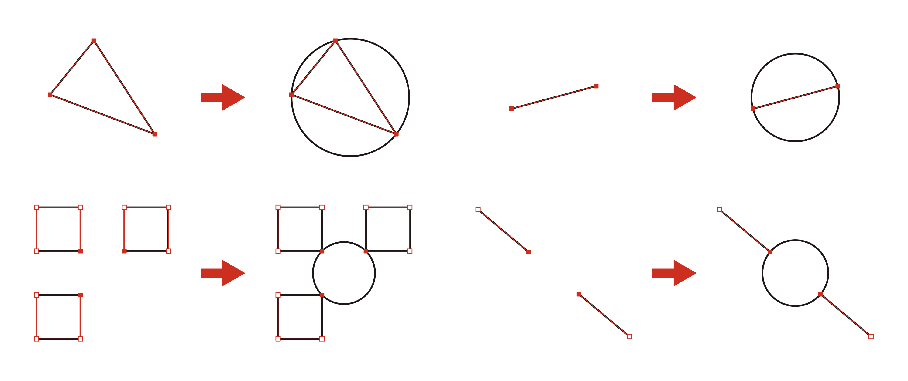

#### 使用方法
ダイレクト選択ツールで3点、または2点のアンカーポイントを選択してスクリプトを実行します。

> **Note**  
> アンカーポイント2点の場合は、直径になります。  
> パス上文字、エリア内文字のアンカーポイントにも対応しています。

#### 動作条件
Illustrator CS以降

<div align="right">[ <a href="#パス">↑ トップへ戻る ↑</a> ]</div>
<br>


# <a name="drawRectanglejs">drawRectangle.js</a>
[](https://github.com/sky-chaser-high/adobe-illustrator-scripts/releases/latest/download/Path.zip)  
オブジェクトの周囲に長方形を描きます。


> **Note** Illustrator日本語版を使用している場合は、UIは日本語で表示します。

#### 使用方法
1. パスオブジェクトを選択してスクリプトを実行します。
2. マージンを入力します。  
   線幅を含めたい場合は、線幅を含むチェックボックスにチェックを入れます。

> **Note**  
> 塗りと線幅なしの長方形を描きます。  
> マージンの単位はルーラー単位により変わります。

#### 動作条件
Illustrator CS4以降

<div align="right">[ <a href="#パス">↑ トップへ戻る ↑</a> ]</div>
<br>


# <a name="drawShapeOnAnchorPointjs">drawShapeOnAnchorPoint.js</a>
[](https://github.com/sky-chaser-high/adobe-illustrator-scripts/releases/latest/download/Path.zip)  
アンカーポイントの位置に図形を描きます。


> **Note** Illustrator日本語版を使用している場合は、UIは日本語で表示します。

#### 使用方法
1. パスオブジェクトを選択してスクリプトを実行します。
2. 描く図形を選択します。
3. 図形のサイズを入力します。
4. ハンドルの位置を描きたい場合は、「ハンドル位置も描く」にチェックを入れます。

> **Note**  
> ダイレクト選択ツールでアンカーポイントを選択すると、選択した箇所にだけ図形を描きます。  
> ハンドル位置は線で描きます。  
> 図形サイズの単位はルーラー単位により変わります。

#### 動作条件
Illustrator CS4以降

<div align="right">[ <a href="#パス">↑ トップへ戻る ↑</a> ]</div>
<br>


# <a name="encloseWordInParenthesesjs">encloseWordInParentheses.js</a>
[](https://github.com/sky-chaser-high/adobe-illustrator-scripts/releases/latest/download/Text.zip)  
文字列を丸括弧（パーレン）で囲みます。


#### 使用方法
括弧で囲みたい文字にカーソルを合わせてスクリプトを実行します。  
文字列を範囲指定した場合はその箇所を囲みます。

> **Warning**  
> 半角パーレンになります。全角パーレンにしたい場合は、下記の方法でスクリプトを書き換えてください。  
> カーソルを移動させるためにスクリプト内部でカット＆ペーストを行っています。そのため、あらかじめ文字列等をコピーしていた場合はその内容が失われてしまいます。  
> エリア内文字で文字の折り返しがある場合、うまく動作しないことがあります。

> **Note**  
> バージョン2020以前の場合は、スクリプトを実行するとキーボードが反応しなくなります。  
> テキストを編集する場合はマウスでテキストをクリックしてください。

丸括弧以外の文字で囲みたい場合は、スクリプト内の41、42行目を変更してください。  
例えば、角括弧 `[ ]` で囲みたい場合は以下のようにします。
```javascript
var parentheses = {
    start: '[',
    end: ']'
};
```

#### 動作条件
Illustrator CC 2018以降

<div align="right">[ <a href="#テキスト">↑ トップへ戻る ↑</a> ]</div>
<br>


# <a name="exportColorValuesToCSVjs">exportColorValuesToCSV.js</a>
[](https://github.com/sky-chaser-high/adobe-illustrator-scripts/releases/latest/download/Color.zip)  
パスオブジェクトまたはスウォッチのカラー数値をCSVファイルに書き出します。

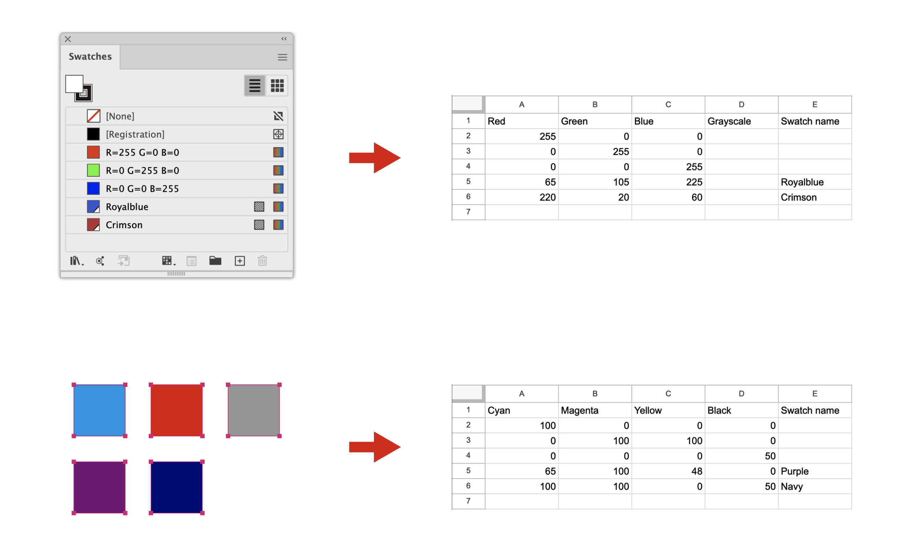

#### 使用方法
パスオブジェクトまたはスウォッチを選択してスクリプトを実行します。  
すべてのスウォッチを書き出したい場合は、パスオブジェクトとスウォッチの選択を解除してください。  

> **Note**  
> スウォッチ名を書き出したい場合は、グローバルカラーを使用してください。  
> デスクトップに書き出します。  
> パスオブジェクトを優先します。  
> テキスト、グラデーションは対応していません。

#### 動作条件
Illustrator CS以降

<div align="right">[ <a href="#カラー">↑ トップへ戻る ↑</a> ]</div>
<br>


# <a name="extendHandlejs">extendHandle.js</a>
[](https://github.com/sky-chaser-high/adobe-illustrator-scripts/releases/latest/download/Path.zip)  
ハンドルを伸縮します。

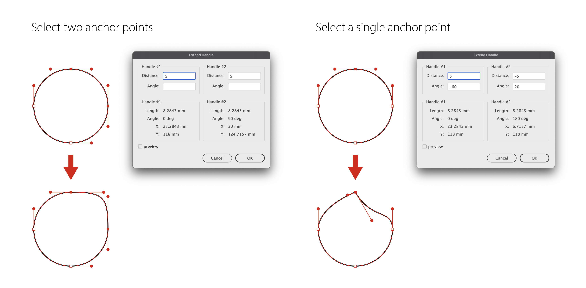
> **Note** Illustrator日本語版を使用している場合は、UIは日本語で表示します。

#### 使用方法
1. ダイレクト選択ツールで1点、または2点のアンカーポイントを選択してスクリプトを実行します。
2. 数値を入力します。正の値で伸び、負の値で縮みます。

> **Note**  
> ハンドルは削除できません。  
> 距離の単位はルーラー単位により変わります。

#### 動作条件
Illustrator CS4以降

<div align="right">[ <a href="#パス">↑ トップへ戻る ↑</a> ]</div>
<br>


# <a name="extendLinejs">extendLine.js</a>
[](https://github.com/sky-chaser-high/adobe-illustrator-scripts/releases/latest/download/Path.zip)  
パスオブジェクトを伸縮します。


> **Note** Illustrator日本語版を使用している場合は、UIは日本語で表示します。

#### 使用方法
1. ダイレクト選択ツールでアンカーポイントを選択してスクリプトを実行します。
2. 数値を入力します。正の値で伸び、負の値で縮みます。

> **Warning**  
> 閉じたパスと曲線には対応していません。

> **Note**  
> 距離の単位はルーラー単位により変わります。

#### 動作条件
Illustrator CS4以降

<div align="right">[ <a href="#パス">↑ トップへ戻る ↑</a> ]</div>
<br>


# <a name="extractColorsFromGradientjs">extractColorsFromGradient.js</a>
[](https://github.com/sky-chaser-high/adobe-illustrator-scripts/releases/latest/download/Color.zip)  
グラデーションのカラー分岐点からそれぞれ色を取り出してスウォッチに追加します。


#### 使用方法
パスオブジェクトまたはスウォッチから色を選択してスクリプトを実行します。

> **Note**  
> パスオブジェクトを優先します。  
> スウォッチから色を取り出したい場合はパスオブジェクトの選択を解除してください。  
> テキスト、線の色には対応していません。

#### 動作条件
Illustrator CS以降

<div align="right">[ <a href="#カラー">↑ トップへ戻る ↑</a> ]</div>
<br>


# <a name="fitGuideInArtboardjs">fitGuideInArtboard.js</a>
[](https://github.com/sky-chaser-high/adobe-illustrator-scripts/releases/latest/download/Path.zip)  
ガイドをアートボードにフィットさせます。


#### 使用方法
ガイドオブジェクトを選択してスクリプトを実行します。

> **Note**  
> 閉じたパスと曲線には対応していません。

#### 動作条件
Illustrator CS以降

<div align="right">[ <a href="#パス">↑ トップへ戻る ↑</a> ]</div>
<br>


# <a name="generateGradientColorjs">generateGradientColor.js</a>
[](https://github.com/sky-chaser-high/adobe-illustrator-scripts/releases/latest/download/Color.zip)  
オブジェクトの塗り色またはスウォッチからグラデーションを生成します。


#### 使用方法
パスオブジェクトまたはスウォッチからグラデーションを選択してスクリプトを実行します。

> **Note**  
> パスオブジェクトを優先します。  
> スウォッチからグラデーションを生成したい場合はパスオブジェクトの選択を解除してください。  
> テキスト、線の色には対応していません。

#### 動作条件
Illustrator CS4以降

<div align="right">[ <a href="#カラー">↑ トップへ戻る ↑</a> ]</div>
<br>


# <a name="goToLinejs">goToLine.js</a>
[](https://github.com/sky-chaser-high/adobe-illustrator-scripts/releases/latest/download/Text.zip)  
Visual Studio Code の「行/列に移動...」( <kbd>Ctrl</kbd> + <kbd>G</kbd> )と同様のことができます。  
[Keyboard Maestro](https://www.keyboardmaestro.com/main/)、
[SPAi](https://tama-san.com/spai/) や
[Sppy](https://sppy.stars.ne.jp/sppyai)
などでショートカットを割り当てると、より一層Visual Studio Codeの操作感が出せると思います。  
ポイント文字、エリア内文字のどちらにも対応しています。


> **Note** Illustrator日本語版を使用している場合は、UIは日本語で表示します。

#### 使用方法
1. テキスト編集状態でスクリプトを実行します。
2. 行番号を入力するか、リストから移動したい行を選択します。

> **Warning**  
> カーソルを移動させるためにスクリプト内部でコピー＆ペーストを行っています。そのため、あらかじめ文字列等をコピーしていた場合はその内容が失われてしまいます。

> **Note**  
> 選択した行がウィンドウの中央に来るようにパンします。  
> バージョン2020以前の場合は、スクリプトを実行するとキーボードが反応しなくなります。  
> テキストを編集する場合はマウスでテキストをクリックしてください。

#### 動作条件
Illustrator CC 2018以降

<div align="right">[ <a href="#テキスト">↑ トップへ戻る ↑</a> ]</div>
<br>


# <a name="goToNextTextjsgoToPreviousTextjs">goToNextText.js<br>goToPreviousText.js</a>
[](https://github.com/sky-chaser-high/adobe-illustrator-scripts/releases/latest/download/Text.zip)  
テキスト編集状態のまま、カーソルを次または前のテキストオブジェクトの先頭に移動します。  
ポイント文字、エリア内文字のどちらにも対応しています。

例 goToNextText.js:


#### 使用方法
テキスト編集状態でスクリプトを実行します。

> **Warning**  
> カーソルを移動させるためにスクリプト内部でカット＆ペーストを行っています。そのため、あらかじめ文字列等をコピーしていた場合はその内容が失われてしまいます。  
> ロック、非表示状態またはスレッドテキストには移動しません。レイヤーの状態も同様です。

> **Note**  
> カーソルの移動順は、テキストの作成順になります。  
> 次または前のテキストがウィンドウの中央に来るようにパンします。  
> バージョン2020以前の場合は、スクリプトを実行するとキーボードが反応しなくなります。  
> テキストを編集する場合はマウスでテキストをクリックしてください。

#### 動作条件
Illustrator CC 2018以降

<div align="right">[ <a href="#テキスト">↑ トップへ戻る ↑</a> ]</div>
<br>


# <a name="highlightWordjs">highlightWord.js</a>
[](https://github.com/sky-chaser-high/adobe-illustrator-scripts/releases/latest/download/Color.zip)  
入力した単語の塗り色を変更します。CMYK、RGB のどちらにも対応しています。


> **Note** Illustrator日本語版を使用している場合は、UIは日本語で表示します。

#### 使用方法
1. テキストオブジェクトを選択してスクリプトを実行します。
2. 単語を入力します。
3. 必要に応じて色を設定します。

#### 動作条件
Illustrator CS4以降

<div align="right">[ <a href="#カラー">↑ トップへ戻る ↑</a> ]</div>
<br>


# <a name="importCSVtoSwatchjs">importCSVtoSwatch.js</a>
[](https://github.com/sky-chaser-high/adobe-illustrator-scripts/releases/latest/download/Color.zip)  
CSVファイルからカラー数値を読み込んでスウォッチに追加します。

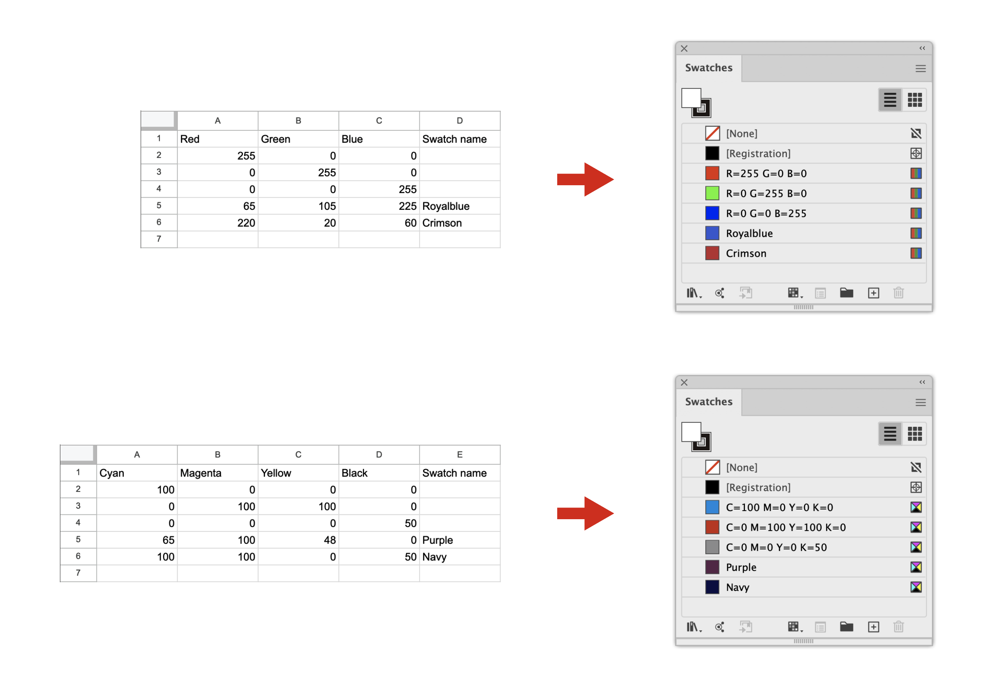

#### 使用方法
1. スクリプトを実行します。
2. CSVファイルを選択します。

> **Note**  
> ドキュメントのカラーモードとCSVファイルの形式をそろえてください。

#### ファイル形式
CSVファイルの形式は以下の3種類になります。

> **Note**  
> 各列はカンマまたはタブで区切ってください。  
> 1行目は項目名を入力してください。  
> スウォッチ名は必須ではありません。

##### CMYK  
| Cyan | Magenta | Yellow | Black | Swatch name |
| --- | --- | --- | --- | --- |
| 100  | 0 | 0 | 0 | Cyan |

##### RGB  
| Red | Green | Blue | Swatch name |
| --- | --- | --- | --- |
| 255 | 0 | 0 | Red |

##### HEX  
| Hex | Swatch name |
| --- | --- |
| FF0000 | Red |

> **Note**  
> Hexカラーを使用する場合は、先頭の"#"を省略できます。  
> Hexカラーが3桁の場合は、CSSと同様のふるまいをします。（例：#F0F → #FF00FF）

#### 動作条件
Illustrator CS以降

<div align="right">[ <a href="#カラー">↑ トップへ戻る ↑</a> ]</div>
<br>


# <a name="insertLineAbovejsinsertLineBelowjs">insertLineAbove.js<br>insertLineBelow.js</a>
[](https://github.com/sky-chaser-high/adobe-illustrator-scripts/releases/latest/download/Text.zip)  
Visual Studio Code のショートカット「上に行を挿入」( <kbd>⌘</kbd> / <kbd>Ctrl</kbd> + <kbd>Shift</kbd> + <kbd>Enter</kbd> )、
「下に行を挿入」( <kbd>⌘</kbd> / <kbd>Ctrl</kbd> + <kbd>Enter</kbd> )と同様のことができます。  
[Keyboard Maestro](https://www.keyboardmaestro.com/main/)、
[SPAi](https://tama-san.com/spai/) や
[Sppy](https://sppy.stars.ne.jp/sppyai)
などでショートカットを割り当てると、より一層Visual Studio Codeの操作感が出せると思います。  
ポイント文字、エリア内文字のどちらにも対応しています。

例 insertLineBelow.js:


#### 使用方法
行を追加したい位置の下または上の行にカーソルを合わせてスクリプトを実行します。  
行末にカーソルを移動する必要はありません。

> **Warning**  
> エリア内文字で文字の折り返しがある行に対して挿入する場合、うまく動作しないことがあります。

> **Note**  
> バージョン2020以前の場合は、スクリプトを実行するとキーボードが反応しなくなります。  
> テキストを編集する場合はマウスでテキストをクリックしてください。

#### 動作条件
Illustrator CC 2018以降

<div align="right">[ <a href="#テキスト">↑ トップへ戻る ↑</a> ]</div>
<br>


# <a name="invertLockedLayerjs">invertLockedLayer.js</a>
[](https://github.com/sky-chaser-high/adobe-illustrator-scripts/releases/latest/download/Layer.zip)  
レイヤーの表示／非表示を切り替えます。


#### 使用方法
このスクリプトを実行するだけです。  

#### 動作条件
Illustrator CS以降

<div align="right">[ <a href="#レイヤー">↑ トップへ戻る ↑</a> ]</div>
<br>


# <a name="invertVisibleLayerjs">invertVisibleLayer.js</a>
[](https://github.com/sky-chaser-high/adobe-illustrator-scripts/releases/latest/download/Layer.zip)  
レイヤーのロック状態を切り替えます。


#### 使用方法
このスクリプトを実行するだけです。  

#### 動作条件
Illustrator CS以降

<div align="right">[ <a href="#レイヤー">↑ トップへ戻る ↑</a> ]</div>
<br>


# <a name="justifyContentSpaceBetweenjs">justifyContentSpaceBetween.js</a>
[](https://github.com/sky-chaser-high/adobe-illustrator-scripts/releases/latest/download/Text.zip)  
トラッキングを調整してポイント文字の両端を揃えます。  
縦書きにも対応しています。

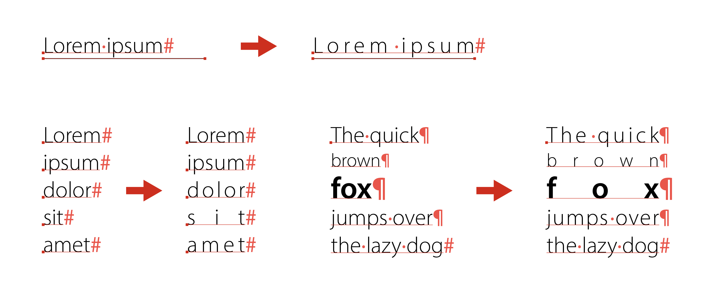

#### 使用方法
ポイント文字と揃える基準のパスオブジェクトを選択してスクリプトを実行します。  
ポイント文字同士で揃えたい場合は、ポイント文字のみ選択します。

> **Note**  
> 1行の文字列中に異なるフォントサイズの文字が混在していると両端揃いになりません。  
> 文字の位置は移動しません。  
> 最も長いオブジェクトを基準にします。

#### 動作条件
Illustrator CS以降

<div align="right">[ <a href="#テキスト">↑ トップへ戻る ↑</a> ]</div>
<br>


# <a name="matchLocationOfGradientStopjs">matchLocationOfGradientStop.js</a>
[](https://github.com/sky-chaser-high/adobe-illustrator-scripts/releases/latest/download/Color.zip)  
グラデーションのカラー分岐点、中間点を同期します。


> **Note** Illustrator日本語版を使用している場合は、UIは日本語で表示します。

#### 使用方法
1. スウォッチからグラデーションを2つ以上選択してスクリプトを実行します。
2. 元になるグラデーションを選択します。

> **Note**  
> スウォッチにあるグラデーションが対象となります。

#### 動作条件
Illustrator CS4以降

<div align="right">[ <a href="#カラー">↑ トップへ戻る ↑</a> ]</div>
<br>


# <a name="measureDistancejs">measureDistance.js</a>
[](https://github.com/sky-chaser-high/adobe-illustrator-scripts/releases/latest/download/Utility.zip)  
2点間のアンカーポイントの距離を正確に測ります。

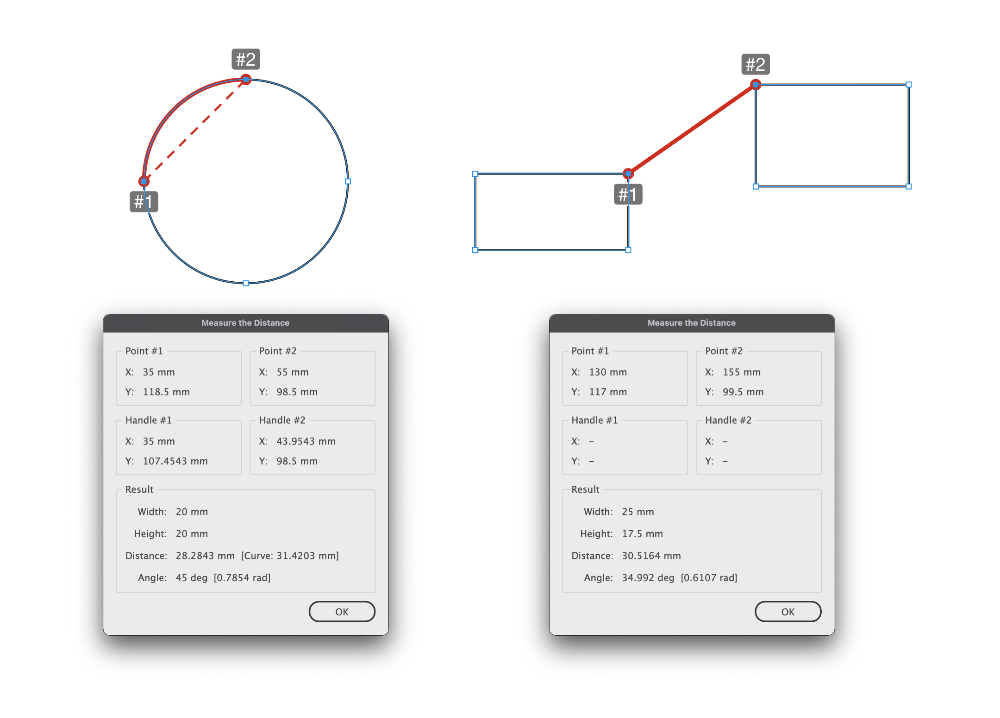
> **Note** Illustrator日本語版を使用している場合は、UIは日本語で表示します。

#### 使用方法
ダイレクト選択ツールで2点のアンカーポイントを選択してスクリプトを実行します。

> **Note**  
> 測定箇所をハイライトします。  
> 角度はポイント#1を基準にします。  
> 寸法の単位はルーラー単位により変わります。  
> パス上文字、エリア内文字のアンカーポイントにも対応しています。

#### 動作条件
Illustrator CS4以降

<div align="right">[ <a href="#ユーティリティ">↑ トップへ戻る ↑</a> ]</div>
<br>


# <a name="moveLineDownjsmoveLineUpjs">moveLineDown.js<br>moveLineUp.js</a>
[](https://github.com/sky-chaser-high/adobe-illustrator-scripts/releases/latest/download/Text.zip)  
Visual Studio Code の「行を下へ移動」( <kbd>Option</kbd> / <kbd>Alt</kbd> + <kbd>↓</kbd> )、
「行を上へ移動」( <kbd>Option</kbd> / <kbd>Alt</kbd> + <kbd>↑</kbd> )と同様のことができます。  
[Keyboard Maestro](https://www.keyboardmaestro.com/main/)、
[SPAi](https://tama-san.com/spai/) や
[Sppy](https://sppy.stars.ne.jp/sppyai)
などでショートカットを割り当てると、より一層Visual Studio Codeの操作感が出せると思います。  
ポイント文字、エリア内文字のどちらにも対応しています。


例 moveLineDown.js:


#### 使用方法
移動したい行にカーソルを合わせてスクリプトを実行します。  
移動する行を選択する必要はありません。

> **Warning**  
> カーソルを移動させるためにスクリプト内部でコピー＆ペーストを行っています。そのため、あらかじめ文字列等をコピーしていた場合はその内容が失われてしまいます。  
> エリア内文字で文字の折り返しがある行を移動する場合、うまく動作しないことがあります。  
> moveLineUp.jsで最終行を移動する場合は、バグを回避するために空行を追加します。

> **Note**  
> 移動できるのは1行のみです。複数行には対応していません。  
> バージョン2020以前の場合は、スクリプトを実行するとキーボードが反応しなくなります。  
> テキストを編集する場合はマウスでテキストをクリックしてください。

#### 動作条件
Illustrator CC 2018以降

<div align="right">[ <a href="#テキスト">↑ トップへ戻る ↑</a> ]</div>
<br>


# <a name="moveSublayerToMainLayerjs">moveSublayerToMainLayer.js</a>
[](https://github.com/sky-chaser-high/adobe-illustrator-scripts/releases/latest/download/Layer.zip)  
サブレイヤーを親レイヤーの外へ移動します。


#### 使用方法
このスクリプトを実行するだけです。

#### 動作条件
Illustrator CS以降

<div align="right">[ <a href="#レイヤー">↑ トップへ戻る ↑</a> ]</div>
<br>


# <a name="randomTextColorjs">randomTextColor.js</a>
[](https://github.com/sky-chaser-high/adobe-illustrator-scripts/releases/latest/download/Color.zip)  
単語または、1文字、1文ごとにランダムに色を適用します。CMYK、RGB のどちらにも対応しています。


> **Note** Illustrator日本語版を使用している場合は、UIは日本語で表示します。

#### 使用方法
1. テキストオブジェクトを選択してスクリプトを実行します。
2. スライダーで各色のしきい値を指定します。
3. ランダムボタンをクリックすると、しきい値に応じた色が割り当てられます。

> **Note**  
> 文字数が多いと変換に時間がかかります。  
> 英文の場合、ピリオドやカンマなど一部適用されない文字があります。

#### 動作条件
Illustrator CS4以降

<div align="right">[ <a href="#カラー">↑ トップへ戻る ↑</a> ]</div>
<br>


# <a name="relinkFileExtensionjs">relinkFileExtension.js</a>
[](https://github.com/sky-chaser-high/adobe-illustrator-scripts/releases/latest/download/Link.zip)  
InDesignのリンクパネルメニュー > ファイル拡張子にリンクを再設定... に相当します。


> **Note** Illustrator日本語版を使用している場合は、UIは日本語で表示します。

#### 使用方法
1. 再設定したいリンク画像を選択しスクリプトを実行します。  
   リンク画像を選択しない場合は、ドキュメント内のすべてのリンク画像が対象になります。
2. ファイルの拡張子を入力します。

> **Warning**  
> リンク切れ画像と埋め込み画像は再設定できません。  
> 再設定するリンク画像は、元のリンク画像と同じフォルダに置いてください。

> **Note**  
> リンク画像を選択する場合は、リンクパネルではなくドキュメント内のリンク画像を選択してください。

#### 動作条件
Illustrator CS4以降

<div align="right">[ <a href="#リンク">↑ トップへ戻る ↑</a> ]</div>
<br>


# <a name="relinkFileExtensionExtrajs">relinkFileExtensionExtra.js</a>
[](https://github.com/sky-chaser-high/adobe-illustrator-scripts/releases/latest/download/Link.zip)  
このスクリプトは、relinkFileExtension.js を機能拡張したものです。


> **Note** Illustrator日本語版を使用している場合は、UIは日本語で表示します。

#### 使用方法
1. 再設定したいリンク画像を選択しスクリプトを実行します。  
   リンク画像を選択しない場合は、ドキュメント内のすべてのリンク画像が対象になります。
2. 置換または追加を選択します。  
   置換の場合は、検索で正規表現が使用できます。  
   追加の場合は、元のファイル名の先頭、末尾またはその両方に追加する文字列を入力します。
3. ファイルの拡張子を入力します。  
   拡張子を入力しない場合は、元のファイルの拡張子を使用します。

> **Warning**  
> 濁点または半濁点を含む文字列を検索の対象にすると置換に失敗します。  
> リンク切れ画像と埋め込み画像は再設定できません。  
> 再設定するリンク画像は、元のリンク画像と同じフォルダに置いてください。

> **Note**  
> リンク画像を選択する場合は、リンクパネルではなくドキュメント内のリンク画像を選択してください。

#### 動作条件
Illustrator CS4以降

<div align="right">[ <a href="#リンク">↑ トップへ戻る ↑</a> ]</div>
<br>


# <a name="relinkToFolderjs">relinkToFolder.js</a>
[](https://github.com/sky-chaser-high/adobe-illustrator-scripts/releases/latest/download/Link.zip)  
選択したフォルダーにある同名の画像と置き換えます。  
InDesignのリンクパネルメニュー > フォルダに再リンク... に相当します。


#### 使用方法
1. 再設定したいリンク画像を選択しスクリプトを実行します。  
   リンク画像を選択しない場合は、ドキュメント内のすべてのリンク画像が対象になります。
2. 表示したダイアログからフォルダを選択します。

> **Warning**  
> リンク切れ画像と埋め込み画像は再設定できません。

> **Note**  
> リンク画像を選択する場合は、リンクパネルではなくドキュメント内のリンク画像を選択してください。

#### 動作条件
Illustrator CS4以降

<div align="right">[ <a href="#リンク">↑ トップへ戻る ↑</a> ]</div>
<br>


# <a name="removeColorInGuideObjectjs">removeColorInGuideObject.js</a>
[](https://github.com/sky-chaser-high/adobe-illustrator-scripts/releases/latest/download/Path.zip)  
すべてのガイドオブジェクトの塗りと線の色を削除します。


#### 使用方法
このスクリプトを実行するだけです。  
ガイドオブジェクトを選択する必要はありません。

> **Note**  
> すべてのレイヤーを表示してロックを解除します。  
> <kbd>⌘</kbd> / <kbd>Ctrl</kbd> + <kbd>3</kbd> で非表示のガイドオブジェクトは対象になりません。  
> アピアランスで塗りや線の色を追加している場合は、削除できない場合があります。

#### 動作条件
Illustrator CS6以降

<div align="right">[ <a href="#パス">↑ トップへ戻る ↑</a> ]</div>
<br>


# <a name="removeDeletedGlobalColorjs">removeDeletedGlobalColor.js</a>
[](https://github.com/sky-chaser-high/adobe-illustrator-scripts/releases/latest/download/Color.zip)  
分版プレビューパネルに表示される Deleted Global Color を削除します。


#### 使用方法
このスクリプトを実行するだけです。  
オブジェクトを選択する必要はありません。

> **Note**  
> まれに削除できない場合があります。  
> 削除後にファイルを保存して再度開くと復活する場合があります。

#### 動作条件
Illustrator CS以降

<div align="right">[ <a href="#カラー">↑ トップへ戻る ↑</a> ]</div>
<br>


# <a name="resetToFullScalejs">resetToFullScale.js</a>
[](https://github.com/sky-chaser-high/adobe-illustrator-scripts/releases/latest/download/Link.zip)  
リンク画像のスケールを100%に、回転角度を0°に戻します。  
埋め込み画像にも対応しています。


#### 使用方法
リンク画像または埋め込み画像を選択してスクリプトを実行します。

#### 動作条件
Illustrator CS6以降

<div align="right">[ <a href="#リンク">↑ トップへ戻る ↑</a> ]</div>
<br>


# <a name="roundColorValuejs">roundColorValue.js</a>
[](https://github.com/sky-chaser-high/adobe-illustrator-scripts/releases/latest/download/Color.zip)  
カラーの数値を四捨五入します。塗り、線のどちらにも対応しています。


#### 使用方法
オブジェクトを選択してスクリプトを実行します。

#### 動作条件
Illustrator CS以降

<div align="right">[ <a href="#カラー">↑ トップへ戻る ↑</a> ]</div>
<br>


# <a name="roundLocationOfGradientStopjs">roundLocationOfGradientStop.js</a>
[](https://github.com/sky-chaser-high/adobe-illustrator-scripts/releases/latest/download/Color.zip)  
グラデーションのカラー分岐点、中間点の数値を四捨五入します。塗り、線のどちらにも対応しています。


#### 使用方法
オブジェクトを選択してスクリプトを実行します。

#### 動作条件
Illustrator CS以降

<div align="right">[ <a href="#カラー">↑ トップへ戻る ↑</a> ]</div>
<br>


# <a name="selectEmbeddedLinkjs">selectEmbeddedLink.js</a>
[](https://github.com/sky-chaser-high/adobe-illustrator-scripts/releases/latest/download/Link.zip)  
埋め込み画像を選択します。

#### 使用方法
このスクリプトを実行するだけです。

> **Warning**  
> ロックまたは非表示状態では選択しません。レイヤーの状態も同様です。

#### 動作条件
Illustrator CS以降

<div align="right">[ <a href="#リンク">↑ トップへ戻る ↑</a> ]</div>
<br>


# <a name="selectGuidesjs">selectGuides.js</a>
[](https://github.com/sky-chaser-high/adobe-illustrator-scripts/releases/latest/download/Path.zip)  
ガイドオブジェクトを選択します。

#### 使用方法
このスクリプトを実行するだけです。

> **Warning**  
> ロックまたは非表示状態では選択しません。レイヤーの状態も同様です。

#### 動作条件
Illustrator CS6以降

<div align="right">[ <a href="#パス">↑ トップへ戻る ↑</a> ]</div>
<br>


# <a name="selectLinkjs">selectLink.js</a>
[](https://github.com/sky-chaser-high/adobe-illustrator-scripts/releases/latest/download/Link.zip)  
リンクを選択します。  


> **Note** Illustrator日本語版を使用している場合は、UIは日本語で表示します。

#### 使用方法
1. スクリプトを実行します。
2. ファイル名を入力します。ファイル名の一部でも可能です。  
   何も入力しない場合は、すべてのリンクを選択します。

> **Warning**  
> ロックまたは非表示状態では選択しません。レイヤーの状態も同様です。  
> リンク切れ画像は選択できない場合があります。

> **Note**  
> 正規表現に対応しています。

#### 動作条件
Illustrator CS4以降

<div align="right">[ <a href="#リンク">↑ トップへ戻る ↑</a> ]</div>
<br>


# <a name="showArtboardNamejs">showArtboardName.js</a>
[](https://github.com/sky-chaser-high/adobe-illustrator-scripts/releases/latest/download/Artboard.zip)  
ドキュメント内にアートボード名とサイズを表示します。


#### 使用方法
このスクリプトを実行するだけです。  

> **Note**  
> サイズの単位はルーラー単位により変わります。

#### 動作条件
Illustrator CS4以降

<div align="right">[ <a href="#アートボード">↑ トップへ戻る ↑</a> ]</div>
<br>


# <a name="showColorValuesjs">showColorValues.js</a>
[](https://github.com/sky-chaser-high/adobe-illustrator-scripts/releases/latest/download/Color.zip)  
カラーの数値を表示します。塗り、線のどちらにも対応しています。

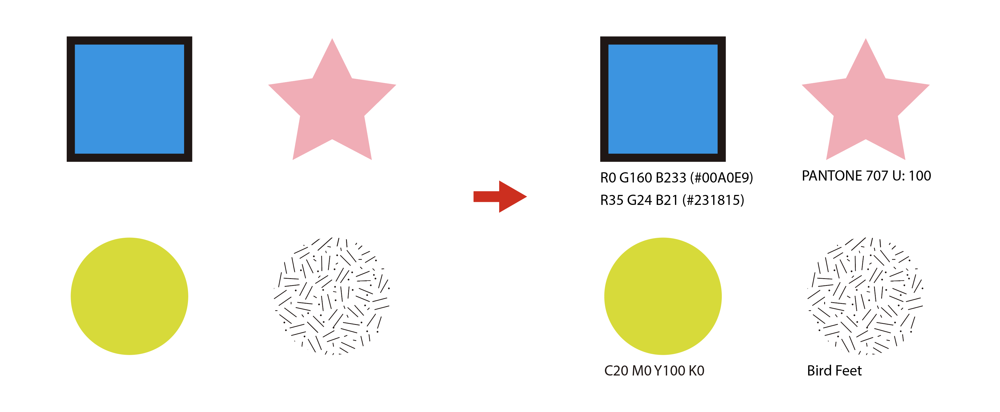

#### 使用方法
パスオブジェクトを選択してスクリプトを実行します。

> **Note**  
> CMYK、RGB、HEX、グレースケール、特色、パターンに対応しています。  
> テキスト、グラデーションは対応していません。

#### 動作条件
Illustrator CS以降

<div align="right">[ <a href="#カラー">↑ トップへ戻る ↑</a> ]</div>
<br>


# <a name="showDimensionsjs">showDimensions.js</a>
[](https://github.com/sky-chaser-high/adobe-illustrator-scripts/releases/latest/download/Path.zip)  
パスオブジェクトの2点間のアンカーポイントの寸法を表示します。

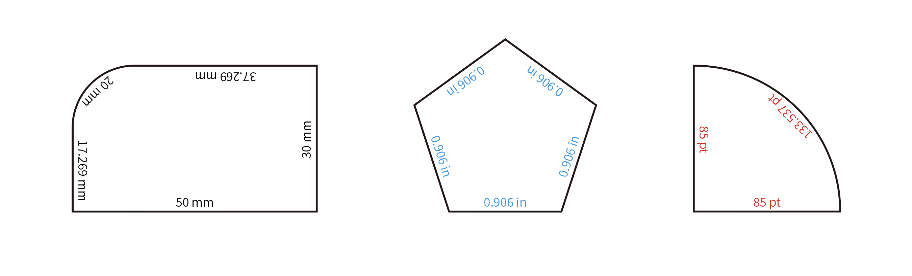

#### 使用方法
パスオブジェクトを選択してスクリプトを実行します。

> **Note**  
> 曲線に対応しています。  
> パスオブジェクトごとに寸法をグループ化し色を付けます。  
> 寸法の単位はルーラー単位により変わります。  
> オブジェクトが複雑な形状や小さい場合、寸法が重なって表示されることがあります。

#### 動作条件
Illustrator CS6以降

<div align="right">[ <a href="#パス">↑ トップへ戻る ↑</a> ]</div>
<br>


# <a name="shuffleGradientColorjs">shuffleGradientColor.js</a>
[](https://github.com/sky-chaser-high/adobe-illustrator-scripts/releases/latest/download/Color.zip)  
グラデーションをシャッフルします。


#### 使用方法
パスオブジェクトを選択してスクリプトを実行します。

> **Note**  
> 線のカラーには対応していません。  
> 複合パスの場合は、ダイレクト選択ツールでパスを選択してください。

#### 動作条件
Illustrator CS以降

<div align="right">[ <a href="#カラー">↑ トップへ戻る ↑</a> ]</div>
<br>


# <a name="shuffleObjectsjs">shuffleObjects.js</a>
[](https://github.com/sky-chaser-high/adobe-illustrator-scripts/releases/latest/download/Path.zip)  
選択したオブジェクトをシャッフルします。


#### 使用方法
オブジェクトを選択してスクリプトを実行します。

#### 動作条件
Illustrator CS以降

<div align="right">[ <a href="#パス">↑ トップへ戻る ↑</a> ]</div>
<br>


# <a name="sortArtboardsjs">sortArtboards.js</a>
[](https://github.com/sky-chaser-high/adobe-illustrator-scripts/releases/latest/download/Artboard.zip)  
アートボードパネル内のアートボード名を昇順でソートします。


#### 使用方法
このスクリプトを実行するだけです。  

> **Note**  
> ドキュメント内のアートボードはソートしません。（位置はそのまま）

#### 動作条件
Illustrator CS5以降

<div align="right">[ <a href="#アートボード">↑ トップへ戻る ↑</a> ]</div>
<br>


# <a name="stepAndRepeatjs">stepAndRepeat.js</a>
[](https://github.com/sky-chaser-high/adobe-illustrator-scripts/releases/latest/download/Path.zip)  
InDesignの編集メニュー > 繰り返し複製... に相当します。


> **Note** Illustrator日本語版を使用している場合は、UIは日本語で表示します。

#### 使用方法
1. オブジェクトを選択してスクリプトを実行します。
2. グリッド状にしたい場合は、「グリッドとして作成」にチェックを入れてください。
3. 繰り返しの場合はカウントに繰り返す回数を入力します。  
   グリッドの場合は行・段数にそれぞれ繰り返す回数を入力します。
4. オフセット値（オブジェクトの間隔）を入力します。

> **Note**  
> オフセット値の単位は、ルーラー単位により切り替わります。

#### 動作条件
Illustrator CS4以降

<div align="right">[ <a href="#パス">↑ トップへ戻る ↑</a> ]</div>
<br>


# <a name="sumNumbersjs">sumNumbers.js</a>
[](https://github.com/sky-chaser-high/adobe-illustrator-scripts/releases/latest/download/Utility.zip)  
文字列内の数字で足し算します。

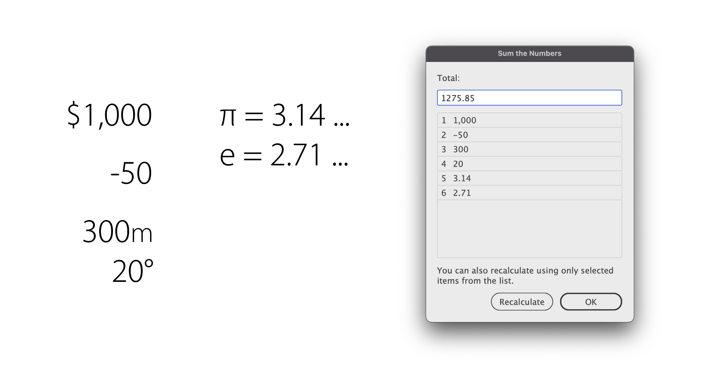
> **Note** Illustrator日本語版を使用している場合は、UIは日本語で表示します。

#### 使用方法
テキストオブジェクトを選択してスクリプトを実行します。  
また、リストから選択した項目のみを使用して再計算することも可能です。

> **Note**  
> 数値の単位は無視して計算します。  
> 全角数字には対応していません。

#### 動作条件
Illustrator CS4以降

<div align="right">[ <a href="#ユーティリティ">↑ トップへ戻る ↑</a> ]</div>
<br>


# <a name="swapTextContentsjs">swapTextContents.js</a>
[](https://github.com/sky-chaser-high/adobe-illustrator-scripts/releases/latest/download/Text.zip)  
2つの文字列の内容を交換します。


#### 使用方法
2つのテキストオブジェクトを選択してスクリプトを実行します。

#### 動作条件
Illustrator CS以降

<div align="right">[ <a href="#テキスト">↑ トップへ戻る ↑</a> ]</div>
<br>


# <a name="syncViewjs">syncView.js</a>
[](https://github.com/sky-chaser-high/adobe-illustrator-scripts/releases/latest/download/Utility.zip)  
アクティブなウィンドウの表示スケールと表示位置に、開いているすべてのウィンドウを同期させます。


#### 使用方法
このスクリプトを実行するだけです。  
オブジェクトを選択する必要はありません。

> **Note**  
> 2ファイル以上開いてください。

#### 動作条件
Illustrator CS以降  

<div align="right">[ <a href="#ユーティリティ">↑ トップへ戻る ↑</a> ]</div>
<br>


# <a name="textAlign_CenterjstextAlign_LeftjstextAlign_Rightjs">textAlign_Center.js<br>textAlign_Left.js<br>textAlign_Right.js</a>
[](https://github.com/sky-chaser-high/adobe-illustrator-scripts/releases/latest/download/Text.zip)  
ポイント文字の位置を動かさずに行揃えを変更します。  
縦書きにも対応しています。

例 textAlign_Center.js:


#### 使用方法
ポイント文字を選択してスクリプトを実行します。

#### 動作条件
Illustrator CS以降

<div align="right">[ <a href="#テキスト">↑ トップへ戻る ↑</a> ]</div>
<br>


# <a name="unifyLayerColorsjs">unifyLayerColors.js</a>
[](https://github.com/sky-chaser-high/adobe-illustrator-scripts/releases/latest/download/Layer.zip)  
レイヤーカラーを統一します。


#### 使用方法
基準のレイヤーを選択してスクリプトを実行します。

> **Note**  
> サブレイヤーにも対応します。

#### 動作条件
Illustrator CS以降

<div align="right">[ <a href="#レイヤー">↑ トップへ戻る ↑</a> ]</div>
<br>


# ライセンス
MITライセンスのもとで公開しています。  
詳しくはLICENSEファイルをご覧ください。
