# Adobe Illustrator Scripts
[](https://github.com/sky-chaser-high/adobe-illustrator-scripts/releases/latest/download/AllScripts.zip)
 

Adobe Illustratorのスクリプト集です。  
タイトルをクリックすると詳細説明に移動します。
[](https://github.com/sky-chaser-high/adobe-illustrator-scripts/releases/latest) からスクリプトをダウンロードしてください。
<br><br>

### アートボード
[](https://github.com/sky-chaser-high/adobe-illustrator-scripts/releases/latest/download/Artboard.zip)
- [アートボードの名前とサイズを表示](#アートボードの名前とサイズを表示)
- [アートボードの名前を変更](#アートボードの名前を変更)
- [アートボードの並べ替え](#アートボードの並べ替え)

### カラー
[](https://github.com/sky-chaser-high/adobe-illustrator-scripts/releases/latest/download/Color.zip)
- [CSVファイルを読み込む](#CSVファイルを読み込む)
- [Deleted Global Color を削除](#Deleted-Global-Color-を削除)
- [カラー数値をCSVファイルに保存](#カラー数値をCSVファイルに保存)
- [カラー数値を四捨五入](#カラー数値を四捨五入)
- [カラー数値を表示](#カラー数値を表示)
- [カラーチャートを作成](#カラーチャートを作成)
- [グラデーションのカラー分岐点から色を取り出す](#グラデーションのカラー分岐点から色を取り出す)
- [グラデーションのカラー分岐・中間点の位置を同期](#グラデーションのカラー分岐中間点の位置を同期)
- [グラデーションのカラー分岐・中間点の数値を四捨五入](#グラデーションのカラー分岐中間点の数値を四捨五入)
- [グラデーションをシャッフル](#グラデーションをシャッフル)
- [グラデーションをスウォッチに追加](#グラデーションをスウォッチに追加)
- [グラデーションを生成](#グラデーションを生成)
- [グローバルカラーに変換](#グローバルカラーに変換特色に変換)
- [すべてのスウォッチを削除](#すべてのスウォッチを削除)
- [テキストの色を変更](#テキストの色を変更)
- [テキストの色をランダムに変更](#テキストの色をランダムに変更)
- [特色に変換](#グローバルカラーに変換特色に変換)

### レイヤー
[](https://github.com/sky-chaser-high/adobe-illustrator-scripts/releases/latest/download/Layer.zip)
- [サブレイヤーをメインレイヤーへ移動](#サブレイヤーをメインレイヤーへ移動)
- [非表示レイヤーを削除](#非表示レイヤーを削除)
- [表示状態を反転](#表示状態を反転)
- [未使用レイヤーを削除](#未使用レイヤーを削除)
- [レイヤーカラーを統合](#レイヤーカラーを統合)
- [レイヤー名の変更](#レイヤー名の変更)
- [ロック状態のレイヤーを削除](#ロック状態のレイヤーを削除)
- [ロック状態を反転](#ロック状態を反転)

### リンク
[](https://github.com/sky-chaser-high/adobe-illustrator-scripts/releases/latest/download/Link.zip)
- [埋め込み画像を選択](#埋め込み画像を選択)
- [ファイル拡張子にリンクを再設定](#ファイル拡張子にリンクを再設定)
- [ファイル拡張子にリンクを再設定（機能拡張版）](#ファイル拡張子にリンクを再設定機能拡張版)
- [フォルダに再リンク](#フォルダに再リンク)
- [まとめてリンクを再設定](#まとめてリンクを再設定)
- [リンク画像の名前を変更](#リンク画像の名前を変更)
- [リンク画像を原寸サイズに戻す](#リンク画像を原寸サイズに戻す)
- [リンク画像を選択](#リンク画像を選択)
- [リンク切れ画像を選択](#リンク切れ画像を選択)

### パス
[](https://github.com/sky-chaser-high/adobe-illustrator-scripts/releases/latest/download/Path.zip)
- [アンカーポイントに図形を描く](#アンカーポイントに図形を描く)
- [アンカーポイントの追加](#アンカーポイントの追加)
- [オブジェクトの周囲に長方形を描く](#オブジェクトの周囲に長方形を描く)
- [オブジェクトの整列](#オブジェクトの整列)
- [オブジェクトの並べ替え](#オブジェクトの並べ替え)
- [オブジェクトをシャッフル](#オブジェクトをシャッフル)
- [外接円を描く](#外接円を描く)
- [ガイドオブジェクトの色を削除](#ガイドオブジェクトの色を削除)
- [ガイドをアートボードにフィット](#ガイドをアートボードにフィット)
- [ガイドを移動](#ガイドを移動)
- [ガイドを選択](#ガイドを選択)
- [繰り返し複製](#繰り返し複製)
- [グリッドラインを作成](#グリッドラインを作成)
- [すべてのアンカーをコーナーポイントに切り替え](#すべてのアンカーをコーナーポイントに切り替え)
- [選択したアンカーポイントを時計回り / 反時計回りに移動](#選択したアンカーポイントを時計回り--反時計回りに移動)
- [選択したアンカーポイントを時計回り / 反時計回りに増やす](#選択したアンカーポイントを時計回り--反時計回りに増やす)
- [選択したアンカーポイントを時計回り / 反時計回りに減らす](#選択したアンカーポイントを時計回り--反時計回りに減らす)
- [ハンドルを伸縮](#ハンドルを伸縮)
- [パスセグメントの角度に合わせて図形を描く](#パスセグメントの角度に合わせて図形を描く)
- [パスの寸法を表示](#パスの寸法を表示)
- [パスを伸縮](#パスを伸縮)
- [パスを閉じる](#パスを閉じる)
- [パスを分解](#パスを分解)
- [法線を描く](#法線を描く)
- [余白の垂直 / 水平方向中央に整列](#余白の垂直--水平方向中央に整列)
- [余白の垂直 / 水平方向に分布](#余白の垂直--水平方向に分布)

### テキスト
[](https://github.com/sky-chaser-high/adobe-illustrator-scripts/releases/latest/download/Text.zip)
- [カーソル位置の単語を削除](#カーソル位置の単語を削除)
- [カーソルの左側 / 右側をすべて削除](#カーソルの左側--右側をすべて削除)
- [カーソルを次 / 前のテキストへ移動](#カーソルを次--前のテキストへ移動)
- [行に移動](#行に移動)
- [行の並べ替え](#行の並べ替え)
- [行末のスペースを削除](#行末のスペースを削除)
- [行を上 / 下へ移動](#行を上--下へ移動)
- [行を上 / 下へコピー](#行を上--下へコピー)
- [行を上 / 下に挿入](#行を上--下に挿入)
- [数字をカンマで区切る](#数字をカンマで区切る)
- [スレッドテキストを作成](#スレッドテキストを作成)
- [選択なしでコピー / カット](#選択なしでコピー--カット)
- [テキスト左 / 中央 / 右揃え](#テキスト左--中央--右揃え)
- [テキスト両端揃え](#テキスト両端揃え)
- [ノンブルを作成](#ノンブルを作成)
- [パス上文字をポイント文字に切り替え](#パス上文字をポイント文字に切り替え)
- [パスセグメントの角度に合わせてテキストを回転](#パスセグメントの角度に合わせてテキストを回転) `Update`
- [パスセグメントの角度に合わせてテキストを作成](#パスセグメントの角度に合わせてテキストを作成)
- [文字列を括弧で囲む](#文字列を括弧で囲む)
- [文字列をカーソルの位置で分割](#文字列をカーソルの位置で分割)
- [文字列を交換](#文字列を交換)
- [文字列を分割](#文字列を分割)

### ユーティリティ
[](https://github.com/sky-chaser-high/adobe-illustrator-scripts/releases/latest/download/Utility.zip)
- [PDFを書き出す](#PDFを書き出す) `New`
- [拡大・縮小率の確認](#拡大縮小率の確認)
- [距離の測定](#距離の測定)
- [すべてのドキュメントを閉じる](#すべてのドキュメントを閉じる)
- [単位を換算](#単位を換算)
- [日付と曜日の確認](#日付と曜日の確認)
- [文字列内の数字の合計](#文字列内の数字の合計)

### 表示
[](https://github.com/sky-chaser-high/adobe-illustrator-scripts/releases/latest/download/View.zip)
- [ウィンドウの表示位置を同期](#ウィンドウの表示位置を同期)
- [ウィンドウを並べて表示](#ウィンドウを並べて表示)
- [オブジェクトを画面全体に拡大表示](#オブジェクトを画面全体に拡大表示)
- [先頭 / 最後 / 次 / 前のアートボードへ移動](#先頭--最後--次--前のアートボードへ移動)

### 環境設定
[](https://github.com/sky-chaser-high/adobe-illustrator-scripts/releases/latest/download/Preferences.zip)
- [同じ濃度を選択](#同じ濃度を選択)
- [コピー元のレイヤーにペースト](#コピー元のレイヤーにペースト)
- [字形の境界に整列](#字形の境界に整列)
- [新規テキストオブジェクトにサンプルテキストを割り付け](#新規テキストオブジェクトにサンプルテキストを割り付け)
- [選択された文字の異体字を表示](#選択された文字の異体字を表示)
- [選択範囲へズーム](#選択範囲へズーム)
- [パターンを変形](#パターンを変形)
- [複数アンカーを選択時にハンドルを表示](#複数アンカーを選択時にハンドルを表示)
- [プレビュー境界を使用](#プレビュー境界を使用)
- [マウスホイールでズーム](#マウスホイールでズーム)
<br><br><br>


### インストール
[](https://github.com/sky-chaser-high/adobe-illustrator-scripts/releases/latest) 
または [Releases](https://github.com/sky-chaser-high/adobe-illustrator-scripts/releases/latest) から
ZIPファイルを[ダウンロード](https://github.com/sky-chaser-high/adobe-illustrator-scripts/releases/latest)してください。  
解凍したスクリプトは好きな場所に置いて管理してください。  
「ファイル > スクリプト > その他のスクリプト( <kbd>⌘</kbd> / <kbd>Ctrl</kbd> + <kbd>F12</kbd> )」からスクリプトを選択して実行します。  

スクリプトの導入方法は下記のサイトで詳しく解説されています。参考にしてみてください。
- [Illustratorでスクリプトを使ってみよう［標準機能編］](https://hamfactory.net/illustrator/script-basic/)
- [Illustratorでスクリプトを使ってみよう［Mac+SPAi編］](https://hamfactory.net/illustrator/script-spai/)

> [!NOTE]
> スクリプトを使い続けていると、まれに動作しなくなる場合があります。  
> その場合は、Illustratorを再起動してから再度実行してみてください。


### ソフトウェア、エクステンション
下記のソフトウェア、エクステンションを使用すると楽にスクリプトを実行できるようになります。
- [SPAi](https://tama-san.com/spai/)（Mac）
- [Sppy](https://sppy.stars.ne.jp/sppyai)（Windows）
- [Scripshon Trees](https://exchange.adobe.com/apps/cc/15873/scripshon-trees)（エクステンション）  
- [LAScripts](https://exchange.adobe.com/apps/cc/19405/lascripts)（エクステンション）


### ファイル名
スクリプトのファイル名は日本語に変更しても問題なく動作します。  
例えば、textAlign_Center.js を「テキスト中央揃え.js」のように変更しても大丈夫です。


### UI デザイン
UIデザインツールには、[ScriptUI Dialog Builder (SDB)](https://scriptui.joonas.me/) を使用しました。  
ツールの詳細は [ScriptUI-Dialog-Builder-Joonas](https://github.com/joonaspaakko/ScriptUI-Dialog-Builder-Joonas) を参照してください。
> [!NOTE]
> Illustrator日本語版を使用している場合は、UIは日本語で表示します。


### 開発環境
OS: macOS Ventura 13.7.1  
テスト: Adobe Illustrator 2020-2023


### ライセンス
MITライセンスのもとで公開しています。  
詳しくはLICENSEファイルをご覧ください。
<br><br><br>


## <a name="アンカーポイントの追加">アンカーポイントの追加</a>
### addAnchorPoints.js
[](https://github.com/sky-chaser-high/adobe-illustrator-scripts/releases/latest/download/Path.zip)


指定した個数のアンカーポイントを等間隔に追加します。  
「オブジェクト > パス > アンカーポイントの追加」を少し使いやすく改良したものです。

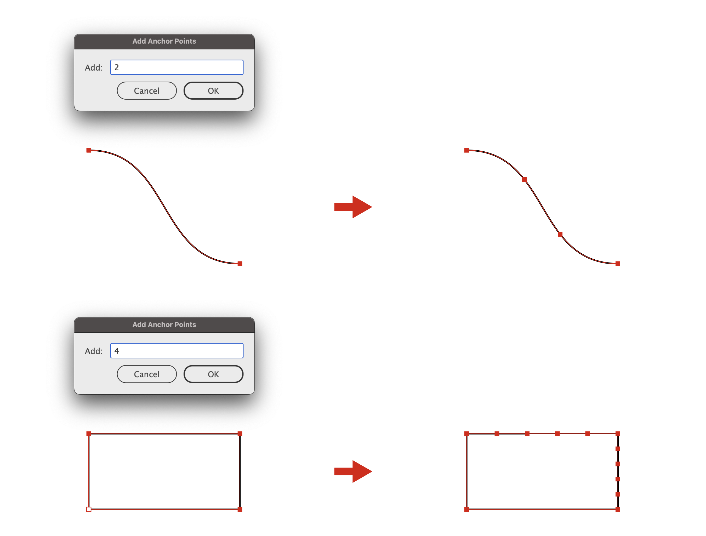
> [!NOTE]
> Illustrator日本語版を使用している場合は、UIは日本語で表示します。

#### 使用方法
1. ダイレクト選択ツールで2点以上のアンカーポイントを選択してスクリプトを実行します。
2. 追加したい個数を入力します。

> [!NOTE]
> パス上文字とエリア内文字のアンカーポイントにも対応しています。

#### 動作条件
Illustrator CS4以降

<div align="right">[ <a href="#パス">↑ トップへ戻る ↑</a> ]</div>
<br>


## <a name="数字をカンマで区切る">数字をカンマで区切る</a>
### addNumericSeparators.js
[](https://github.com/sky-chaser-high/adobe-illustrator-scripts/releases/latest/download/Text.zip)


数値をカンマで3桁区切りにします。


#### 使用方法
テキストオブジェクトを選択、または編集状態で範囲を指定してスクリプトを実行します。

#### 動作条件
Illustrator CS以降

<div align="right">[ <a href="#テキスト">↑ トップへ戻る ↑</a> ]</div>
<br>


## <a name="グラデーションをスウォッチに追加">グラデーションをスウォッチに追加</a>
### addSelectedGradientsToSwatch.js
[](https://github.com/sky-chaser-high/adobe-illustrator-scripts/releases/latest/download/Color.zip)


選択したグラデーションをスウォッチに追加します。


#### 使用方法
パスオブジェクトを選択してスクリプトを実行します。

> [!NOTE]
> テキスト、線の色には対応していません。

#### 動作条件
Illustrator CS以降

<div align="right">[ <a href="#カラー">↑ トップへ戻る ↑</a> ]</div>
<br>


## <a name="余白の垂直--水平方向中央に整列">余白の垂直 / 水平方向中央に整列</a>
### alignInCenterOfSpace(Vertical).js<br>alignInCenterOfSpace(Horizontal).js
[](https://github.com/sky-chaser-high/adobe-illustrator-scripts/releases/latest/download/Path.zip)


余白の垂直または水平方向中央にオブジェクトを整列します。

例 alignInCenterOfSpace(Vertical).js:


#### 使用方法
3つ以上のオブジェクトを選択してスクリプトを実行します。  
整列の位置は、基準点により変化します。

> [!NOTE]
> 線幅を含めるか含めないかは、「整列パネルメニュー > プレビュー境界を使用」によります。  
> オブジェクトは3つ以上選択してください。

#### 動作条件
Illustrator CS3以降

<div align="right">[ <a href="#パス">↑ トップへ戻る ↑</a> ]</div>
<br>


## <a name="オブジェクトの整列">オブジェクトの整列</a>
### alignObjects.js
[](https://github.com/sky-chaser-high/adobe-illustrator-scripts/releases/latest/download/Path.zip)


オブジェクトの水平方向と垂直方向を同時に整列します。

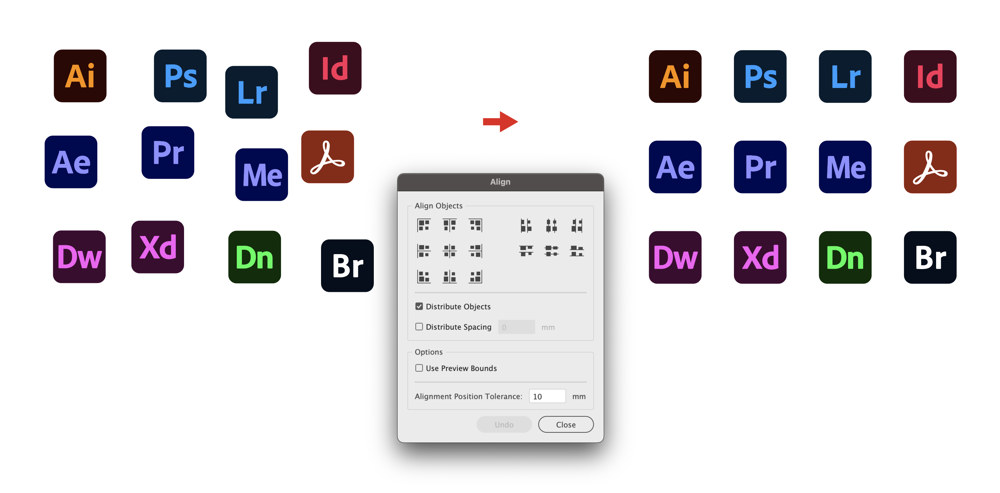
> [!NOTE]
> Illustrator日本語版を使用している場合は、UIは日本語で表示します。

#### 使用方法
1. オブジェクトを選択してスクリプトを実行します。
2. ［オブジェクトの分布］または［等間隔に分布］を選択します。  
   等間隔に整列したくない場合は、両方のチェックを外してください。
3. 線幅を含める場合は、［プレビュー境界を使用］にチェックを付けます。
4. ［整列位置の許容誤差］の値を入力します。（0以上の数値）  
   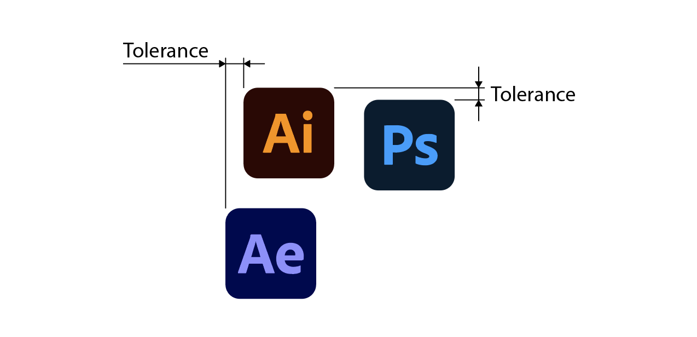
5. 整列アイコンボタンをクリックします。

> [!NOTE]
> 最上段の行と左端の列が整列の基準になります。  
> 複合パス、テキスト、リンク画像、埋め込み画像にも対応しています。

#### 対応する単位
ポイント、ピクセル、パイカ、インチ、フィート、ヤード、ミリメートル、センチメートル、メートル。  
使用する単位は、定規の単位によります。

#### 動作条件
Illustrator 2021以降

<div align="right">[ <a href="#パス">↑ トップへ戻る ↑</a> ]</div>
<br>


## <a name="ウィンドウを並べて表示">ウィンドウを並べて表示</a>
### arrangeWindows.js
[](https://github.com/sky-chaser-high/adobe-illustrator-scripts/releases/latest/download/View.zip)


開いているすべてのウィンドウを分割して並べて表示します。

> [!TIP]
> バージョン2022からアプリケーションバーに実装されています。


#### 使用方法
このスクリプトを実行するだけです。

> [!NOTE]
> 2ファイル以上開いてください。

#### 動作条件
Illustrator CS6以降

<div align="right">[ <a href="#表示">↑ トップへ戻る ↑</a> ]</div>
<br>


## <a name="まとめてリンクを再設定">まとめてリンクを再設定</a>
### bulkRelink.js
[](https://github.com/sky-chaser-high/adobe-illustrator-scripts/releases/latest/download/Link.zip)


リンク切れ画像、リンク画像、または埋め込み画像を一括で再設定します。

> [!IMPORTANT]
> バージョン2024以降、リンク切れ画像がある場合に表示するアラートから「すべてに適用」チェックボックスが削除されました。そのため、リンク画像を一括で置換することができなくなりました。

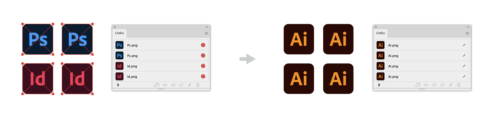

#### 使用方法
1. 再設定したいリンク切れ画像、リンク画像、または埋め込み画像を選択しスクリプトを実行します。
2. 新しいリンク画像を選択します。
3. PDFの場合、読み込みオプションからトリミングとページを選択します。

> [!NOTE]
> 画像を選択する場合は、リンクパネルではなくドキュメント内の画像を選択してください。

#### 動作条件
Illustrator CS6以降

<div align="right">[ <a href="#リンク">↑ トップへ戻る ↑</a> ]</div>
<br>


## <a name="日付と曜日の確認">日付と曜日の確認</a>
### checkDayOfWeek.js
[](https://github.com/sky-chaser-high/adobe-illustrator-scripts/releases/latest/download/Utility.zip)


選択した日付の曜日を確認します。


> [!NOTE]
> Illustrator日本語版を使用している場合は、UIは日本語で表示します。

#### 使用方法
テキスト内の日付をカーソルで選択してスクリプトを実行します。

> [!NOTE]
> 年がない場合（月日のみ）は、今年とみなします。  
> 漢数字には対応していません。

#### 書式
確認できる日付の書式は下記になります。  
`YYYY年MM月DD日`, `令和YY年MM月DD日`, `平成YY年MM月DD日`, `昭和YY年MM月DD日`, `大正YY年MM月DD日`, `明治YY年MM月DD日`,  
`YYYY/MM/DD`, `MM/DD/YYYY`, `DD/MM/YYYY`,   
`YYYY-MM-DD`, `MM-DD-YYYY`, `DD-MM-YYYY`,  
`YYYY.MM.DD`, `MM.DD.YYYY`, `DD.MM.YYYY`,  
`YYYY MM DD`, `MM DD YYYY`, `DD MM YYYY`,  
`Jan(uary) (the) DD(st|nd|rd|th)(,) YYYY`, `MM DD(st|nd|rd|th)(,) YYYY`,  
`DD(st|nd|rd|th) (of) Jan(uary)(,) YYYY`, `DD(st|nd|rd|th) MM(,) YYYY`

#### 動作条件
Illustrator CS4以降

<div align="right">[ <a href="#ユーティリティ">↑ トップへ戻る ↑</a> ]</div>
<br>


## <a name="すべてのドキュメントを閉じる">すべてのドキュメントを閉じる</a>
### closeAllDocuments.js
[](https://github.com/sky-chaser-high/adobe-illustrator-scripts/releases/latest/download/Utility.zip)


すべてのドキュメントを閉じます。

> [!TIP]
> バージョン2021からファイルメニューに実装されています。

#### 使用方法
このスクリプトを実行するだけです。  
編集中のドキュメントがある場合は、保存するかしないかを選択します。

#### 動作条件
Illustrator CS4以降

<div align="right">[ <a href="#ユーティリティ">↑ トップへ戻る ↑</a> ]</div>
<br>


## <a name="パスを閉じる">パスを閉じる</a>
### closePath.js
[](https://github.com/sky-chaser-high/adobe-illustrator-scripts/releases/latest/download/Path.zip)


開いているパスを閉じます。


#### 使用方法
パスオブジェクトを選択してスクリプトを実行します。

#### 動作条件
Illustrator CS以降

<div align="right">[ <a href="#パス">↑ トップへ戻る ↑</a> ]</div>
<br>


## <a name="拡大縮小率の確認">拡大・縮小率の確認</a>
### compareScale.js
[](https://github.com/sky-chaser-high/adobe-illustrator-scripts/releases/latest/download/Utility.zip)


2つのオブジェクトを比較して拡大・縮小率を表示します。


> [!NOTE]
> Illustrator日本語版を使用している場合は、UIは日本語で表示します。

#### 使用方法
1. 2つのオブジェクトを選択してスクリプトを実行します。
2. 線幅を含める場合は、［プレビュー境界を使用］にチェックを付けます。

#### 対応する単位
ポイント、ピクセル、パイカ、インチ、フィート、ヤード、ミリメートル、センチメートル、メートル。  
使用する単位は、定規の単位によります。

#### 動作条件
Illustrator CC以降

<div align="right">[ <a href="#ユーティリティ">↑ トップへ戻る ↑</a> ]</div>
<br>


## <a name="すべてのアンカーをコーナーポイントに切り替え">すべてのアンカーをコーナーポイントに切り替え</a>
### convertAllAnchorPointsToCorner.js
[](https://github.com/sky-chaser-high/adobe-illustrator-scripts/releases/latest/download/Path.zip)


すべてのアンカーポイントをコーナーポイントに切り替えます。  
コントロールパネルの機能ではアンカーポイントを選択しなければなりませんが、このスクリプトではオブジェクト全体を選択します。


#### 使用方法
選択ツールでパスオブジェクト全体を選択してスクリプトを実行します。  
ダイレクト選択ツールでアンカーポイントを選択した場合は、すべてまたは選択したアンカーポイントのみをコーナーポイントに切り替えるダイアログを表示します。  
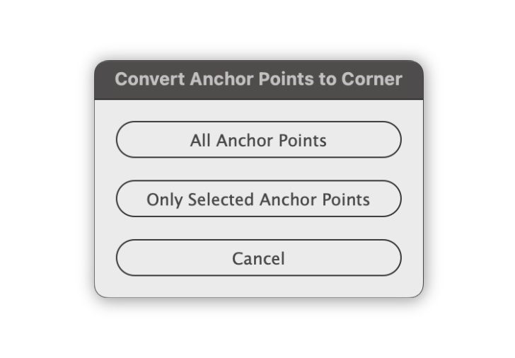

> [!NOTE]
> パス上文字とエリア内文字のアンカーポイントにも対応しています。  
> Illustrator日本語版を使用している場合は、UIは日本語で表示します。

#### 動作条件
Illustrator CS4以降

<div align="right">[ <a href="#パス">↑ トップへ戻る ↑</a> ]</div>
<br>


## <a name="グローバルカラーに変換特色に変換">グローバルカラーに変換<br>特色に変換</a>
### convertToGlobalColor.js<br>convertToSpotColor.js
[](https://github.com/sky-chaser-high/adobe-illustrator-scripts/releases/latest/download/Color.zip)


スウォッチをグローバルカラーまたは特色に変換します。

convertToGlobalColor.js:


convertToSpotColor.js:


#### 使用方法
変換したいスウォッチを選択してスクリプトを実行します。  
選択しない場合は、すべてのスウォッチが対象になります。

> [!NOTE]
> 同名のスウォッチがある場合は変換しません。  
> プロセスカラーを変換する場合は、スウォッチに登録し直すため表示順が変わります。

#### 動作条件
Illustrator CS以降

<div align="right">[ <a href="#カラー">↑ トップへ戻る ↑</a> ]</div>
<br>


## <a name="パス上文字をポイント文字に切り替え">パス上文字をポイント文字に切り替え</a>
### convertTypeOnAPathToPointType.js
[](https://github.com/sky-chaser-high/adobe-illustrator-scripts/releases/latest/download/Text.zip)


パス上文字をポイント文字に切り替えます。


#### 使用方法
パス上文字を選択してスクリプトを実行します。

> [!NOTE]
> 元のパス上文字は削除されます。  
> アピアランスで適用していた効果は失われます。

#### 動作条件
Illustrator CS以降

<div align="right">[ <a href="#テキスト">↑ トップへ戻る ↑</a> ]</div>
<br>


## <a name="行を上--下へコピー">行を上 / 下へコピー</a>
### copyLineUp.js<br>copyLineDown.js
[](https://github.com/sky-chaser-high/adobe-illustrator-scripts/releases/latest/download/Text.zip)


Visual Studio Code の「行を上へコピー」( <kbd>Option</kbd> / <kbd>Alt</kbd> + <kbd>Shift</kbd> + <kbd>↑</kbd> )、
「行を下へコピー」( <kbd>Option</kbd> / <kbd>Alt</kbd> + <kbd>Shift</kbd> + <kbd>↓</kbd> )と同様のことができます。  
[Keyboard Maestro](https://www.keyboardmaestro.com/main/)、
[SPAi](https://tama-san.com/spai/) や
[Sppy](https://sppy.stars.ne.jp/sppyai)
などでショートカットを割り当てると、より一層Visual Studio Codeの操作感が出せると思います。  
ポイント文字、エリア内文字のどちらにも対応しています。


例 copyLineDown.js:


#### 使用方法
コピーしたい行にカーソルを合わせてスクリプトを実行します。  
1行すべてを選択する必要はありません。

> [!WARNING]
> カーソルを移動させるためにスクリプト内部でコピー＆ペーストを行っています。そのため、あらかじめ文字列等をコピーしていた場合はその内容が失われてしまいます。

> [!NOTE]
> エリア内文字で文字の折り返しがある行をコピーする場合、うまく動作しないことがあります。  
> copyLineDown.jsで最終行をコピーする場合は、バグを回避するために空行を追加します。  
> コピーできるのは1行のみです。複数行には対応していません。  
> バージョン2020以前の場合は、スクリプトを実行するとキーボードが反応しなくなります。  
> テキストを編集する場合はマウスでテキストをクリックしてください。

#### 動作条件
Illustrator CC 2018以降

<div align="right">[ <a href="#テキスト">↑ トップへ戻る ↑</a> ]</div>
<br>


## <a name="選択なしでコピー--カット">選択なしでコピー / カット</a>
### copyLine(emptySelection).js<br>cutLine(emptySelection).js
[](https://github.com/sky-chaser-high/adobe-illustrator-scripts/releases/latest/download/Text.zip)


Visual Studio Code のショートカット「コピー（選択なし）」( <kbd>⌘</kbd> / <kbd>Ctrl</kbd> + <kbd>C</kbd> )、
「切り取り（選択なし）」( <kbd>⌘</kbd> / <kbd>Ctrl</kbd> + <kbd>X</kbd> )と同様のことができます。  
[Keyboard Maestro](https://www.keyboardmaestro.com/main/)、
[SPAi](https://tama-san.com/spai/) や
[Sppy](https://sppy.stars.ne.jp/sppyai)
などでショートカットを割り当てると、より一層Visual Studio Codeの操作感が出せると思います。  
ポイント文字、エリア内文字のどちらにも対応しています。

例 cutLine(emptySelection).js:


#### 使用方法
コピーまたは、カットしたい行にカーソルを合わせてスクリプトを実行します。  
1行すべてを選択する必要はありません。

> [!IMPORTANT]
> バグを回避するために改行は含みません。

> [!NOTE]
> エリア内文字で文字の折り返しがある行をコピーまたはカットする場合、うまく動作しないことがあります。  
> バージョン2020以前の場合は、スクリプトを実行するとキーボードが反応しなくなります。  
> テキストを編集する場合はマウスでテキストをクリックしてください。

#### 動作条件
Illustrator CC 2018以降

<div align="right">[ <a href="#テキスト">↑ トップへ戻る ↑</a> ]</div>
<br>


## <a name="カラーチャートを作成">カラーチャートを作成</a>
### createColorChart.js
[](https://github.com/sky-chaser-high/adobe-illustrator-scripts/releases/latest/download/Color.zip)


カラーチャートを作成します。CMYK、RGB のどちらにも対応しています。


> [!NOTE]
> Illustrator日本語版を使用している場合は、UIは日本語で表示します。

#### 使用方法
1. スクリプトを実行します。
2. CMYKまたはRGBを選択します。
3. 基準とするカラー数値を入力します。  
   パスまたはテキストオブジェクトを選択している場合は、塗りの値を初期値として使用します。
4. 垂直方向と水平方向で増減させたい色を選択します。
5. 増減値を入力します。
6. 加算または濃度を選択します。
   - `加算` 増減値をそのまま加算します。
   - `濃度` 対象の色に対する割合を加算します。「編集 > カラーを編集 > 彩度調整」に相当します。  
   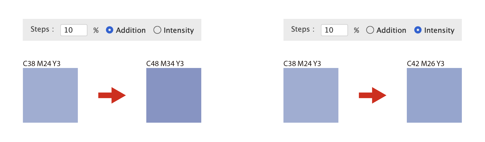
7. 単位、アートボードサイズ、カラーチップサイズを設定します。

> [!NOTE]
> 特色、グラデーション、パターンには対応していません。  
> 新規ドキュメントにカラーチャートを作成します。

#### 動作条件
Illustrator CS6以降

<div align="right">[ <a href="#カラー">↑ トップへ戻る ↑</a> ]</div>
<br>


## <a name="グリッドラインを作成">グリッドラインを作成</a>
### createGridLines.js
[](https://github.com/sky-chaser-high/adobe-illustrator-scripts/releases/latest/download/Path.zip)


アートボードにグリッドを作成します。


#### 使用方法
このスクリプトを実行するだけです。

> [!NOTE]
> グリッドの間隔は環境設定のガイド・グリッド項目の設定に依存します。

#### 動作条件
Illustrator CS以降

<div align="right">[ <a href="#パス">↑ トップへ戻る ↑</a> ]</div>
<br>


## <a name="ノンブルを作成">ノンブルを作成</a>
### createPageNumbers.js
[](https://github.com/sky-chaser-high/adobe-illustrator-scripts/releases/latest/download/Text.zip)


InDesignの「書式 > 特殊文字を挿入 > マーカー > 現在のページ番号」に相当します。  
アートボードの指定した位置にノンブルを配置します。


> [!NOTE]
> Illustrator日本語版を使用している場合は、UIは日本語で表示します。

#### 使用方法
1. スクリプトを実行します。
2. 各項目を設定します。
   - `位置` ノンブルの表示位置。
   - `見開き` チェックを付けると見開きページに対応します。
   - `開始ページ番号` 始まりの番号を指定します。
   - `セクションプレフィックス` ノンブルの前に文字列を追加します。見開きページの場合は、後ろに追加します。
   - `フォントサイズ` ノンブルのフォントサイズ。
   - `マージン` アートボードからの距離を指定します。現在のルーラー設定で単位が切り替わります。

> [!NOTE]
> ノンブルに指定できるスタイルは数字のみです。  
> アートボード順にノンブルを割り当てます。

#### 動作条件
Illustrator CS4以降

<div align="right">[ <a href="#テキスト">↑ トップへ戻る ↑</a> ]</div>
<br>


## <a name="パスセグメントの角度に合わせてテキストを作成">パスセグメントの角度に合わせてテキストを作成</a>
### createTextParallelToPathSegment.js
[](https://github.com/sky-chaser-high/adobe-illustrator-scripts/releases/latest/download/Text.zip)


直線セグメント、または2点のアンカーポイントを結ぶ直線の角度に合わせてテキストを作成します。

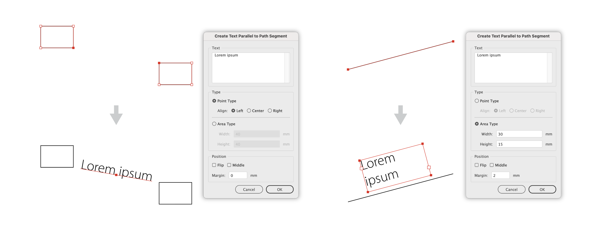
> [!NOTE]
> Illustrator日本語版を使用している場合は、UIは日本語で表示します。

#### 使用方法
1. ダイレクト選択ツールで2点のアンカーポイントを選択してスクリプトを実行します。
2. テキストを入力します。デフォルト値は、2点間の距離と角度です。
3. ポイント文字、またはエリア内文字のいずれかを選択します。  
   `ポイント文字` 左揃え、中央揃え、右揃えを選択します。  
   `エリア内文字` テキストエリアの幅と高さを入力します。
4. ［反転］にチェックを付けるとテキストの表示位置が反転します。
5. ［中間］にチェックを付けるとパスセグメントの中央に描きます。
6. 間隔の値を入力するとパスセグメントから間隔をあけます。

> [!NOTE]
> 曲線には対応していません。  
> パス上文字とエリア内文字のアンカーポイントにも対応しています。

#### 対応する単位
ポイント、ピクセル、パイカ、インチ、フィート、ヤード、ミリメートル、センチメートル、メートル。  
使用する単位は、定規の単位によります。

#### 動作条件
Illustrator 2021以降

<div align="right">[ <a href="#テキスト">↑ トップへ戻る ↑</a> ]</div>
<br>


## <a name="スレッドテキストを作成">スレッドテキストを作成</a>
### createThreadedText.js
[](https://github.com/sky-chaser-high/adobe-illustrator-scripts/releases/latest/download/Text.zip)


スレッドテキストを作成します。ポイント文字やパスが混在していても作成できます。  
縦組みのテキストにも対応しています。


> [!NOTE]
> Illustrator日本語版を使用している場合は、UIは日本語で表示します。

#### 使用方法
1. 2つ以上のテキストやパスオブジェクトを選択してスクリプトを実行します。あらかじめエリア内文字に変換しておく必要はありません。
2. オブジェクトを連結する順番を選択します。
3. 整列位置の許容誤差の値を入力します。（0以上の数値）  
   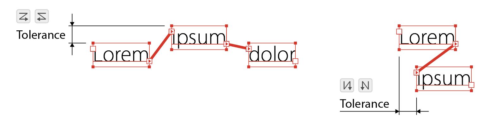
4. パスをテキストに変換するには、［パスをテキストに変換］にチェックを付けて、エリア内文字またはパス上文字のどちらかを選択します。

> [!NOTE]
> オブジェクトやレイヤーの重ね順は、連結する順番には関係ありません。  
> パスをエリア内文字に変換する場合、アンカーポイントの数が2点以下のパスは変換しません。

#### 対応する単位
ポイント、ピクセル、パイカ、インチ、フィート、ヤード、ミリメートル、センチメートル、メートル。  
使用する単位は、定規の単位によります。

#### 動作条件
Illustrator CC以降

<div align="right">[ <a href="#テキスト">↑ トップへ戻る ↑</a> ]</div>
<br>


## <a name="選択したアンカーポイントを時計回り--反時計回りに減らす">選択したアンカーポイントを時計回り / 反時計回りに減らす</a>
### decreaseSelectedAnchorPointsCW.js<br>decreaseSelectedAnchorPointsCCW.js
[](https://github.com/sky-chaser-high/adobe-illustrator-scripts/releases/latest/download/Path.zip)


選択したアンカーポイントの個数を時計回り、または反時計回りに減らします。

例 decreaseSelectedAnchorPointsCW.js:


#### 使用方法
ダイレクト選択ツールでアンカーポイントを選択してスクリプトを実行します。

#### 動作条件
Illustrator CS以降

<div align="right">[ <a href="#パス">↑ トップへ戻る ↑</a> ]</div>
<br>


## <a name="カーソルの左側--右側をすべて削除">カーソルの左側 / 右側をすべて削除</a>
### deleteAllLeft.js<br>deleteAllRight.js
[](https://github.com/sky-chaser-high/adobe-illustrator-scripts/releases/latest/download/Text.zip)


Visual Studio Code のショートカット「左側をすべて削除」( <kbd>⌘</kbd> + <kbd>Backspace</kbd> )、
「右側をすべて削除」( <kbd>⌘</kbd> + <kbd>Delete</kbd> )と同様のことができます。  
[Keyboard Maestro](https://www.keyboardmaestro.com/main/)、
[SPAi](https://tama-san.com/spai/) や
[Sppy](https://sppy.stars.ne.jp/sppyai)
などでショートカットを割り当てると、より一層Visual Studio Codeの操作感が出せると思います。  
ポイント文字、エリア内文字のどちらにも対応しています。

例 deleteAllRight.js:


#### 使用方法
削除したい場所にカーソルを合わせてスクリプトを実行します。  
削除する文字列を選択する必要はありません。

> [!WARNING]
> カーソルを移動させるためにスクリプト内部でコピー＆ペーストを行っています。そのため、あらかじめ文字列等をコピーしていた場合はその内容が失われてしまいます。

> [!NOTE]
> 削除できるのは1行のみです。複数行には対応していません。  
> バージョン2020以前の場合は、スクリプトを実行するとキーボードが反応しなくなります。  
> テキストを編集する場合はマウスでテキストをクリックしてください。

#### 動作条件
Illustrator CC 2018以降

<div align="right">[ <a href="#テキスト">↑ トップへ戻る ↑</a> ]</div>
<br>


## <a name="すべてのスウォッチを削除">すべてのスウォッチを削除</a>
### deleteAllSwatches.js
[](https://github.com/sky-chaser-high/adobe-illustrator-scripts/releases/latest/download/Color.zip)


［なし］と［レジストレーション］以外のすべてのスウォッチを削除します。


#### 使用方法
このスクリプトを実行するだけです。

> [!NOTE]
> オブジェクトに使用中のスウォッチも削除します。

#### 動作条件
Illustrator CS以降

<div align="right">[ <a href="#カラー">↑ トップへ戻る ↑</a> ]</div>
<br>


## <a name="非表示レイヤーを削除">非表示レイヤーを削除</a>
### deleteHiddenLayers.js
[](https://github.com/sky-chaser-high/adobe-illustrator-scripts/releases/latest/download/Layer.zip)


非表示のレイヤーを削除します。

> [!TIP]
> バージョン2021からレイヤーパネルメニューに実装されています。


#### 使用方法
このスクリプトを実行するだけです。  

#### 動作条件
Illustrator CS以降

<div align="right">[ <a href="#レイヤー">↑ トップへ戻る ↑</a> ]</div>
<br>


## <a name="ロック状態のレイヤーを削除">ロック状態のレイヤーを削除</a>
### deleteLockedLayers.js
[](https://github.com/sky-chaser-high/adobe-illustrator-scripts/releases/latest/download/Layer.zip)


ロックしているレイヤーを削除します。


#### 使用方法
このスクリプトを実行するだけです。  

#### 動作条件
Illustrator CS以降

<div align="right">[ <a href="#レイヤー">↑ トップへ戻る ↑</a> ]</div>
<br>


## <a name="行末のスペースを削除">行末のスペースを削除</a>
### deleteTrailingSpaces.js
[](https://github.com/sky-chaser-high/adobe-illustrator-scripts/releases/latest/download/Text.zip)


行末のスペースとタブを削除します。
ポイント文字、エリア内文字のどちらにも対応しています。


#### 使用方法
テキストオブジェクトを選択してスクリプトを実行します。  
スペースがある文字列を選択する必要はありません。

> [!NOTE]
> エリア内文字で文字の折り返しがある場合、うまく動作しないことがあります。

#### 動作条件
Illustrator CS以降

<div align="right">[ <a href="#テキスト">↑ トップへ戻る ↑</a> ]</div>
<br>


## <a name="未使用レイヤーを削除">未使用レイヤーを削除</a>
### deleteUnusedLayers.js
[](https://github.com/sky-chaser-high/adobe-illustrator-scripts/releases/latest/download/Layer.zip)


未使用（空）のレイヤーを削除します。サブレイヤーも対象です。


#### 使用方法
このスクリプトを実行するだけです。  
未使用のレイヤーを選択する必要はありません。

#### 動作条件
Illustrator CS以降

<div align="right">[ <a href="#レイヤー">↑ トップへ戻る ↑</a> ]</div>
<br>


## <a name="カーソル位置の単語を削除">カーソル位置の単語を削除</a>
### deleteWord.js
[](https://github.com/sky-chaser-high/adobe-illustrator-scripts/releases/latest/download/Text.zip)


カーソル位置の単語を削除します。
ポイント文字、エリア内文字のどちらにも対応しています。


#### 使用方法
削除したい単語の位置にカーソルを合わせてスクリプトを実行します。  
削除する単語を選択する必要はありません。

> [!WARNING]
> カーソルを移動させるためにスクリプト内部でコピー＆ペーストを行っています。そのため、あらかじめ文字列等をコピーしていた場合はその内容が失われてしまいます。

> [!NOTE]
> エリア内文字で文字の折り返しがある場合、うまく動作しないことがあります。  
> バージョン2020以前の場合は、スクリプトを実行するとキーボードが反応しなくなります。  
> テキストを編集する場合はマウスでテキストをクリックしてください。

#### 動作条件
Illustrator CC 2018以降

<div align="right">[ <a href="#テキスト">↑ トップへ戻る ↑</a> ]</div>
<br>


## <a name="パスを分解">パスを分解</a>
### disjoinPath.js
[](https://github.com/sky-chaser-high/adobe-illustrator-scripts/releases/latest/download/Path.zip)


アンカーポイントごとにパスオブジェクトを分割します。


#### 使用方法
パスオブジェクトを選択してスクリプトを実行します。

> [!WARNING]
> 元のパスオブジェクトは削除されます。

#### 動作条件
Illustrator CS以降

<div align="right">[ <a href="#パス">↑ トップへ戻る ↑</a> ]</div>
<br>


## <a name="余白の垂直--水平方向に分布">余白の垂直 / 水平方向に分布</a>
### distributeInSpace(Vertical).js<br>distributeInSpace(Horizontal).js
[](https://github.com/sky-chaser-high/adobe-illustrator-scripts/releases/latest/download/Path.zip)


余白の垂直または水平方向にオブジェクトを分布します。

例 distributeInSpace(Vertical).js:


#### 使用方法
3つ以上のオブジェクトを選択してスクリプトを実行します。  
分布の位置は、基準点により変化します。

> [!NOTE]
> 線幅を含めるか含めないかは、「整列パネルメニュー > プレビュー境界を使用」によります。  
> オブジェクトは3つ以上選択してください。

#### 動作条件
Illustrator CS3以降

<div align="right">[ <a href="#パス">↑ トップへ戻る ↑</a> ]</div>
<br>


## <a name="外接円を描く">外接円を描く</a>
### drawCircumscribedCircle.js
[](https://github.com/sky-chaser-high/adobe-illustrator-scripts/releases/latest/download/Path.zip)


アンカーポイント3点、または2点を通る外接円を描きます。


#### 使用方法
ダイレクト選択ツールで3点、または2点のアンカーポイントを選択してスクリプトを実行します。

> [!NOTE]
> アンカーポイント2点の場合は、直径になります。  
> パス上文字とエリア内文字のアンカーポイントにも対応しています。

#### 動作条件
Illustrator CS以降

<div align="right">[ <a href="#パス">↑ トップへ戻る ↑</a> ]</div>
<br>


## <a name="法線を描く">法線を描く</a>
### drawNormalLine.js
[](https://github.com/sky-chaser-high/adobe-illustrator-scripts/releases/latest/download/Path.zip)


2点のアンカーポイント間の曲線または直線に対して法線（接線に垂直な線）を描きます。

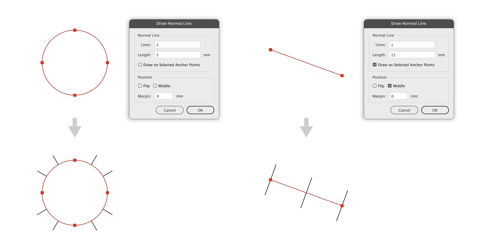
> [!NOTE]
> Illustrator日本語版を使用している場合は、UIは日本語で表示します。

#### 使用方法
1. ダイレクト選択ツールで2点以上のアンカーポイントを選択してスクリプトを実行します。
2. 法線の数を入力します。
3. 法線の長さを入力します。
4. 選択したアンカーポイントにも描く場合は、［選択アンカーポイントにも描く］にチェックを付けます。
5. ［反転］にチェックを付けると法線の表示位置が反転します。
6. ［中間］にチェックを付けるとパスセグメントの中央に描きます。
7. 距離の値を入力するとパスセグメントから間隔をあけます。

> [!NOTE]
> パス上文字とエリア内文字のアンカーポイントには対応していません。

#### 対応する単位
ポイント、ピクセル、パイカ、インチ、フィート、ヤード、ミリメートル、センチメートル、メートル。  
使用する単位は、定規の単位によります。

#### 動作条件
Illustrator CS4以降

<div align="right">[ <a href="#パス">↑ トップへ戻る ↑</a> ]</div>
<br>


## <a name="オブジェクトの周囲に長方形を描く">オブジェクトの周囲に長方形を描く</a>
### drawRectangle.js
[](https://github.com/sky-chaser-high/adobe-illustrator-scripts/releases/latest/download/Path.zip)


オブジェクトの周囲に長方形を描きます。


> [!NOTE]
> Illustrator日本語版を使用している場合は、UIは日本語で表示します。

#### 使用方法
1. パスオブジェクトを選択してスクリプトを実行します。
2. マージンの値を入力します。
3. グループ内のそれぞれのオブジェクトに長方形を描く場合は、［グループを無視］にチェックを付けます。
4. 線幅を含める場合は、［プレビュー境界を使用］にチェックを付けます。

> [!NOTE]
> 塗りと線幅なしの長方形を描きます。

#### 対応する単位
ポイント、ピクセル、パイカ、インチ、フィート、ヤード、ミリメートル、センチメートル、メートル。  
使用する単位は、定規の単位によります。

#### 動作条件
Illustrator CS4以降

<div align="right">[ <a href="#パス">↑ トップへ戻る ↑</a> ]</div>
<br>


## <a name="アンカーポイントに図形を描く">アンカーポイントに図形を描く</a>
### drawShapeOnAnchorPoint.js
[](https://github.com/sky-chaser-high/adobe-illustrator-scripts/releases/latest/download/Path.zip)


アンカーポイントとハンドルの位置に図形を描きます。


> [!NOTE]
> Illustrator日本語版を使用している場合は、UIは日本語で表示します。

#### 使用方法
1. パスオブジェクトを選択してスクリプトを実行します。
2. 描く図形を選択します。
3. 図形のサイズを入力します。
4. ダイレクト選択ツールでアンカーポイントを選択した場合は、すべてのアンカーポイントに図形を描くか選択したアンカーポイントのみに描くかを選択します。
5. ハンドルの位置を描きたい場合は、［ハンドル位置も描く］にチェックを付けます。

#### 対応する単位
ポイント、ピクセル、パイカ、インチ、フィート、ヤード、ミリメートル、センチメートル、メートル。  
使用する単位は、定規の単位によります。

#### 動作条件
Illustrator CS4以降

<div align="right">[ <a href="#パス">↑ トップへ戻る ↑</a> ]</div>
<br>


## <a name="パスセグメントの角度に合わせて図形を描く">パスセグメントの角度に合わせて図形を描く</a>
### drawShapeParallelToPathSegment.js
[](https://github.com/sky-chaser-high/adobe-illustrator-scripts/releases/latest/download/Path.zip)


直線セグメント、または2点のアンカーポイントを結ぶ直線の角度に合わせて図形を描きます。

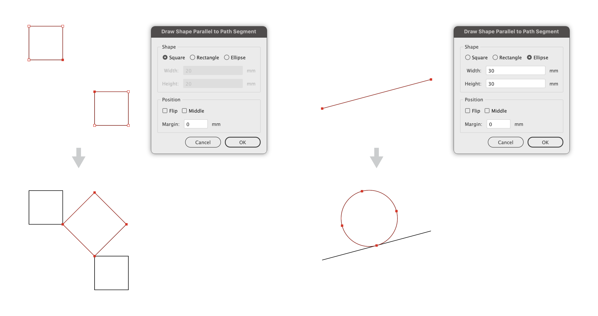
> [!NOTE]
> Illustrator日本語版を使用している場合は、UIは日本語で表示します。

#### 使用方法
1. ダイレクト選択ツールで2点のアンカーポイントを選択してスクリプトを実行します。
2. 正方形、長方形、または楕円を選択します。
3. 長方形または楕円を選択した場合は、幅と高さの値を入力します。
4. ［反転］にチェックを付けると図形の表示位置が反転します。
5. ［中間］にチェックを付けるとパスセグメントの中央に描きます。
6. 間隔の値を入力するとパスセグメントから間隔をあけます。

> [!NOTE]
> 曲線には対応していません。  
> パス上文字とエリア内文字のアンカーポイントにも対応しています。

#### 対応する単位
ポイント、ピクセル、パイカ、インチ、フィート、ヤード、ミリメートル、センチメートル、メートル。  
使用する単位は、定規の単位によります。

#### 動作条件
Illustrator CS4以降

<div align="right">[ <a href="#パス">↑ トップへ戻る ↑</a> ]</div>
<br>


## <a name="文字列を括弧で囲む">文字列を括弧で囲む</a>
### encloseWordInParentheses.js
[](https://github.com/sky-chaser-high/adobe-illustrator-scripts/releases/latest/download/Text.zip)


文字列を丸括弧（パーレン）で囲みます。


#### 使用方法
括弧で囲みたい文字にカーソルを合わせてスクリプトを実行します。  
文字列を範囲指定した場合はその箇所を囲みます。

> [!WARNING]
> カーソルを移動させるためにスクリプト内部でカット＆ペーストを行っています。そのため、あらかじめ文字列等をコピーしていた場合はその内容が失われてしまいます。

> [!NOTE]
> エリア内文字で文字の折り返しがある場合、うまく動作しないことがあります。  
> バージョン2020以前の場合は、スクリプトを実行するとキーボードが反応しなくなります。  
> テキストを編集する場合はマウスでテキストをクリックしてください。

> [!TIP]
> 半角パーレンになります。全角パーレンにしたい場合は、下記の方法でスクリプトを書き換えてください。

丸括弧以外の文字で囲みたい場合は、スクリプト内の41、42行目を変更してください。  
例えば、角括弧 `[ ]` で囲みたい場合は以下のようにします。
```javascript
var parentheses = {
    start: '[',
    end: ']'
};
```

#### 動作条件
Illustrator CC 2018以降

<div align="right">[ <a href="#テキスト">↑ トップへ戻る ↑</a> ]</div>
<br>


## <a name="PDFを書き出す">PDFを書き出す</a>
### exportAsPDF.js
[](https://github.com/sky-chaser-high/adobe-illustrator-scripts/releases/latest/download/Utility.zip)


1つのIllustratorドキュメントから複数のPDFを同時に書き出します。開いているすべてのドキュメントや、フォルダ内のすべてのドキュメントをまとめて書き出すこともできます。


> [!NOTE]
> Illustrator日本語版を使用している場合は、UIは日本語で表示します。

#### 使用方法
1. PDFに書き出したいドキュメントを開いてスクリプトを実行します。
2. PDFプリセットを選択します。
3. ファイル名の末尾に追加する文字列を入力します。デフォルト値は数字です。
4. アートボードが複数ある場合は、書き出すPDFを単一ファイルにするか、複数ファイルにするかを選択します。
5. 書き出すアートボードの範囲を選択します。
   - `すべて` すべてのアートボードを書き出します。
   - `範囲` 書き出すアートボードの範囲を指定します。
6. PDFに書き出すドキュメントを選択します。
   - `アクティブなドキュメントのみ` 現在、表示している（最前面の）ドキュメントのみをPDFに書き出します。
   - `開いているすべてのドキュメント` 開いているすべてのドキュメントをPDFに書き出します。
   - `同じフォルダ内のすべてのドキュメント` チェックを付けるとアクティブなドキュメント、または開いているすべてのドキュメントと同じフォルダ内のすべてのドキュメントをPDFに書き出します。すべてのドキュメントを開く必要はありません。
7. 文字列をアウトライン化する場合は、［アウトラインを作成］にチェックを付けます。

> [!NOTE]
> Illustratorドキュメントと同じフォルダ内に書き出します。  
> 同名のPDFファイルが存在する場合は上書きします。

#### 動作条件
Illustrator CS6以降

<div align="right">[ <a href="#ユーティリティ">↑ トップへ戻る ↑</a> ]</div>
<br>


## <a name="カラー数値をCSVファイルに保存">カラー数値をCSVファイルに保存</a>
### exportColorValuesToCSV.js
[](https://github.com/sky-chaser-high/adobe-illustrator-scripts/releases/latest/download/Color.zip)


パスオブジェクトまたはスウォッチのカラー数値をCSVファイルに書き出します。


#### 使用方法
パスオブジェクトまたはスウォッチを選択してスクリプトを実行します。  
すべてのスウォッチを書き出したい場合は、パスオブジェクトとスウォッチの選択を解除してください。  

> [!NOTE]
> スウォッチ名を書き出したい場合は、グローバルカラーを使用してください。  
> デスクトップに書き出します。  
> パスオブジェクトを優先します。  
> テキスト、グラデーションは対応していません。

#### 動作条件
Illustrator CS以降

<div align="right">[ <a href="#カラー">↑ トップへ戻る ↑</a> ]</div>
<br>


## <a name="ハンドルを伸縮">ハンドルを伸縮</a>
### extendHandle.js
[](https://github.com/sky-chaser-high/adobe-illustrator-scripts/releases/latest/download/Path.zip)


ハンドルを伸縮します。角度も変更できます。


> [!NOTE]
> Illustrator日本語版を使用している場合は、UIは日本語で表示します。

#### 使用方法
1. ダイレクト選択ツールで1点、または2点のアンカーポイントを選択してスクリプトを実行します。
2. 距離の項目に数値を入力します。正の値で伸び、負の値で縮みます。
3. 角度の項目に数値を入力します。正の値で反時計回りに回転し、負の値で時計回りに回転します。

> [!NOTE]
> ハンドルは削除できません。  
> 角度は現在の値を基準にして増減します。

#### 対応する単位
ポイント、ピクセル、パイカ、インチ、フィート、ヤード、ミリメートル、センチメートル、メートル。  
使用する単位は、定規の単位によります。

#### 動作条件
Illustrator CS4以降

<div align="right">[ <a href="#パス">↑ トップへ戻る ↑</a> ]</div>
<br>


## <a name="パスを伸縮">パスを伸縮</a>
### extendLine.js
[](https://github.com/sky-chaser-high/adobe-illustrator-scripts/releases/latest/download/Path.zip)


選択しているパスセグメントを伸縮します。


> [!NOTE]
> Illustrator日本語版を使用している場合は、UIは日本語で表示します。

#### 使用方法
1. ダイレクト選択ツールでアンカーポイントを選択してスクリプトを実行します。
2. 数値を入力します。正の値で伸び、負の値で縮みます。

> [!NOTE]
> 閉じたパスと曲線には対応していません。  
> パス上文字のアンカーポイントにも対応しています。

#### 対応する単位
ポイント、ピクセル、パイカ、インチ、フィート、ヤード、ミリメートル、センチメートル、メートル。  
使用する単位は、定規の単位によります。

#### 動作条件
Illustrator CS4以降

<div align="right">[ <a href="#パス">↑ トップへ戻る ↑</a> ]</div>
<br>


## <a name="グラデーションのカラー分岐点から色を取り出す">グラデーションのカラー分岐点から色を取り出す</a>
### extractColorsFromGradient.js
[](https://github.com/sky-chaser-high/adobe-illustrator-scripts/releases/latest/download/Color.zip)


グラデーションのカラー分岐点からそれぞれ色を取り出してスウォッチに追加します。


#### 使用方法
パスオブジェクトまたはスウォッチから色を選択してスクリプトを実行します。

> [!NOTE]
> パスオブジェクトを優先します。  
> スウォッチから色を取り出したい場合はパスオブジェクトの選択を解除してください。  
> テキスト、線の色には対応していません。

#### 動作条件
Illustrator CS以降

<div align="right">[ <a href="#カラー">↑ トップへ戻る ↑</a> ]</div>
<br>


## <a name="ガイドをアートボードにフィット">ガイドをアートボードにフィット</a>
### fitGuideInArtboard.js
[](https://github.com/sky-chaser-high/adobe-illustrator-scripts/releases/latest/download/Path.zip)


ガイドをアートボードにフィットさせます。


#### 使用方法
ガイドオブジェクトを選択してスクリプトを実行します。

> [!NOTE]
> 閉じたパスと曲線には対応していません。

#### 動作条件
Illustrator CS以降

<div align="right">[ <a href="#パス">↑ トップへ戻る ↑</a> ]</div>
<br>


## <a name="オブジェクトを画面全体に拡大表示">オブジェクトを画面全体に拡大表示</a>
### fitSelectedObjectsInWindow.js
[](https://github.com/sky-chaser-high/adobe-illustrator-scripts/releases/latest/download/View.zip)


選択したオブジェクトが画面全体に収まるようにズーム倍率を変更します。

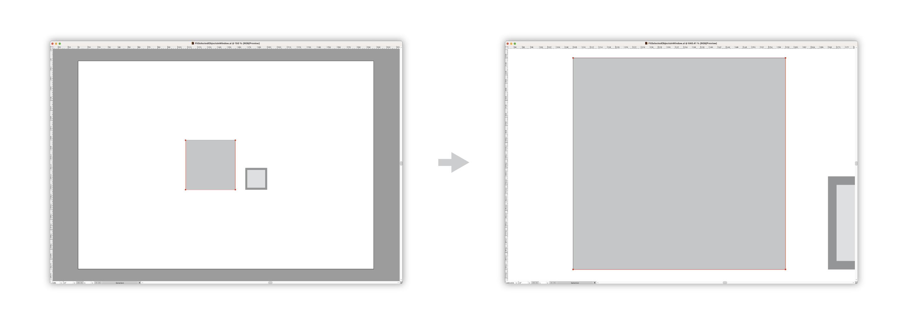

#### 使用方法
オブジェクトを選択してスクリプトを実行します。

> [!NOTE]
> オブジェクトを選択していない場合は、すべてのオブジェクトが画面に収まるように表示します。そのときはガイドを無視します。

#### 動作条件
Illustrator CS以降

<div align="right">[ <a href="#表示">↑ トップへ戻る ↑</a> ]</div>
<br>


## <a name="グラデーションを生成">グラデーションを生成</a>
### generateGradientColor.js
[](https://github.com/sky-chaser-high/adobe-illustrator-scripts/releases/latest/download/Color.zip)


オブジェクトの塗り色またはスウォッチからグラデーションを生成します。

> [!TIP]
> バージョン2025からスウォッチパネルメニューに実装されています。


#### 使用方法
パスオブジェクトまたはスウォッチを選択してスクリプトを実行します。

> [!NOTE]
> パスオブジェクトを優先します。スウォッチからグラデーションを生成したい場合はパスオブジェクトの選択を解除してください。  
> テキスト、線の色には対応していません。

#### 動作条件
Illustrator CS4以降

<div align="right">[ <a href="#カラー">↑ トップへ戻る ↑</a> ]</div>
<br>


## <a name="行に移動">行に移動</a>
### goToLine.js
[](https://github.com/sky-chaser-high/adobe-illustrator-scripts/releases/latest/download/Text.zip)


Visual Studio Code の「行/列に移動」( <kbd>Ctrl</kbd> + <kbd>G</kbd> )と同様のことができます。  
[Keyboard Maestro](https://www.keyboardmaestro.com/main/)、
[SPAi](https://tama-san.com/spai/) や
[Sppy](https://sppy.stars.ne.jp/sppyai)
などでショートカットを割り当てると、より一層Visual Studio Codeの操作感が出せると思います。  
ポイント文字、エリア内文字のどちらにも対応しています。


> [!NOTE]
> Illustrator日本語版を使用している場合は、UIは日本語で表示します。

#### 使用方法
1. テキスト編集状態でスクリプトを実行します。
2. 行番号を入力するか、リストから移動したい行を選択します。

> [!WARNING]
> カーソルを移動させるためにスクリプト内部でコピー＆ペーストを行っています。そのため、あらかじめ文字列等をコピーしていた場合はその内容が失われてしまいます。

> [!NOTE]
> 選択した行がウィンドウの中央に来るようにパンします。  
> バージョン2020以前の場合は、スクリプトを実行するとキーボードが反応しなくなります。  
> テキストを編集する場合はマウスでテキストをクリックしてください。

#### 動作条件
Illustrator CC 2018以降

<div align="right">[ <a href="#テキスト">↑ トップへ戻る ↑</a> ]</div>
<br>


## <a name="カーソルを次--前のテキストへ移動">カーソルを次 / 前のテキストへ移動</a>
### goToNextText.js<br>goToPreviousText.js
[](https://github.com/sky-chaser-high/adobe-illustrator-scripts/releases/latest/download/Text.zip)


テキスト編集状態のまま、カーソルを次または前のテキストオブジェクトの先頭に移動します。  
ポイント文字、エリア内文字のどちらにも対応しています。

例 goToNextText.js:


#### 使用方法
テキスト編集状態でスクリプトを実行します。

> [!WARNING]
> カーソルを移動させるためにスクリプト内部でカット＆ペーストを行っています。そのため、あらかじめ文字列等をコピーしていた場合はその内容が失われてしまいます。

> [!NOTE]
> ロック、非表示状態またはスレッドテキストには移動しません。レイヤーの状態も同様です。  
> カーソルの移動順は、テキストの作成順になります。  
> 次または前のテキストがウィンドウの中央に来るようにパンします。  
> バージョン2020以前の場合は、スクリプトを実行するとキーボードが反応しなくなります。  
> テキストを編集する場合はマウスでテキストをクリックしてください。

#### 動作条件
Illustrator CC 2018以降

<div align="right">[ <a href="#テキスト">↑ トップへ戻る ↑</a> ]</div>
<br>


## <a name="テキストの色を変更">テキストの色を変更</a>
### highlightWord.js
[](https://github.com/sky-chaser-high/adobe-illustrator-scripts/releases/latest/download/Color.zip)


指定したテキストの塗り色を変更します。CMYK、RGB のどちらにも対応しています。


> [!NOTE]
> Illustrator日本語版を使用している場合は、UIは日本語で表示します。

#### 使用方法
1. テキストオブジェクトを選択してスクリプトを実行します。  
   なにも選択しない場合は、ドキュメント内のすべてのテキストが対象になります。
2. 検索文字列にテキストを入力します。正規表現に対応しています。
3. 色を指定するには、色の値を入力するか、スライダーを使用します。
4. スウォッチを指定するには、スウォッチタブのリストからスウォッチ名を選択し、［カラー設定を無視］にチェックを付けます。
5. 文字スタイルを指定するには、文字スタイルタブのリストからスタイル名を選択します。
6. 段落スタイルを指定するには、段落スタイルタブのリストからスタイル名を選択します。

文字、または段落スタイルに色を付けたい場合は、［カラー設定を無視］のチェックを外します。

> [!NOTE]
> カラーとスウォッチを同時に適用できません。

#### 動作条件
Illustrator CS6以降

<div align="right">[ <a href="#カラー">↑ トップへ戻る ↑</a> ]</div>
<br>


## <a name="CSVファイルを読み込む">CSVファイルを読み込む</a>
### importCSVtoSwatch.js
[](https://github.com/sky-chaser-high/adobe-illustrator-scripts/releases/latest/download/Color.zip)


CSVファイルからカラー数値を読み込んでスウォッチに追加します。


#### 使用方法
1. スクリプトを実行します。
2. CSVファイルを選択します。

> [!IMPORTANT]
> ドキュメントのカラーモードとCSVファイルの形式をそろえてください。

#### ファイル形式
CSVファイルの形式は以下の3種類になります。

> [!NOTE]
> 各列はカンマまたはタブで区切ってください。  
> 1行目は項目名を入力してください。  
> スウォッチ名は必須ではありません。

##### CMYK  
| Cyan | Magenta | Yellow | Black | Swatch name |
| --- | --- | --- | --- | --- |
| 100  | 0 | 0 | 0 | Cyan |

##### RGB  
| Red | Green | Blue | Swatch name |
| --- | --- | --- | --- |
| 255 | 0 | 0 | Red |

##### HEX  
| Hex | Swatch name |
| --- | --- |
| FF0000 | Red |

> [!NOTE]
> Hexカラーを使用する場合は、先頭の"#"を省略できます。  
> Hexカラーが3桁の場合は、CSSと同様のふるまいをします。（例：#F0F → #FF00FF）

#### 動作条件
Illustrator CS以降

<div align="right">[ <a href="#カラー">↑ トップへ戻る ↑</a> ]</div>
<br>


## <a name="選択したアンカーポイントを時計回り--反時計回りに増やす">選択したアンカーポイントを時計回り / 反時計回りに増やす</a>
### increaseSelectedAnchorPointsCW.js<br>increaseSelectedAnchorPointsCCW.js
[](https://github.com/sky-chaser-high/adobe-illustrator-scripts/releases/latest/download/Path.zip)


選択したアンカーポイントの個数を時計回り、または反時計回りに増やします。

例 increaseSelectedAnchorPointsCW.js:


#### 使用方法
ダイレクト選択ツールでアンカーポイントを選択してスクリプトを実行します。

#### 動作条件
Illustrator CS以降

<div align="right">[ <a href="#パス">↑ トップへ戻る ↑</a> ]</div>
<br>


## <a name="行を上--下に挿入">行を上 / 下に挿入</a>
### insertLineAbove.js<br>insertLineBelow.js
[](https://github.com/sky-chaser-high/adobe-illustrator-scripts/releases/latest/download/Text.zip)


Visual Studio Code のショートカット「行を上に挿入」( <kbd>⌘</kbd> / <kbd>Ctrl</kbd> + <kbd>Shift</kbd> + <kbd>Enter</kbd> )、
「行を下に挿入」( <kbd>⌘</kbd> / <kbd>Ctrl</kbd> + <kbd>Enter</kbd> )と同様のことができます。  
[Keyboard Maestro](https://www.keyboardmaestro.com/main/)、
[SPAi](https://tama-san.com/spai/) や
[Sppy](https://sppy.stars.ne.jp/sppyai)
などでショートカットを割り当てると、より一層Visual Studio Codeの操作感が出せると思います。  
ポイント文字、エリア内文字のどちらにも対応しています。

例 insertLineBelow.js:


#### 使用方法
行を追加したい位置の下または上の行にカーソルを合わせてスクリプトを実行します。  
行末にカーソルを移動する必要はありません。

> [!NOTE]
> エリア内文字で文字の折り返しがある行に対して挿入する場合、うまく動作しないことがあります。  
> バージョン2020以前の場合は、スクリプトを実行するとキーボードが反応しなくなります。  
> テキストを編集する場合はマウスでテキストをクリックしてください。

#### 動作条件
Illustrator CC 2018以降

<div align="right">[ <a href="#テキスト">↑ トップへ戻る ↑</a> ]</div>
<br>


## <a name="ロック状態を反転">ロック状態を反転</a>
### invertLockedLayer.js
[](https://github.com/sky-chaser-high/adobe-illustrator-scripts/releases/latest/download/Layer.zip)


レイヤーのロック状態を切り替えます。


#### 使用方法
このスクリプトを実行するだけです。  

#### 動作条件
Illustrator CS以降

<div align="right">[ <a href="#レイヤー">↑ トップへ戻る ↑</a> ]</div>
<br>


## <a name="表示状態を反転">表示状態を反転</a>
### invertVisibleLayer.js
[](https://github.com/sky-chaser-high/adobe-illustrator-scripts/releases/latest/download/Layer.zip)


レイヤーの表示／非表示を切り替えます。


#### 使用方法
このスクリプトを実行するだけです。  

#### 動作条件
Illustrator CS以降

<div align="right">[ <a href="#レイヤー">↑ トップへ戻る ↑</a> ]</div>
<br>


## <a name="テキスト両端揃え">テキスト両端揃え</a>
### justifyContentSpaceBetween.js
[](https://github.com/sky-chaser-high/adobe-illustrator-scripts/releases/latest/download/Text.zip)


トラッキングを調整してポイント文字の両端を揃えます。  
縦組みのテキストにも対応しています。


#### 使用方法
ポイント文字と揃える基準のパスオブジェクトを選択してスクリプトを実行します。  
ポイント文字同士で揃えたい場合は、ポイント文字のみ選択します。

> [!NOTE]
> 1行の文字列中に異なるフォントサイズの文字が混在していると両端揃いになりません。  
> 文字の位置は移動しません。  
> 最も長いオブジェクトを基準にします。

#### 動作条件
Illustrator CS以降

<div align="right">[ <a href="#テキスト">↑ トップへ戻る ↑</a> ]</div>
<br>


## <a name="グラデーションのカラー分岐中間点の位置を同期">グラデーションのカラー分岐・中間点の位置を同期</a>
### matchLocationOfGradientStop.js
[](https://github.com/sky-chaser-high/adobe-illustrator-scripts/releases/latest/download/Color.zip)


グラデーションのカラー分岐点、中間点を同期します。


> [!NOTE]
> Illustrator日本語版を使用している場合は、UIは日本語で表示します。

#### 使用方法
1. スウォッチからグラデーションを2つ以上選択してスクリプトを実行します。
2. 元になるグラデーションを選択します。

> [!NOTE]
> スウォッチにあるグラデーションが対象になります。

#### 動作条件
Illustrator CS4以降

<div align="right">[ <a href="#カラー">↑ トップへ戻る ↑</a> ]</div>
<br>


## <a name="距離の測定">距離の測定</a>
### measureDistance.js
[](https://github.com/sky-chaser-high/adobe-illustrator-scripts/releases/latest/download/Utility.zip)


2点間のアンカーポイントの距離をものさしツールよりも正確に測ります。


> [!NOTE]
> Illustrator日本語版を使用している場合は、UIは日本語で表示します。

#### 使用方法
ダイレクト選択ツールで2点のアンカーポイントを選択してスクリプトを実行します。

> [!NOTE]
> 測定箇所をハイライトします。  
> 角度はポイント#1を基準にします。  
> パス上文字とエリア内文字のアンカーポイントにも対応しています。  
> フォントサイズが小さくなりすぎるため、15500％以上に拡大表示するとラベルが表示されません。

#### 対応する単位
ポイント、ピクセル、パイカ、インチ、フィート、ヤード、ミリメートル、センチメートル、メートル。  
使用する単位は、定規の単位によります。

#### 動作条件
Illustrator CS4以降

<div align="right">[ <a href="#ユーティリティ">↑ トップへ戻る ↑</a> ]</div>
<br>


## <a name="ガイドを移動">ガイドを移動</a>
### moveGuides.js
[](https://github.com/sky-chaser-high/adobe-illustrator-scripts/releases/latest/download/Path.zip)


すべてのガイドオブジェクトを指定したレイヤー、最前面、または最背面へ移動します。

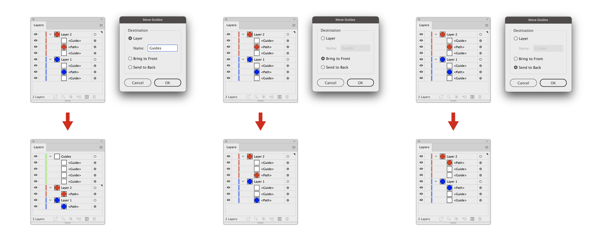
> [!NOTE]
> Illustrator日本語版を使用している場合は、UIは日本語で表示します。

#### 使用方法
1. スクリプトを実行します。  
   ガイドオブジェクトを選択する必要はありません。
2. 移動先を選択します。  
   - `レイヤー` 指定したレイヤーへ移動します。存在しない場合は、新規レイヤーを作成します。  
   - `最前面へ` 各レイヤーの最前面へ移動します。  
   - `最背面へ` 各レイヤーの最背面へ移動します。

> [!NOTE]
> 非表示やロックされているレイヤー内のガイドは移動しません。

#### 動作条件
Illustrator CS6以降

<div align="right">[ <a href="#パス">↑ トップへ戻る ↑</a> ]</div>
<br>


## <a name="行を上--下へ移動">行を上 / 下へ移動</a>
### moveLineUp.js<br>moveLineDown.js
[](https://github.com/sky-chaser-high/adobe-illustrator-scripts/releases/latest/download/Text.zip)


Visual Studio Code の「行を上へ移動」( <kbd>Option</kbd> / <kbd>Alt</kbd> + <kbd>↑</kbd> )、
「行を下へ移動」( <kbd>Option</kbd> / <kbd>Alt</kbd> + <kbd>↓</kbd> )と同様のことができます。  
[Keyboard Maestro](https://www.keyboardmaestro.com/main/)、
[SPAi](https://tama-san.com/spai/) や
[Sppy](https://sppy.stars.ne.jp/sppyai)
などでショートカットを割り当てると、より一層Visual Studio Codeの操作感が出せると思います。  
ポイント文字、エリア内文字のどちらにも対応しています。


例 moveLineDown.js:


#### 使用方法
移動したい行にカーソルを合わせてスクリプトを実行します。  
移動する行を選択する必要はありません。

> [!WARNING]
> カーソルを移動させるためにスクリプト内部でコピー＆ペーストを行っています。そのため、あらかじめ文字列等をコピーしていた場合はその内容が失われてしまいます。

> [!NOTE]
> エリア内文字で文字の折り返しがある行を移動する場合、うまく動作しないことがあります。  
> moveLineUp.jsで最終行を移動する場合は、バグを回避するために空行を追加します。  
> 移動できるのは1行のみです。複数行には対応していません。  
> バージョン2020以前の場合は、スクリプトを実行するとキーボードが反応しなくなります。  
> テキストを編集する場合はマウスでテキストをクリックしてください。

#### 動作条件
Illustrator CC 2018以降

<div align="right">[ <a href="#テキスト">↑ トップへ戻る ↑</a> ]</div>
<br>


## <a name="サブレイヤーをメインレイヤーへ移動">サブレイヤーをメインレイヤーへ移動</a>
### moveSublayerToMainLayer.js
[](https://github.com/sky-chaser-high/adobe-illustrator-scripts/releases/latest/download/Layer.zip)


サブレイヤーをメインレイヤーへ移動します。


#### 使用方法
このスクリプトを実行するだけです。  
サブレイヤーを選択する必要はありません。

> [!NOTE]
> すべてのレイヤーを強制的に表示しロックを解除します。

#### 動作条件
Illustrator CS以降

<div align="right">[ <a href="#レイヤー">↑ トップへ戻る ↑</a> ]</div>
<br>


## <a name="先頭--最後--次--前のアートボードへ移動">先頭 / 最後 / 次 / 前のアートボードへ移動</a>
### navigateToFirstArtboard.js<br>navigateToLastArtboard.js<br>navigateToNextArtboard.js<br>navigateToPreviousArtboard.js
[](https://github.com/sky-chaser-high/adobe-illustrator-scripts/releases/latest/download/View.zip)


アートボードの表示倍率と位置を維持したまま、先頭、最後、次、または前のアートボードに移動します。

> [!IMPORTANT]
> 標準機能( <kbd>shift</kbd> + <kbd>pagedown</kbd> / <kbd>pageup</kbd> )でもできますが、アートボードを全体表示にします。

#### 使用方法
このスクリプトを実行するだけです。

> [!NOTE]
> 2つ以上のアートボードが必要です。

> [!TIP]
> `navigateToNextArtboard.js`は、最後のアートボードを表示している場合、先頭のアートボードに移動します。  
> `navigateToPreviousArtboard.js`は、先頭のアートボードを表示している場合、最後のアートボードに移動します。  
> アートボードのサイズが同じであれば、より効果的です。

#### 動作条件
Illustrator CS4以降

<div align="right">[ <a href="#表示">↑ トップへ戻る ↑</a> ]</div>
<br>


## <a name="テキストの色をランダムに変更">テキストの色をランダムに変更</a>
### randomTextColor.js
[](https://github.com/sky-chaser-high/adobe-illustrator-scripts/releases/latest/download/Color.zip)


単語、1文字、または1文ごとにランダムに色を適用します。CMYK、RGB のどちらにも対応しています。


> [!NOTE]
> Illustrator日本語版を使用している場合は、UIは日本語で表示します。

#### 使用方法
1. テキストオブジェクトを選択してスクリプトを実行します。
2. 色の値を入力するか、スライダーを使用してしきい値を設定します。
3. ランダムボタンをクリックすると、しきい値に応じた色を割り当てます。

> [!NOTE]
> 文字数が多いと変換に時間がかかります。  
> 英文の場合、ピリオドやカンマなど一部適用されない文字があります。

#### 動作条件
Illustrator CS4以降

<div align="right">[ <a href="#カラー">↑ トップへ戻る ↑</a> ]</div>
<br>


## <a name="オブジェクトの並べ替え">オブジェクトの並べ替え</a>
### rearrangeObjects.js
[](https://github.com/sky-chaser-high/adobe-illustrator-scripts/releases/latest/download/Path.zip)


選択しているオブジェクトを並べ替えます。


> [!NOTE]
> Illustrator日本語版を使用している場合は、UIは日本語で表示します。

#### 使用方法
1. オブジェクトを選択してスクリプトを実行します。
2. レイアウトを選択します。
3. 1列に並べるオブジェクトの個数を［横列数］または［縦列数］に入力します。
4. 並べるオブジェクトの間隔を［間隔］に入力します。
5. オブジェクトの現在の並び順を選択します。並び順を逆にするには、［逆順］にチェックを付けます。
6. 線幅を含める場合は、［プレビュー境界を使用］にチェックを付けます。
7. ［整列位置の許容誤差］の値を入力します。（0以上の数値）  
   
8. レイアウトを確認するには、［プレビュー］にチェックを付けます。

> [!NOTE]
> 左上のオブジェクトが並べ替えの基準になります。  
> 複合パス、テキスト、リンク画像、埋め込み画像にも対応しています。

#### 対応する単位
ポイント、ピクセル、パイカ、インチ、フィート、ヤード、ミリメートル、センチメートル、メートル。  
使用する単位は、定規の単位によります。

#### 動作条件
Illustrator 2021以降

<div align="right">[ <a href="#パス">↑ トップへ戻る ↑</a> ]</div>
<br>


## <a name="ファイル拡張子にリンクを再設定">ファイル拡張子にリンクを再設定</a>
### relinkFileExtension.js
[](https://github.com/sky-chaser-high/adobe-illustrator-scripts/releases/latest/download/Link.zip)


リンク画像を指定した拡張子のファイルに置き換えます。InDesignの「リンクパネル > ファイル拡張子にリンクを再設定」に相当します。
より詳細な設定がしたい場合は、[relinkFileExtensionExtra.js](#ファイル拡張子にリンクを再設定機能拡張版)を使用してください。


> [!NOTE]
> Illustrator日本語版を使用している場合は、UIは日本語で表示します。

#### 使用方法
1. 再設定したいリンク画像を選択しスクリプトを実行します。  
   なにも選択しない場合は、ドキュメント内のすべてのリンク画像が対象になります。
2. ファイルの拡張子を入力します。

> [!WARNING]
> リンク切れ画像と埋め込み画像はリンクを再設定できません。

> [!NOTE]
> 再設定するリンク画像は、元のリンク画像と同じフォルダに置いてください。  
> リンク画像を選択する場合は、リンクパネルではなくドキュメント内のリンク画像を選択してください。

#### 動作条件
Illustrator CS4以降

<div align="right">[ <a href="#リンク">↑ トップへ戻る ↑</a> ]</div>
<br>


## <a name="ファイル拡張子にリンクを再設定機能拡張版">ファイル拡張子にリンクを再設定（機能拡張版）</a>
### relinkFileExtensionExtra.js
[](https://github.com/sky-chaser-high/adobe-illustrator-scripts/releases/latest/download/Link.zip)


[relinkFileExtension.js](#ファイル拡張子にリンクを再設定)の機能拡張版です。リンクを再設定するためのより高度な機能を備えています。


> [!NOTE]
> Illustrator日本語版を使用している場合は、UIは日本語で表示します。

#### 使用方法
1. 再設定したいリンク画像を選択しスクリプトを実行します。  
   なにも選択しない場合は、ドキュメント内のすべてのリンク画像が対象になります。
2. `置換`または`追加`のどちらかを選択します。
   - `置換` 検索文字列に現在のファイル名を、置換文字列に新しいファイル名を入力します。ファイル名の一部でも可能です。検索文字列では正規表現が使用できます。
   - `追加` 元のファイル名の先頭、末尾またはその両方に追加する文字列を入力します。
3. ファイルの拡張子を入力します。  
   なにも入力しない場合は、元のリンク画像の拡張子を使用します。
4. 拡張子にPDFを指定した場合は、ページ番号を入力し、トリミングオプションを選択します。  
   トリミングの詳細は、「[Adobe PDF ファイルの読み込み](https://helpx.adobe.com/jp/illustrator/using/importing-pdf-files.html)」を参照してください。
5. リンク画像のフォルダを変更するには、再設定するリンク画像があるフォルダを選択します。  
   なにも選択しない場合は、元のリンク画像と同じフォルダになります。  
   フォルダのパスを削除したい場合は、<kbd>Option</kbd> / <kbd>Alt</kbd> キーを押しながら削除ボタンをクリックします。

> [!WARNING]
> リンク切れ画像と埋め込み画像はリンクを再設定できません。

> [!NOTE]
> リンク画像を選択する場合は、リンクパネルではなくドキュメント内のリンク画像を選択してください。

#### 動作条件
Illustrator CS6以降

<div align="right">[ <a href="#リンク">↑ トップへ戻る ↑</a> ]</div>
<br>


## <a name="フォルダに再リンク">フォルダに再リンク</a>
### relinkToFolder.js
[](https://github.com/sky-chaser-high/adobe-illustrator-scripts/releases/latest/download/Link.zip)


リンク画像を選択したフォルダにある同じ名前のファイルと置き換えます。InDesignの「リンクパネル > フォルダに再リンク」に相当します。

#### 使用方法
1. 再設定したいリンク画像を選択しスクリプトを実行します。  
   なにも選択しない場合は、ドキュメント内のすべてのリンク画像が対象になります。
2. 表示したダイアログからフォルダを選択します。

> [!WARNING]
> リンク切れ画像と埋め込み画像はリンクを再設定できません。

> [!NOTE]
> リンク画像を選択する場合は、リンクパネルではなくドキュメント内のリンク画像を選択してください。

#### 動作条件
Illustrator CS4以降

<div align="right">[ <a href="#リンク">↑ トップへ戻る ↑</a> ]</div>
<br>


## <a name="ガイドオブジェクトの色を削除">ガイドオブジェクトの色を削除</a>
### removeColorInGuideObject.js
[](https://github.com/sky-chaser-high/adobe-illustrator-scripts/releases/latest/download/Path.zip)


すべてのガイドオブジェクトの塗りと線の色を削除します。


#### 使用方法
このスクリプトを実行するだけです。  
ガイドオブジェクトを選択する必要はありません。

> [!NOTE]
> アピアランスで塗りや線の色を追加している場合は、削除できない場合があります。

#### 動作条件
Illustrator CS6以降

<div align="right">[ <a href="#パス">↑ トップへ戻る ↑</a> ]</div>
<br>


## <a name="Deleted-Global-Color-を削除">Deleted Global Color を削除</a>
### removeDeletedGlobalColor.js
[](https://github.com/sky-chaser-high/adobe-illustrator-scripts/releases/latest/download/Color.zip)


分版プレビューパネルに表示される Deleted Global Color を削除します。


#### 使用方法
このスクリプトを実行するだけです。  
オブジェクトを選択する必要はありません。

> [!NOTE]
> まれに削除できない場合があります。  
> 削除後にファイルを保存して再度開くと復活する場合があります。

#### 動作条件
Illustrator CS以降

<div align="right">[ <a href="#カラー">↑ トップへ戻る ↑</a> ]</div>
<br>


## <a name="アートボードの名前を変更">アートボードの名前を変更</a>
### renameArtboard.js
[](https://github.com/sky-chaser-high/adobe-illustrator-scripts/releases/latest/download/Artboard.zip)


すべてのアートボードの名前をまとめて編集します。

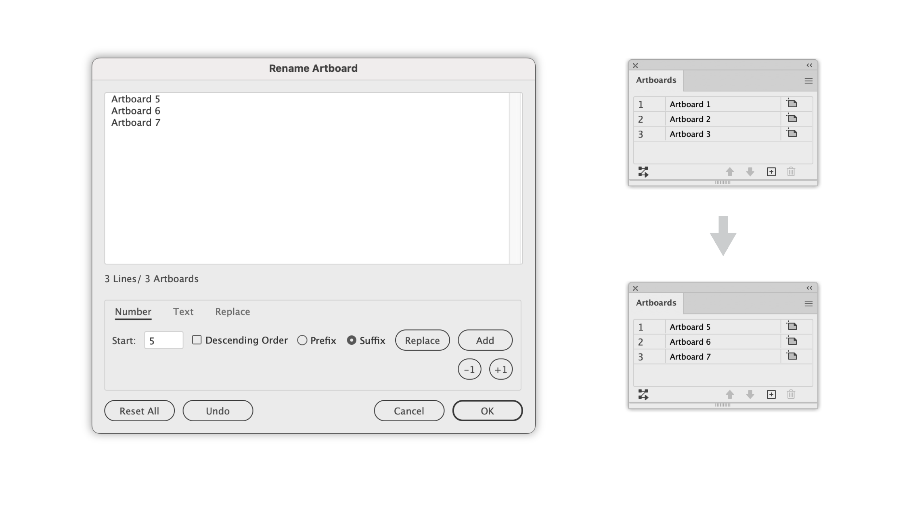
> [!NOTE]
> Illustrator日本語版を使用している場合は、UIは日本語で表示します。

#### 使用方法
1. スクリプトを実行します。
2. テキストフィールドに表示したアートボードの名前を編集します。

#### オプション
素早く編集するためのオプションを用意しています。
##### 数字
- `置換` アートボードの名前の先頭または末尾の数字を置換します。
- `追加` アートボードの名前の先頭または末尾に数字を追加します。
- `-1` `+1` アートボードの名前の先頭または末尾の数字を増減します。
- ［降順］にチェックを付けると降順に変更します。
##### 文字
- アートボードの名前の先頭または末尾に文字列を追加します。
##### 置換
- アートボードの名前を指定した文字列で置換します。
- 検索文字列では正規表現が使用できます。

> [!NOTE]
> テキストフィールドの行数がアートボードの数と一致しない場合は警告が出ます。

#### 動作条件
Illustrator CS4以降

<div align="right">[ <a href="#アートボード">↑ トップへ戻る ↑</a> ]</div>
<br>


## <a name="レイヤー名の変更">レイヤー名の変更</a>
### renameLayer.js
[](https://github.com/sky-chaser-high/adobe-illustrator-scripts/releases/latest/download/Layer.zip)


すべてのレイヤーの名前をまとめて編集します。

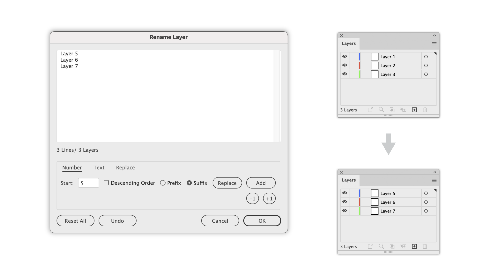
> [!NOTE]
> Illustrator日本語版を使用している場合は、UIは日本語で表示します。

#### 使用方法
1. スクリプトを実行します。
2. テキストフィールドに表示したレイヤー名を編集します。

#### オプション
素早く編集するためのオプションを用意しています。
##### 数字
- `置換` レイヤー名の先頭または末尾の数字を置換します。
- `追加` レイヤー名の先頭または末尾に数字を追加します。
- `-1` `+1` レイヤー名の先頭または末尾の数字を増減します。
- ［降順］にチェックを付けると降順に変更します。
##### 文字
- レイヤー名の先頭または末尾に文字列を追加します。
##### 置換
- レイヤー名を指定した文字列で置換します。
- 検索文字列では正規表現が使用できます。

> [!NOTE]
> サブレイヤーには対応していません。  
> テキストフィールドの行数がレイヤー数より少なくなると警告が出ます。  
> テキストフィールドの行数がレイヤー数より多い場合は、行数が増えた分だけレイヤーを追加します。

#### 動作条件
Illustrator CS4以降

<div align="right">[ <a href="#レイヤー">↑ トップへ戻る ↑</a> ]</div>
<br>


## <a name="リンク画像の名前を変更">リンク画像の名前を変更</a>
### renameLinkedFile.js
[](https://github.com/sky-chaser-high/adobe-illustrator-scripts/releases/latest/download/Link.zip)


リンク画像のファイル名を変更し、リンクを再設定します。

> [!CAUTION]
> **「編集 > 取り消し」( <kbd>⌘</kbd> / <kbd>Ctrl</kbd> + <kbd>Z</kbd> )でファイル名を元に戻すことができません。**  
> **ファイル操作は危険です。スクリプトを実行する前にデータのバックアップをおすすめします。**

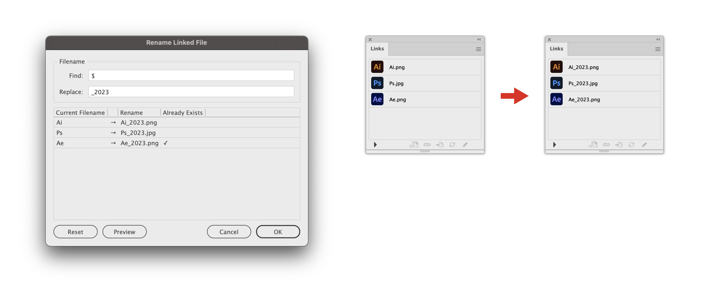
> [!NOTE]
> Illustrator日本語版を使用している場合は、UIは日本語で表示します。

#### 使用方法
1. 名前を変更したいリンク画像を選択しスクリプトを実行します。  
   なにも選択しない場合は、ドキュメント内のすべてのリンク画像が対象になります。
2. 検索文字列に現在のファイル名を、置換文字列に新しいファイル名を入力します。  
   ファイル名の一部でも可能です。検索文字列では正規表現が使用できます。
3. プレビューをクリックすると、変更後のファイル名をリストに表示します。  
   既存ファイルにチェックがある場合は、同名のファイルがすでに存在することを表します。

> [!WARNING]
> リンク切れ画像と埋め込み画像はリンクを再設定できません。  
> 他のドキュメントにも同じリンク画像を使用している場合は、リンクが切れてしまいます。

> [!NOTE]
> リンク画像を選択する場合は、リンクパネルではなくドキュメント内のリンク画像を選択してください。  
> スクリプト実行時に表示する警告を非表示にしたい場合は、50行目を削除またはコメントアウトしてください。

#### 動作条件
Illustrator CS4以降

<div align="right">[ <a href="#リンク">↑ トップへ戻る ↑</a> ]</div>
<br>


## <a name="リンク画像を原寸サイズに戻す">リンク画像を原寸サイズに戻す</a>
### resetToFullScale.js
[](https://github.com/sky-chaser-high/adobe-illustrator-scripts/releases/latest/download/Link.zip)


リンクまたは埋め込み画像のスケールを100%に、回転角度を0°に戻します。


#### 使用方法
リンクまたは埋め込み画像を選択してスクリプトを実行します。

#### 動作条件
Illustrator CS6以降

<div align="right">[ <a href="#リンク">↑ トップへ戻る ↑</a> ]</div>
<br>


## <a name="パスセグメントの角度に合わせてテキストを回転">パスセグメントの角度に合わせてテキストを回転</a>
### rotateTextToMatchPathSegmentAngle.js
[](https://github.com/sky-chaser-high/adobe-illustrator-scripts/releases/latest/download/Text.zip)


直線セグメント、または2点のアンカーポイントを結ぶ直線の角度に合わせてテキストを回転します。縦組みのテキストにも対応しています。

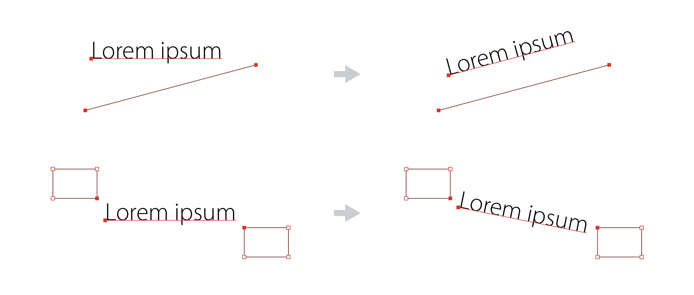

#### 使用方法
ダイレクト選択ツールで2点のアンカーポイント、またはパスセグメントとテキストオブジェクトを選択してスクリプトを実行します。

> [!NOTE]
> 曲線には対応していません。  
> ポイント文字の場合はアンカーポイントを支点にして回転します。

#### 動作条件
Illustrator CS以降

<div align="right">[ <a href="#テキスト">↑ トップへ戻る ↑</a> ]</div>
<br>


## <a name="カラー数値を四捨五入">カラー数値を四捨五入</a>
### roundColorValue.js
[](https://github.com/sky-chaser-high/adobe-illustrator-scripts/releases/latest/download/Color.zip)


カラーの数値を四捨五入します。塗り、線のどちらにも対応しています。


#### 使用方法
オブジェクトを選択してスクリプトを実行します。

#### 動作条件
Illustrator CS以降

<div align="right">[ <a href="#カラー">↑ トップへ戻る ↑</a> ]</div>
<br>


## <a name="グラデーションのカラー分岐中間点の数値を四捨五入">グラデーションのカラー分岐・中間点の数値を四捨五入</a>
### roundLocationOfGradientStop.js
[](https://github.com/sky-chaser-high/adobe-illustrator-scripts/releases/latest/download/Color.zip)


グラデーションのカラー分岐点、中間点の数値を四捨五入します。塗り、線のどちらにも対応しています。


#### 使用方法
オブジェクトを選択してスクリプトを実行します。

#### 動作条件
Illustrator CS以降

<div align="right">[ <a href="#カラー">↑ トップへ戻る ↑</a> ]</div>
<br>


## <a name="埋め込み画像を選択">埋め込み画像を選択</a>
### selectEmbeddedLink.js
[](https://github.com/sky-chaser-high/adobe-illustrator-scripts/releases/latest/download/Link.zip)


すべての埋め込み画像を選択します。

#### 使用方法
このスクリプトを実行するだけです。

> [!NOTE]
> ロックまたは非表示状態では選択しません。レイヤーの状態も同様です。

#### 動作条件
Illustrator CS以降

<div align="right">[ <a href="#リンク">↑ トップへ戻る ↑</a> ]</div>
<br>


## <a name="ガイドを選択">ガイドを選択</a>
### selectGuides.js
[](https://github.com/sky-chaser-high/adobe-illustrator-scripts/releases/latest/download/Path.zip)


すべてのガイドオブジェクトを選択します。

#### 使用方法
このスクリプトを実行するだけです。

> [!NOTE]
> 非表示やロックされているレイヤー内のガイドは選択できません。

#### 動作条件
Illustrator CS6以降

<div align="right">[ <a href="#パス">↑ トップへ戻る ↑</a> ]</div>
<br>


## <a name="リンク画像を選択">リンク画像を選択</a>
### selectLink.js
[](https://github.com/sky-chaser-high/adobe-illustrator-scripts/releases/latest/download/Link.zip)


リンク画像を選択します。


> [!NOTE]
> Illustrator日本語版を使用している場合は、UIは日本語で表示します。

#### 使用方法
1. スクリプトを実行します。
2. 検索文字列にファイル名を入力するか、リストからファイル名を選択します。  
   検索文字列になにも入力しない場合は、すべてのリンク画像を選択します。正規表現が使用できます。

> [!NOTE]
> ロックまたは非表示状態では選択しません。レイヤーの状態も同様です。  
> リンク切れ画像は選択できない場合があります。

#### 動作条件
Illustrator CS4以降

<div align="right">[ <a href="#リンク">↑ トップへ戻る ↑</a> ]</div>
<br>


## <a name="リンク切れ画像を選択">リンク切れ画像を選択</a>
### selectMissingLink.js
[](https://github.com/sky-chaser-high/adobe-illustrator-scripts/releases/latest/download/Link.zip)


すべてのリンク切れ画像を選択します。

#### 使用方法
このスクリプトを実行するだけです。

> [!NOTE]
> ロックまたは非表示状態では選択しません。レイヤーの状態も同様です。

#### 動作条件
Illustrator CS以降

<div align="right">[ <a href="#リンク">↑ トップへ戻る ↑</a> ]</div>
<br>


## <a name="選択したアンカーポイントを時計回り--反時計回りに移動">選択したアンカーポイントを時計回り / 反時計回りに移動</a>
### shiftSelectedAnchorPointsCW.js<br>shiftSelectedAnchorPointsCCW.js
[](https://github.com/sky-chaser-high/adobe-illustrator-scripts/releases/latest/download/Path.zip)


選択したアンカーポイントを時計回り、または反時計回りに移動します。

例 shiftSelectedAnchorPointsCW.js:


#### 使用方法
ダイレクト選択ツールでアンカーポイントを選択してスクリプトを実行します。

#### 動作条件
Illustrator CS以降

<div align="right">[ <a href="#パス">↑ トップへ戻る ↑</a> ]</div>
<br>


## <a name="アートボードの名前とサイズを表示">アートボードの名前とサイズを表示</a>
### showArtboardName.js
[](https://github.com/sky-chaser-high/adobe-illustrator-scripts/releases/latest/download/Artboard.zip)


ドキュメント内にアートボードの名前とサイズを表示します。


#### 使用方法
このスクリプトを実行するだけです。  

#### 対応する単位
ポイント、ピクセル、パイカ、インチ、フィート、ヤード、ミリメートル、センチメートル、メートル。  
使用する単位は、定規の単位によります。

#### 動作条件
Illustrator CS4以降

<div align="right">[ <a href="#アートボード">↑ トップへ戻る ↑</a> ]</div>
<br>


## <a name="カラー数値を表示">カラー数値を表示</a>
### showColorValues.js
[](https://github.com/sky-chaser-high/adobe-illustrator-scripts/releases/latest/download/Color.zip)


カラーの数値を表示します。塗り、線のどちらにも対応しています。


#### 使用方法
パスオブジェクトを選択してスクリプトを実行します。

> [!NOTE]
> CMYK、RGB、HEX、グレースケール、特色、パターンに対応しています。  
> テキスト、グラデーションは対応していません。

#### 動作条件
Illustrator CS以降

<div align="right">[ <a href="#カラー">↑ トップへ戻る ↑</a> ]</div>
<br>


## <a name="パスの寸法を表示">パスの寸法を表示</a>
### showDimensions.js
[](https://github.com/sky-chaser-high/adobe-illustrator-scripts/releases/latest/download/Path.zip)


パスオブジェクトの2点間のアンカーポイントの寸法を表示します。

> [!TIP]
> バージョン2024から寸法ツールがツールバーに実装されています。


#### 使用方法
パスオブジェクトを選択してスクリプトを実行します。  
ダイレクト選択ツールでアンカーポイントを選択した場合は、選択した箇所のみに表示します。この場合は、2点以上のアンカーポイントを選択してください。

> [!NOTE]
> 曲線に対応しています。  
> パスオブジェクトごとに寸法をグループ化し色を付けます。  
> オブジェクトが複雑な形状や小さい場合、寸法が重なって表示されることがあります。

#### 対応する単位
ポイント、ピクセル、パイカ、インチ、フィート、ヤード、ミリメートル、センチメートル、メートル。  
使用する単位は、定規の単位によります。

#### 動作条件
Illustrator CS6以降

<div align="right">[ <a href="#パス">↑ トップへ戻る ↑</a> ]</div>
<br>


## <a name="グラデーションをシャッフル">グラデーションをシャッフル</a>
### shuffleGradientColor.js
[](https://github.com/sky-chaser-high/adobe-illustrator-scripts/releases/latest/download/Color.zip)


グラデーションをシャッフルします。


#### 使用方法
パスオブジェクトを選択してスクリプトを実行します。

> [!NOTE]
> 線のカラーには対応していません。  
> 複合パスの場合は、ダイレクト選択ツールでパスを選択してください。

#### 動作条件
Illustrator CS以降

<div align="right">[ <a href="#カラー">↑ トップへ戻る ↑</a> ]</div>
<br>


## <a name="オブジェクトをシャッフル">オブジェクトをシャッフル</a>
### shuffleObjects.js
[](https://github.com/sky-chaser-high/adobe-illustrator-scripts/releases/latest/download/Path.zip)


選択したオブジェクトをシャッフルします。


#### 使用方法
オブジェクトを選択してスクリプトを実行します。

#### 動作条件
Illustrator CS以降

<div align="right">[ <a href="#パス">↑ トップへ戻る ↑</a> ]</div>
<br>


## <a name="アートボードの並べ替え">アートボードの並べ替え</a>
### sortArtboards.js
[](https://github.com/sky-chaser-high/adobe-illustrator-scripts/releases/latest/download/Artboard.zip)


アートボードパネル内のアートボードを昇順で並べ替えます。


#### 使用方法
このスクリプトを実行するだけです。  

> [!NOTE]
> ドキュメント内のアートボードは並べ替えしません。（位置はそのまま）

#### 動作条件
Illustrator CS5以降

<div align="right">[ <a href="#アートボード">↑ トップへ戻る ↑</a> ]</div>
<br>


## <a name="行の並べ替え">行の並べ替え</a>
### sortLines.js
[](https://github.com/sky-chaser-high/adobe-illustrator-scripts/releases/latest/download/Text.zip)


テキストの行を並べ替えます。縦組みのテキストにも対応しています。

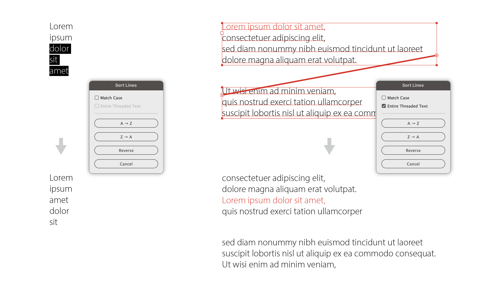
> [!NOTE]
> Illustrator日本語版を使用している場合は、UIは日本語で表示します。

#### 使用方法
1. 並べ替えるテキストまたは行を選択してスクリプトを実行します。
2. アルファベットの大文字と小文字を区別する場合は、［大文字と小文字を区別］にチェックを付けます。
3. スレッドテキスト全体を並べ替えるには、［スレッド全体を並べ替え］にチェックを付けます。
4. 以下の並べ替えボタンのいずれかをクリックします。  
   `A → Z` 昇順に並べ替えます。  
   `Z → A` 降順に並べ替えます。  
   `逆順` 逆順に並べ替えます。

> [!NOTE]
> エリア内文字で折り返された行は各行で分割します。  
> テキストの選択範囲が次のスレッドにまたがる場合は、並べ替えできません。  
> パス上文字には対応していません。

#### 動作条件
Illustrator CS4以降

<div align="right">[ <a href="#テキスト">↑ トップへ戻る ↑</a> ]</div>
<br>


## <a name="文字列を分割">文字列を分割</a>
### splitText.js
[](https://github.com/sky-chaser-high/adobe-illustrator-scripts/releases/latest/download/Text.zip)


ポイント文字またはエリア内文字を行、単語、または1文字ごとに分割します。  
縦組みのテキストにも対応しています。

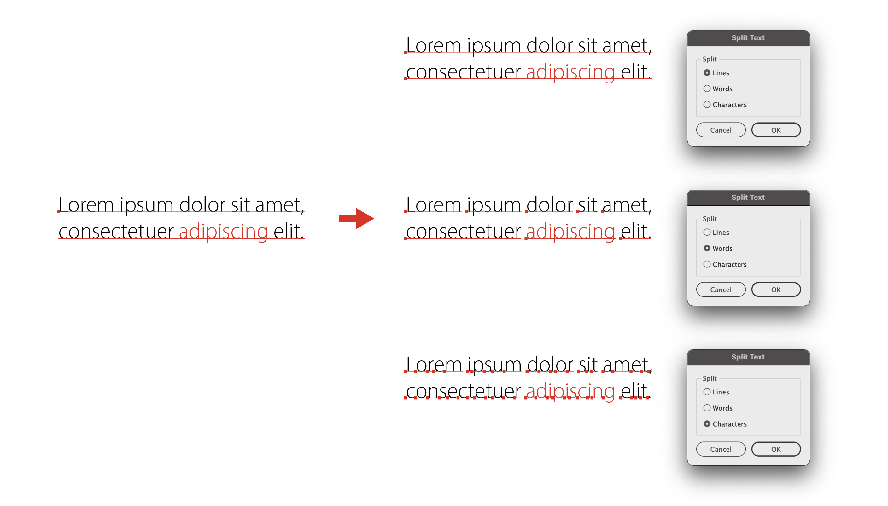
> [!NOTE]
> Illustrator日本語版を使用している場合は、UIは日本語で表示します。

#### 使用方法
1. ポイント文字、またはエリア内文字を選択してスクリプトを実行します。
2. 行、単語、1文字のいずれかを選択します。

> [!NOTE]
> エリア内文字はポイント文字に変換します。  
> 文字数が多いと分割に時間がかかります。  
> 分割後、テキストの位置がわずかに移動することがあります。

#### 動作条件
Illustrator CC以降

<div align="right">[ <a href="#テキスト">↑ トップへ戻る ↑</a> ]</div>
<br>


## <a name="文字列をカーソルの位置で分割">文字列をカーソルの位置で分割</a>
### splitTextAtCursorPosition.js
[](https://github.com/sky-chaser-high/adobe-illustrator-scripts/releases/latest/download/Text.zip)


ポイント文字をカーソルの位置で分割します。  
縦組みのテキストにも対応しています。

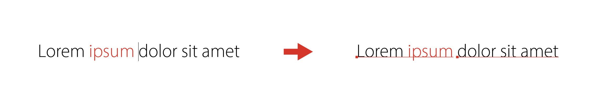

#### 使用方法
分割したい位置にカーソルを合わせてスクリプトを実行します。

> [!NOTE]
> エリア内文字には対応していません。  
> 文字列が複数行の場合はレイアウトが崩れます。  
> 分割後、テキストの位置がわずかに移動することがあります。

#### 動作条件
Illustrator CS6以降

<div align="right">[ <a href="#テキスト">↑ トップへ戻る ↑</a> ]</div>
<br>


## <a name="繰り返し複製">繰り返し複製</a>
### stepAndRepeat.js
[](https://github.com/sky-chaser-high/adobe-illustrator-scripts/releases/latest/download/Path.zip)


選択したオブジェクトを繰り返し複製します。InDesignの「編集 > 繰り返し複製」に相当します。


> [!NOTE]
> Illustrator日本語版を使用している場合は、UIは日本語で表示します。

#### 使用方法
1. オブジェクトを選択してスクリプトを実行します。
2. グリッド状にしたい場合は、［グリッドとして作成］にチェックを付けます。
3. 繰り返しの場合はカウントに繰り返す回数を入力します。  
   グリッドの場合は行・段数にそれぞれ繰り返す回数を入力します。
4. オフセット値（オブジェクトの間隔）を入力します。

#### 対応する単位
ポイント、ピクセル、パイカ、インチ、フィート、ヤード、ミリメートル、センチメートル、メートル。  
使用する単位は、定規の単位によります。

#### 動作条件
Illustrator CS4以降

<div align="right">[ <a href="#パス">↑ トップへ戻る ↑</a> ]</div>
<br>


## <a name="文字列内の数字の合計">文字列内の数字の合計</a>
### sumNumbers.js
[](https://github.com/sky-chaser-high/adobe-illustrator-scripts/releases/latest/download/Utility.zip)


文字列内の数字を足し合わせます。


> [!NOTE]
> Illustrator日本語版を使用している場合は、UIは日本語で表示します。

#### 使用方法
テキストオブジェクトを選択、または編集状態で範囲を指定してスクリプトを実行します。  
テキストフィールドの数値を編集して合計を再計算することもできます。

> [!NOTE]
> テキストフィールドの数値を編集しても、元のテキストオブジェクトには影響しません。

#### 動作条件
Illustrator CS4以降

<div align="right">[ <a href="#ユーティリティ">↑ トップへ戻る ↑</a> ]</div>
<br>


## <a name="文字列を交換">文字列を交換</a>
### swapTextContents.js
[](https://github.com/sky-chaser-high/adobe-illustrator-scripts/releases/latest/download/Text.zip)


2つの文字列の内容を交換します。


#### 使用方法
2つのテキストオブジェクトを選択してスクリプトを実行します。

#### 動作条件
Illustrator CS以降

<div align="right">[ <a href="#テキスト">↑ トップへ戻る ↑</a> ]</div>
<br>


## <a name="ウィンドウの表示位置を同期">ウィンドウの表示位置を同期</a>
### syncView.js
[](https://github.com/sky-chaser-high/adobe-illustrator-scripts/releases/latest/download/View.zip)


開いているすべてのウィンドウが、アクティブなウィンドウの表示倍率と位置に同期します。


#### 使用方法
このスクリプトを実行するだけです。

> [!NOTE]
> 2ファイル以上開いてください。

#### 動作条件
Illustrator CS以降  

<div align="right">[ <a href="#表示">↑ トップへ戻る ↑</a> ]</div>
<br>


## <a name="テキスト左--中央--右揃え">テキスト左 / 中央 / 右揃え</a>
### textAlign_Left.js<br>textAlign_Center.js<br>textAlign_Right.js
[](https://github.com/sky-chaser-high/adobe-illustrator-scripts/releases/latest/download/Text.zip)


ポイント文字の位置を動かさずに行揃えを変更します。  
縦組みのテキストにも対応しています。

例 textAlign_Center.js:


#### 使用方法
ポイント文字を選択してスクリプトを実行します。

#### 動作条件
Illustrator CS以降

<div align="right">[ <a href="#テキスト">↑ トップへ戻る ↑</a> ]</div>
<br>


## <a name="字形の境界に整列">字形の境界に整列</a>
### toggleAlignToGlyphBounds.js
[](https://github.com/sky-chaser-high/adobe-illustrator-scripts/releases/latest/download/Utility.zip)


「整列パネル > 字形の境界に整列 > ポイント文字・エリア内文字」のオン/オフを両方同時に切り替えます。

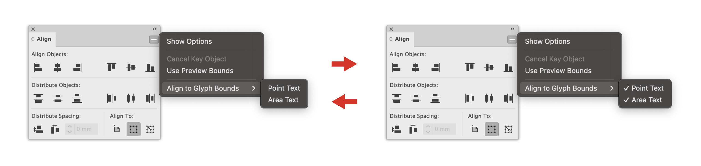

#### 使用方法
このスクリプトを実行するだけです。  

#### 動作条件
Illustrator 2020以降

<div align="right">[ <a href="#環境設定">↑ トップへ戻る ↑</a> ]</div>
<br>


## <a name="新規テキストオブジェクトにサンプルテキストを割り付け">新規テキストオブジェクトにサンプルテキストを割り付け</a>
### toggleFillNewTypeObjectsWithPlaceholderText.js
[](https://github.com/sky-chaser-high/adobe-illustrator-scripts/releases/latest/download/Utility.zip)


「環境設定 > テキスト > 新規テキストオブジェクトにサンプルテキストを割り付け」のオン/オフを切り替えます。

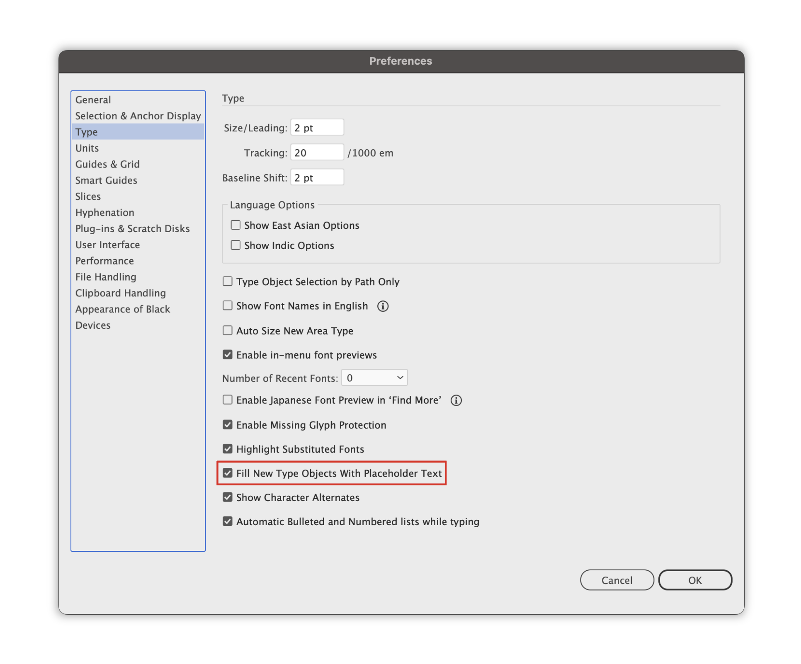

#### 使用方法
このスクリプトを実行するだけです。  

#### 動作条件
Illustrator 2018以降

<div align="right">[ <a href="#環境設定">↑ トップへ戻る ↑</a> ]</div>
<br>


## <a name="コピー元のレイヤーにペースト">コピー元のレイヤーにペースト</a>
### togglePasteRemembersLayers.js
[](https://github.com/sky-chaser-high/adobe-illustrator-scripts/releases/latest/download/Utility.zip)


「レイヤーパネル > コピー元のレイヤーにペースト」のオン/オフを切り替えます。

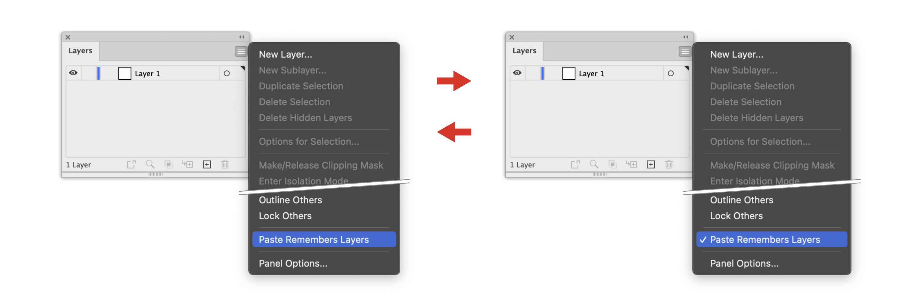

#### 使用方法
このスクリプトを実行するだけです。  

#### 動作条件
Illustrator CC以降

<div align="right">[ <a href="#環境設定">↑ トップへ戻る ↑</a> ]</div>
<br>


## <a name="同じ濃度を選択">同じ濃度を選択</a>
### toggleSelectSameTintPercentage.js
[](https://github.com/sky-chaser-high/adobe-illustrator-scripts/releases/latest/download/Utility.zip)


「環境設定 > 一般 > 同じ濃度を選択」のオン/オフを切り替えます。

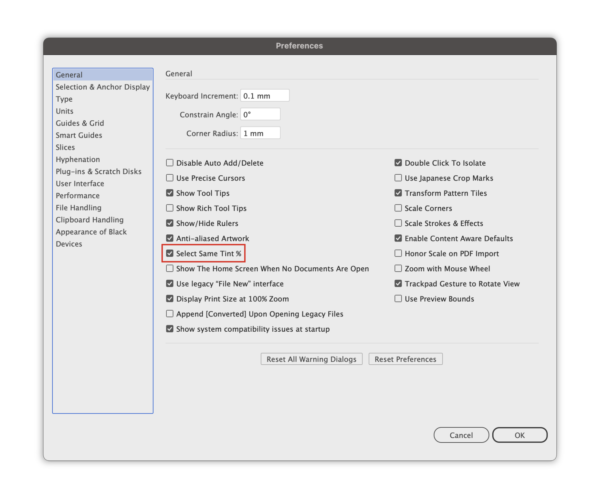

#### 使用方法
このスクリプトを実行するだけです。  

#### 動作条件
Illustrator CC以降

<div align="right">[ <a href="#環境設定">↑ トップへ戻る ↑</a> ]</div>
<br>


## <a name="選択された文字の異体字を表示">選択された文字の異体字を表示</a>
### toggleShowCharacterAlternates.js
[](https://github.com/sky-chaser-high/adobe-illustrator-scripts/releases/latest/download/Utility.zip)


「環境設定 > テキスト > 選択された文字の異体字を表示」のオン/オフを切り替えます。

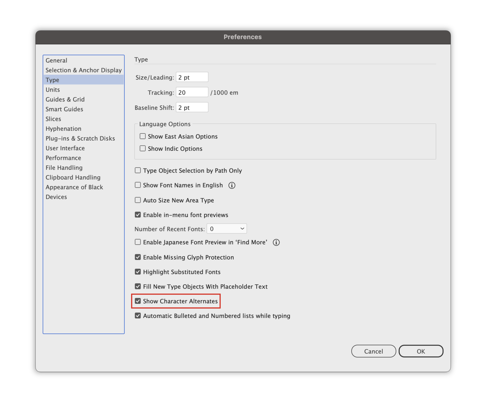

#### 使用方法
このスクリプトを実行するだけです。  

#### 動作条件
Illustrator 2020以降

<div align="right">[ <a href="#環境設定">↑ トップへ戻る ↑</a> ]</div>
<br>


## <a name="複数アンカーを選択時にハンドルを表示">複数アンカーを選択時にハンドルを表示</a>
### toggleShowHandles.js
[](https://github.com/sky-chaser-high/adobe-illustrator-scripts/releases/latest/download/Utility.zip)


「環境設定 > 選択範囲・アンカー表示 > アンカーポイント、ハンドル、およびバウンディングボックスの表示 > 複数アンカーを選択時にハンドルを表示」のオン/オフを切り替えます。

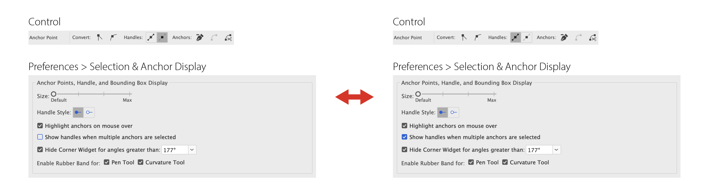

#### 使用方法
このスクリプトを実行するだけです。  

#### 動作条件
Illustrator CC以降

<div align="right">[ <a href="#環境設定">↑ トップへ戻る ↑</a> ]</div>
<br>


## <a name="パターンを変形">パターンを変形</a>
### toggleTransformPatternTiles.js
[](https://github.com/sky-chaser-high/adobe-illustrator-scripts/releases/latest/download/Utility.zip)


「環境設定 > 一般 > パターンを変形」のオン/オフを切り替えます。

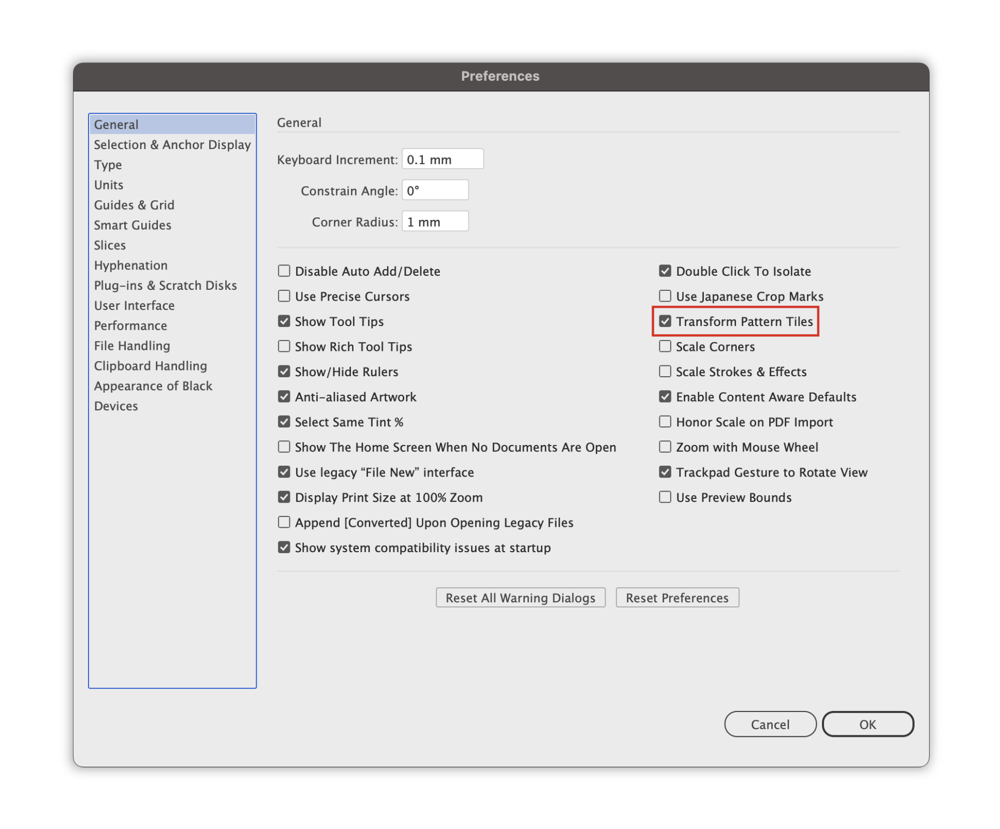

#### 使用方法
このスクリプトを実行するだけです。  

#### 動作条件
Illustrator CC以降

<div align="right">[ <a href="#環境設定">↑ トップへ戻る ↑</a> ]</div>
<br>


## <a name="プレビュー境界を使用">プレビュー境界を使用</a>
### toggleUsePreviewBounds.js
[](https://github.com/sky-chaser-high/adobe-illustrator-scripts/releases/latest/download/Utility.zip)


「環境設定 > 一般 > プレビュー境界を使用」のオン/オフを切り替えます。


#### 使用方法
このスクリプトを実行するだけです。  

#### 動作条件
Illustrator CC以降

<div align="right">[ <a href="#環境設定">↑ トップへ戻る ↑</a> ]</div>
<br>


## <a name="選択範囲へズーム">選択範囲へズーム</a>
### toggleZoomToSelection.js
[](https://github.com/sky-chaser-high/adobe-illustrator-scripts/releases/latest/download/Utility.zip)


「環境設定 > 選択範囲・アンカー表示 > 選択範囲 > 選択範囲へズーム」のオン/オフを切り替えます。

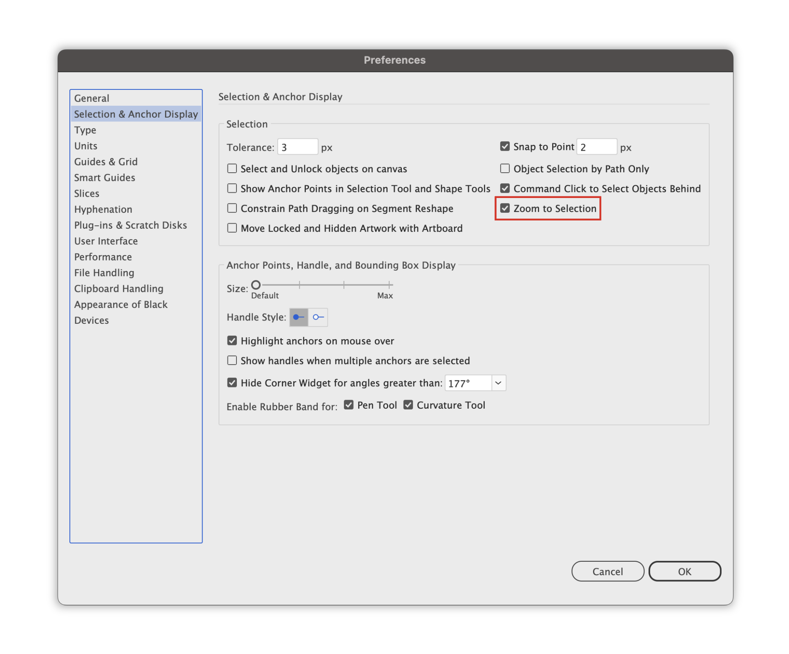

#### 使用方法
このスクリプトを実行するだけです。  

#### 動作条件
Illustrator 2018以降

<div align="right">[ <a href="#環境設定">↑ トップへ戻る ↑</a> ]</div>
<br>


## <a name="マウスホイールでズーム">マウスホイールでズーム</a>
### toggleZoomWithMouseWheel.js
[](https://github.com/sky-chaser-high/adobe-illustrator-scripts/releases/latest/download/Utility.zip)


「環境設定 > 一般 > マウスホイールでズーム」のオン/オフを切り替えます。

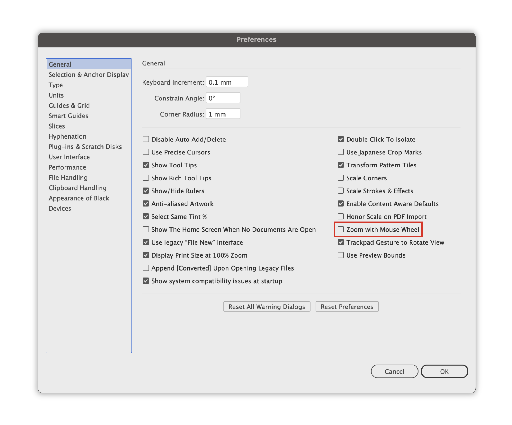

#### 使用方法
このスクリプトを実行するだけです。  

#### 動作条件
Illustrator 2022以降

<div align="right">[ <a href="#環境設定">↑ トップへ戻る ↑</a> ]</div>
<br>


## <a name="レイヤーカラーを統合">レイヤーカラーを統合</a>
### unifyLayerColors.js
[](https://github.com/sky-chaser-high/adobe-illustrator-scripts/releases/latest/download/Layer.zip)


レイヤーカラーを統合します。


#### 使用方法
1. すべてのレイヤーのロックを解除します。変更したくない色のレイヤーはロックします。
2. 基準の色のレイヤーを選択してスクリプトを実行します。

> [!NOTE]
> サブレイヤーにも対応します。

#### 動作条件
Illustrator CS以降

<div align="right">[ <a href="#レイヤー">↑ トップへ戻る ↑</a> ]</div>
<br>


## <a name="単位を換算">単位を換算</a>
### unitCalculator.js
[](https://github.com/sky-chaser-high/adobe-illustrator-scripts/releases/latest/download/Utility.zip)


Illustratorで対応しているほぼすべての単位を換算します。

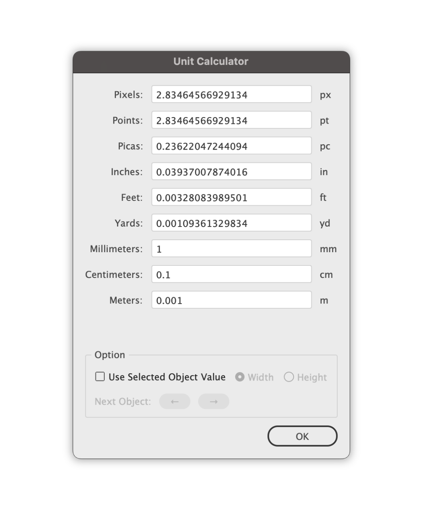

> [!NOTE]
> Illustrator日本語版を使用している場合は、UIは日本語で表示します。

#### 使用方法
1. スクリプトを実行します。
   オブジェクトの幅や高さの値を参照したい場合は、選択ツールでオブジェクトを選択してからスクリプトを実行します。
2. いずれかの単位に値を入力します。

> [!NOTE]
> ドキュメントを開いている場合は、定規の単位が基準になります。

#### 対応する単位
ポイント、ピクセル、パイカ、インチ、フィート、ヤード、ミリメートル、センチメートル、メートル、歯（日本語版のみ）。  
使用する単位は、定規の単位によります。

#### 動作条件
Illustrator CC以降

<div align="right">[ <a href="#ユーティリティ">↑ トップへ戻る ↑</a> ]</div>
<br>


# ライセンス
MITライセンスのもとで公開しています。  
詳しくはLICENSEファイルをご覧ください。
